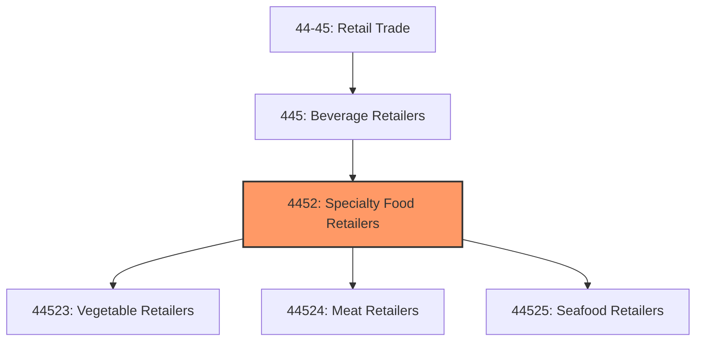
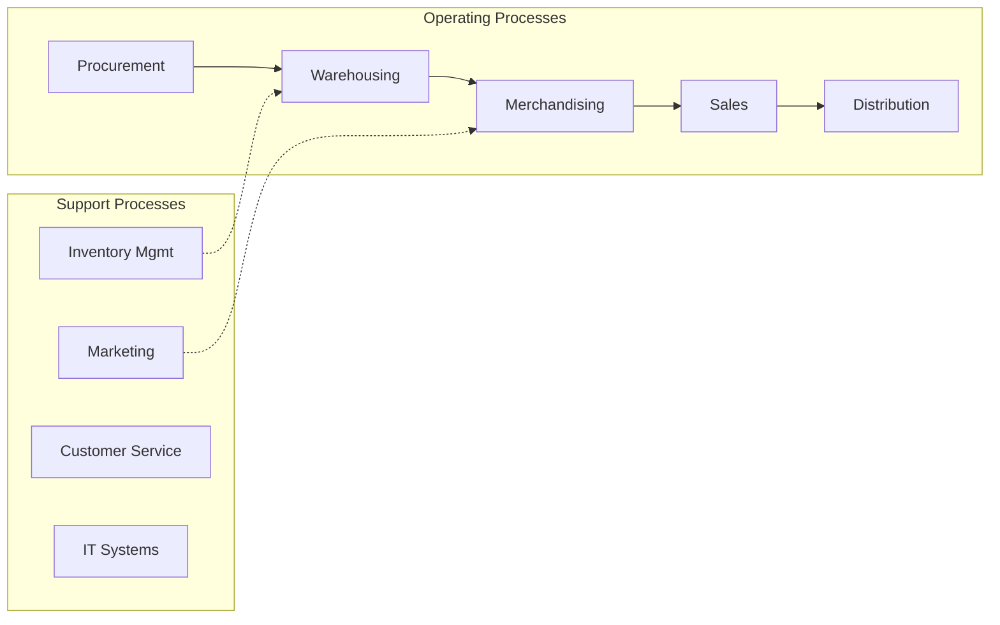

# Specialty Food Retailers

> This industry group comprises establishments primarily engaged in retailing specialized lines of food not for immediate consumption.

## Overview

Specialty Food Retailers represents an important category within the Retail Trade sector (NAICS 44-45). This industry group encompasses establishments primarily engaged in specialty food retailers.

This industry group comprises establishments primarily engaged in retailing specialized lines of food not for immediate consumption.

## Industry Hierarchy

## Key Statistics

| Metric | Value |
|--------|-------|
| NAICS Code | 4452 |
| Level | Industry Group |
| Parent | [Beverage Retailers](../) |
| Child Industries | 3 |

## Sub-Industries

| Industry | Code | Description |
|----------|------|-------------|
| [Vegetable Retailers](./VegetableRetailers/) | 44523 | See industry description for 445230 |
| [Meat Retailers](./MeatRetailers/) | 44524 | See industry description for 445240 |
| [Seafood Retailers](./SeafoodRetailers/) | 44525 | See industry description for 445250 |

## Related Occupations

- [Sales Managers](/occupations/Management/SalesManagers) - Direct sales teams and set goals
- [Retail Salespersons](/occupations/Sales/RetailSalespersons) - Sell merchandise in retail settings
- [Cashiers](/occupations/Sales/Cashiers) - Process customer transactions
- [First-Line Supervisors of Retail Sales Workers](/occupations/Sales/FirstLineSupervisorsOfRetailSalesWorkers) - Supervise retail staff

## Core Business Processes

## Industry Value Chain

```mermaid
graph LR
    subgraph Inputs["Inputs"]
        I1["Products"]
        I2["Inventory"]
        I3["Store/Warehouse"]
    end

    subgraph Primary["Primary Activities"]
        A1["Inbound Logistics"]
        A2["Core Operations"]
        A3["Quality Assurance"]
        A4["Outbound/Delivery"]
    end

    subgraph Outputs["Products/Services"]
        O1["Goods for Sale"]
        O2["Services"]
        O3["Delivery"]
    end

    subgraph Customers["Markets"]
        C1["Businesses"]
        C2["Consumers"]
        C3["Institutions"]
        C4["Government"]
    end

    Inputs --> Primary --> Outputs --> Customers
```

## Regulatory Environment

- **FTC** (Federal Trade Commission) - Enforces consumer protection and truth-in-advertising
- **CPSC** (Consumer Product Safety Commission) - Regulates product safety in retail
- **State Consumer Protection Agencies** - Handle retail licensing and consumer complaints
- **ADA** (Americans with Disabilities Act) - Governs accessibility requirements for retail spaces

## Technology & Innovation

- **E-commerce and Omnichannel** - Unified online/offline shopping experiences and last-mile delivery
- **AI Personalization** - Machine learning product recommendations and dynamic pricing
- **Cashierless Stores** - Computer vision and sensor-based automated checkout
- **Augmented Reality** - Virtual try-on, in-store navigation, and product visualization

## Industry Outlook

The retail sector continues its omnichannel evolution, with seamless integration between physical stores and digital channels becoming essential. AI-driven personalization, last-mile delivery innovation, and experiential retail are key differentiators. Consumer preferences for sustainability and social responsibility are influencing product sourcing and business practices across the industry.

---

*Source: NAICS 4452 - Specialty Food Retailers*
