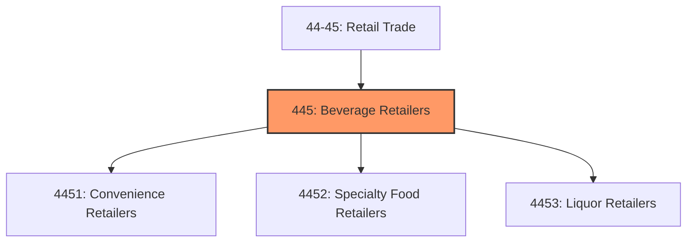
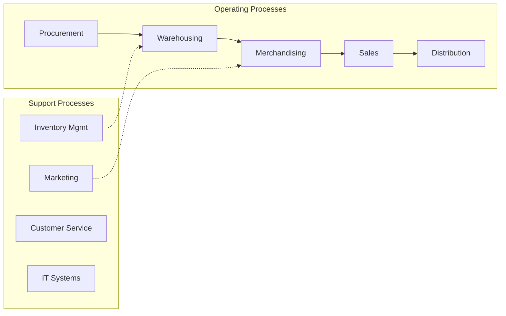

# Beverage Retailers

> Industries in the Food and Beverage Retailers subsector primarily retail general or specialized lines of food and beverage products.

## Overview

Beverage Retailers represents an important category within the Retail Trade sector (NAICS 44-45). This subsector encompasses establishments primarily engaged in beverage retailers.

Industries in the Food and Beverage Retailers subsector primarily retail general or specialized lines of food and beverage products. Establishments in this subsector with fixed point-of-sale locations have special equipment (e.g., freezers, refrigerated display cases, refrigerators) for displaying food and beverage products and have staff trained in the processing of food products to guarantee the proper storage and sanitary conditions required by regulatory authority. Vending machine operators are also included in this subsector.

## Industry Hierarchy

## Key Statistics

| Metric | Value |
|--------|-------|
| NAICS Code | 445 |
| Level | Subsector |
| Child Industries | 3 |

## Sub-Industries

| Industry | Code | Description |
|----------|------|-------------|
| [Convenience Retailers](./ConvenienceRetailers/) | 4451 | This industry group comprises establishments primarily engaged in retailing a ge |
| [Specialty Food Retailers](./SpecialtyFoodRetailers/) | 4452 | This industry group comprises establishments primarily engaged in retailing spec |
| [Liquor Retailers](./LiquorRetailers/) | 4453 | Liquor Retailers |

## Core Business Processes

## Industry Value Chain

```mermaid
graph LR
    subgraph Inputs["Inputs"]
        I1["Products"]
        I2["Inventory"]
        I3["Store/Warehouse"]
    end

    subgraph Primary["Primary Activities"]
        A1["Inbound Logistics"]
        A2["Core Operations"]
        A3["Quality Assurance"]
        A4["Outbound/Delivery"]
    end

    subgraph Outputs["Products/Services"]
        O1["Goods for Sale"]
        O2["Services"]
        O3["Delivery"]
    end

    subgraph Customers["Markets"]
        C1["Businesses"]
        C2["Consumers"]
        C3["Institutions"]
        C4["Government"]
    end

    Inputs --> Primary --> Outputs --> Customers
```

## Market Context

Retail connects products to consumers through various channels, with omnichannel strategies and e-commerce reshaping traditional retail models.

| Aspect | Details |
|--------|---------|
| Industry Sector | Retail |
| NAICS/SIC Code | 445 |
| Market Segment | Beverage Retailers |

## Key Business Processes

- Merchandising and display
- Sales and customer service
- Inventory management
- Loss prevention
- Omnichannel fulfillment

## Common Occupations

- [Retail Managers](/occupations/Management/SalesManagers)
- [Retail Salespersons](/occupations/Sales/RetailSalespersons)
- [Cashiers](/occupations/Sales/Cashiers)
- [Stock Clerks](/occupations/Sales/StockClerksAndOrderFillers)

## Regulations and Standards

- Consumer protection laws
- Payment Card Industry (PCI) compliance
- Labor and employment regulations
- Product safety standards
- State retail licensing

## Technology and Tools

- Point-of-sale (POS) systems
- Inventory management software
- E-commerce platforms
- Customer relationship management (CRM)
- Mobile payment solutions

## Industry Trends

- Digital transformation and automation adoption
- Sustainability and environmental compliance focus
- Workforce development and skills training
- Supply chain resilience and optimization
- Customer experience enhancement

---

*Source: NAICS 445 - Beverage Retailers*
