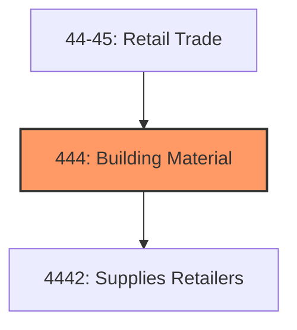
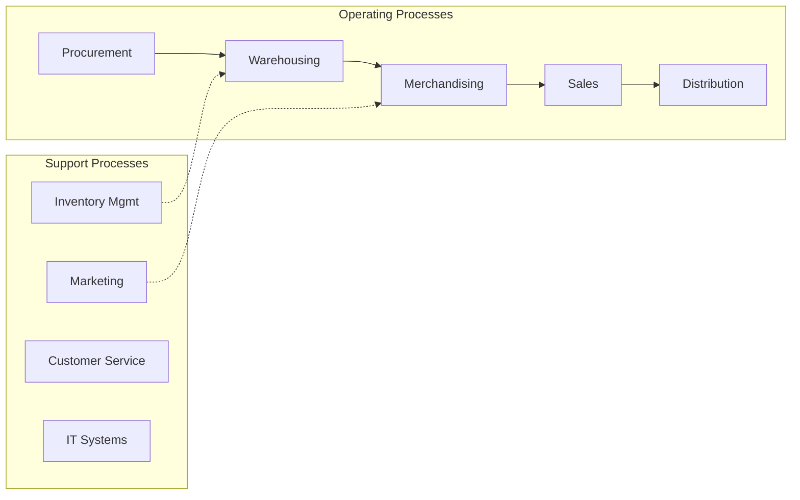

# Building Material

> Industries in the Building Material and Garden Equipment and Supplies Dealers subsector retail new building materials, hardware, paint, and garden and outdoor power equipment and supplies.

## Overview

Building Material represents an important category within the Retail Trade sector (NAICS 44-45). This subsector encompasses establishments primarily engaged in building material.

Industries in the Building Material and Garden Equipment and Supplies Dealers subsector retail new building materials, hardware, paint, and garden and outdoor power equipment and supplies. Establishments in this subsector with fixed point-of-sale locations, including home centers and retail lumber yards, may display merchandise either indoors or outdoors under covered areas. The staff is usually knowledgeable in the use of the specific products being retailed in the construction, repair, and maintenance of the home and associated grounds.

## Industry Hierarchy

## Key Statistics

| Metric | Value |
|--------|-------|
| NAICS Code | 444 |
| Level | Subsector |
| Child Industries | 1 |

## Sub-Industries

| Industry | Code | Description |
|----------|------|-------------|
| [Supplies Retailers](./SuppliesRetailers/) | 4442 | This industry group comprises establishments primarily engaged in retailing new  |

## Core Business Processes

## Industry Value Chain

```mermaid
graph LR
    subgraph Inputs["Inputs"]
        I1["Products"]
        I2["Inventory"]
        I3["Store/Warehouse"]
    end

    subgraph Primary["Primary Activities"]
        A1["Inbound Logistics"]
        A2["Core Operations"]
        A3["Quality Assurance"]
        A4["Outbound/Delivery"]
    end

    subgraph Outputs["Products/Services"]
        O1["Goods for Sale"]
        O2["Services"]
        O3["Delivery"]
    end

    subgraph Customers["Markets"]
        C1["Businesses"]
        C2["Consumers"]
        C3["Institutions"]
        C4["Government"]
    end

    Inputs --> Primary --> Outputs --> Customers
```

---

*Source: NAICS 444 - Building Material*
