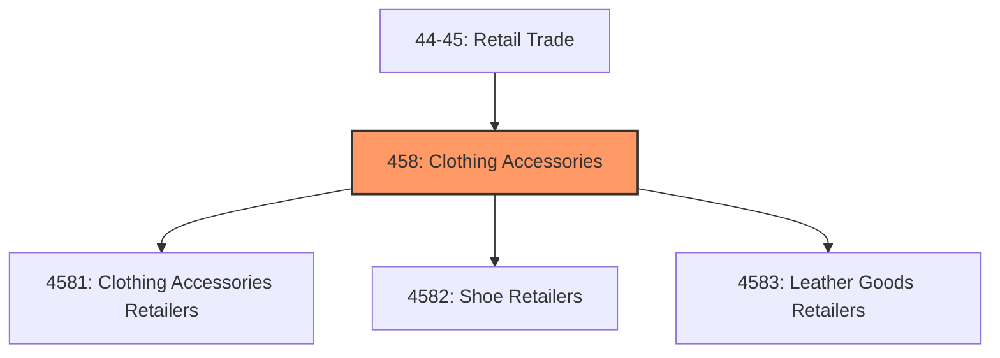
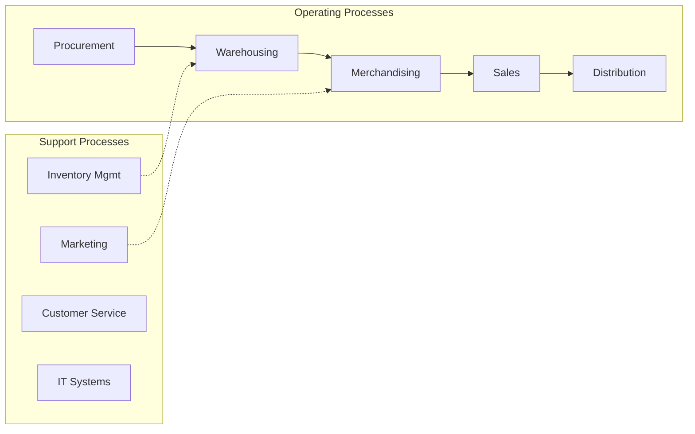

# Clothing Accessories

> Industries in the Clothing, Clothing Accessories, Shoe, and Jewelry Retailers subsector retail new clothing, clothing accessories, shoes, jewelry, luggage, and leather goods.

## Overview

Clothing Accessories represents an important category within the Retail Trade sector (NAICS 44-45). This subsector encompasses establishments primarily engaged in clothing accessories.

Industries in the Clothing, Clothing Accessories, Shoe, and Jewelry Retailers subsector retail new clothing, clothing accessories, shoes, jewelry, luggage, and leather goods.

## Industry Hierarchy

## Key Statistics

| Metric | Value |
|--------|-------|
| NAICS Code | 458 |
| Level | Subsector |
| Child Industries | 3 |

## Sub-Industries

| Industry | Code | Description |
|----------|------|-------------|
| [Clothing Accessories Retailers](./ClothingAccessoriesRetailers/) | 4581 | Clothing Accessories Retailers |
| [Shoe Retailers](./ShoeRetailers/) | 4582 | Shoe Retailers |
| [Leather Goods Retailers](./LeatherGoodsRetailers/) | 4583 | This industry group comprises establishments primarily engaged in retailing new  |

## Related Occupations

- [Sales Managers](/occupations/Management/SalesManagers) - Direct sales teams and set goals
- [Retail Salespersons](/occupations/Sales/RetailSalespersons) - Sell merchandise in retail settings
- [Cashiers](/occupations/Sales/Cashiers) - Process customer transactions
- [First-Line Supervisors of Retail Sales Workers](/occupations/Sales/FirstLineSupervisorsOfRetailSalesWorkers) - Supervise retail staff

## Core Business Processes

## Industry Value Chain

```mermaid
graph LR
    subgraph Inputs["Inputs"]
        I1["Products"]
        I2["Inventory"]
        I3["Store/Warehouse"]
    end

    subgraph Primary["Primary Activities"]
        A1["Inbound Logistics"]
        A2["Core Operations"]
        A3["Quality Assurance"]
        A4["Outbound/Delivery"]
    end

    subgraph Outputs["Products/Services"]
        O1["Goods for Sale"]
        O2["Services"]
        O3["Delivery"]
    end

    subgraph Customers["Markets"]
        C1["Businesses"]
        C2["Consumers"]
        C3["Institutions"]
        C4["Government"]
    end

    Inputs --> Primary --> Outputs --> Customers
```

## Regulatory Environment

- **FTC** (Federal Trade Commission) - Enforces consumer protection and truth-in-advertising
- **CPSC** (Consumer Product Safety Commission) - Regulates product safety in retail
- **State Consumer Protection Agencies** - Handle retail licensing and consumer complaints
- **ADA** (Americans with Disabilities Act) - Governs accessibility requirements for retail spaces

## Technology & Innovation

- **E-commerce and Omnichannel** - Unified online/offline shopping experiences and last-mile delivery
- **AI Personalization** - Machine learning product recommendations and dynamic pricing
- **Cashierless Stores** - Computer vision and sensor-based automated checkout
- **Augmented Reality** - Virtual try-on, in-store navigation, and product visualization

## Industry Outlook

The retail sector continues its omnichannel evolution, with seamless integration between physical stores and digital channels becoming essential. AI-driven personalization, last-mile delivery innovation, and experiential retail are key differentiators. Consumer preferences for sustainability and social responsibility are influencing product sourcing and business practices across the industry.

---

*Source: NAICS 458 - Clothing Accessories*
