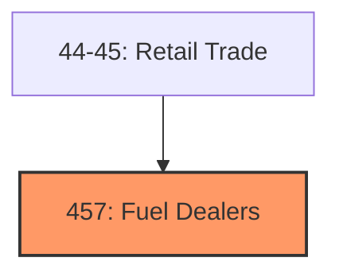
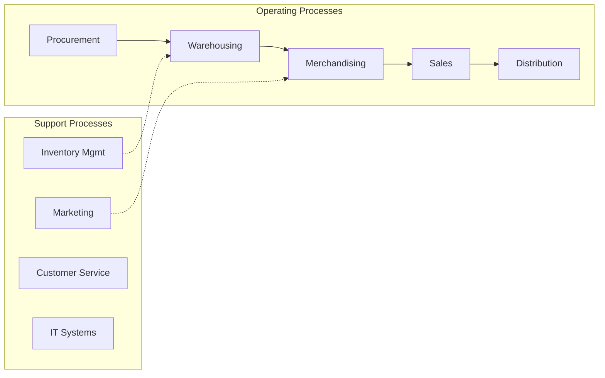

# Fuel Dealers

> Industries in the Gasoline Stations and Fuel Dealers subsector retail automotive fuels (e.

## Overview

Fuel Dealers represents an important category within the Retail Trade sector (NAICS 44-45).

Industries in the Gasoline Stations and Fuel Dealers subsector retail automotive fuels (e.g., gasoline, diesel fuel, gasohol, alternative fuels) and automotive oils, without or in combination with convenience store items; or retail heating oil, liquefied petroleum (LP) gas, and other fuels via direct selling (i.e., home delivery). Gasoline stations have specialized equipment for storing and dispensing automotive fuels.

## Industry Hierarchy

## Key Statistics

| Metric | Value |
|--------|-------|
| NAICS Code | 457 |
| Level | Subsector |
| Child Industries | 0 |

## Related Occupations

See the [occupations directory](/occupations) for roles commonly found in this industry.

## Core Business Processes

## Industry Value Chain

```mermaid
graph LR
    subgraph Inputs["Inputs"]
        I1["Products"]
        I2["Inventory"]
        I3["Store/Warehouse"]
    end

    subgraph Primary["Primary Activities"]
        A1["Inbound Logistics"]
        A2["Core Operations"]
        A3["Quality Assurance"]
        A4["Outbound/Delivery"]
    end

    subgraph Outputs["Products/Services"]
        O1["Goods for Sale"]
        O2["Services"]
        O3["Delivery"]
    end

    subgraph Customers["Markets"]
        C1["Businesses"]
        C2["Consumers"]
        C3["Institutions"]
        C4["Government"]
    end

    Inputs --> Primary --> Outputs --> Customers
```

---

*Source: NAICS 457 - Fuel Dealers*
