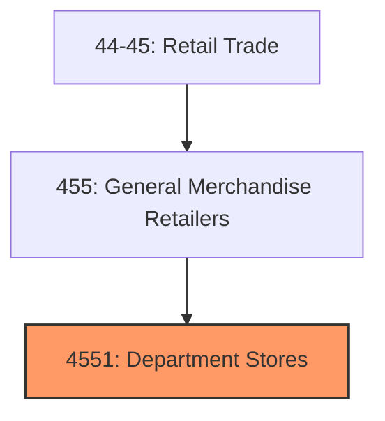
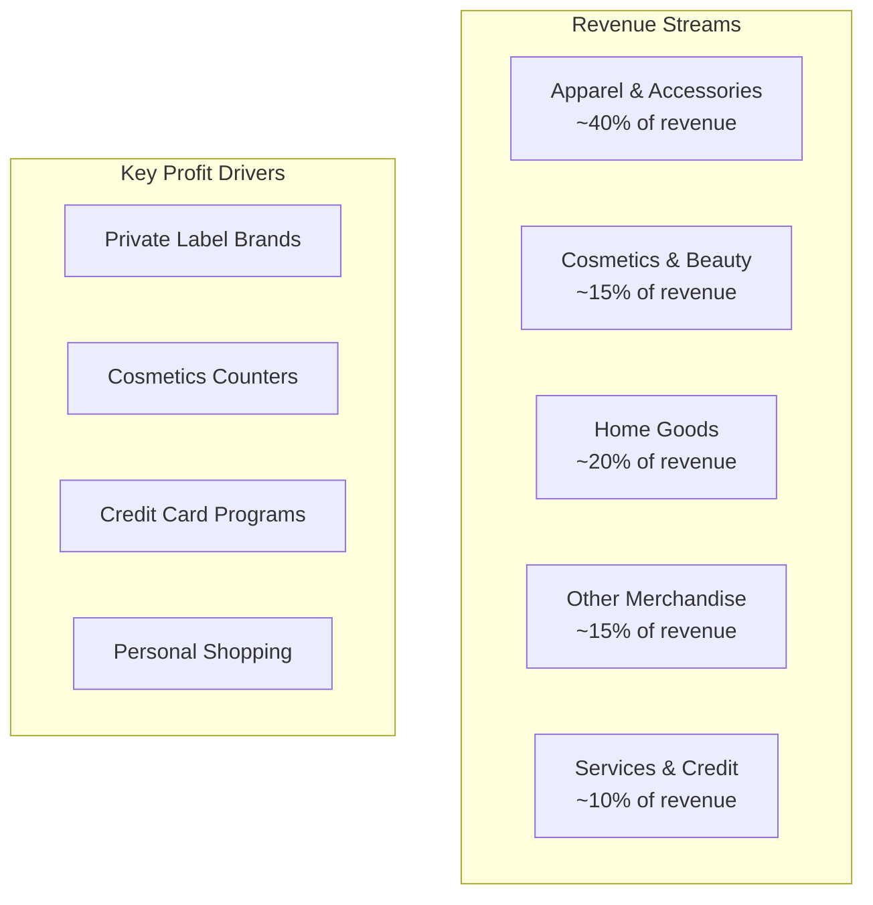
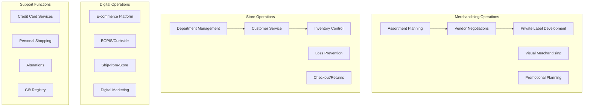

# Department Stores

> Establishments primarily engaged in retailing a wide range of products organized into separate departments with unified checkout, traditionally offering apparel, home furnishings, cosmetics, and general merchandise under one roof.

## Overview

Department stores represent a foundational retail format that has evolved from the grand emporiums of the 19th century into modern omnichannel operations. These establishments are characterized by their breadth of merchandise categories, organized into distinct departments with specialized staff, unified store management, and central checkout capabilities.

The department store model traditionally served as a one-stop shopping destination, offering everything from clothing and cosmetics to home goods and furniture. While facing significant competitive pressure from e-commerce, specialty retailers, and discount chains, successful department stores have adapted by emphasizing customer experience, exclusive brand partnerships, and seamless omnichannel integration.

The U.S. department store market generates approximately $120-140 billion in annual revenue, though this figure has declined from peak levels as consumer shopping patterns have shifted. The industry continues to consolidate, with major players focusing on right-sizing store fleets, enhancing digital capabilities, and repositioning as experiential retail destinations.

## Industry Hierarchy

## Key Statistics

| Metric | Value |
|--------|-------|
| NAICS Code | 4551 |
| Level | Industry Group |
| US Establishments | ~3,500 |
| Annual Revenue | $120-140 billion |
| Employment | ~500,000 |
| Average Store Size | 100,000-200,000 sq ft |

## Illustrative Examples

- Traditional department stores (Macy's, Nordstrom, Dillard's)
- Upscale/luxury department stores (Neiman Marcus, Saks Fifth Avenue, Bloomingdale's)
- Mid-tier department stores (JCPenney, Kohl's)
- Regional department stores (Belk, Von Maur)
- Store-within-store concepts

## Business Model

## Store Formats

| Format | Characteristics |
|--------|-----------------|
| **Full-Line Store** | 150,000+ sq ft, all merchandise categories, anchor location |
| **Off-Price/Outlet** | Discounted merchandise, smaller footprint, value-oriented |
| **Small-Format** | 25,000-50,000 sq ft, curated assortment, urban/suburban |
| **Flagship** | Largest store, premium location, full brand experience |
| **Store-in-Store** | Branded shops within department store environment |

## Related Occupations

- [Sales Managers](/occupations/Management/SalesManagers) - Direct sales teams and set departmental goals
- [Retail Salespersons](/occupations/Sales/RetailSalespersons) - Sell merchandise and provide customer service
- [Cashiers](/occupations/Sales/Cashiers) - Process customer transactions
- [First-Line Supervisors of Retail Sales Workers](/occupations/Sales/FirstLineSupervisorsOfRetailSalesWorkers) - Supervise retail staff by department
- [Buyers and Purchasing Agents](/occupations/Business/BuyersAndPurchasingAgents) - Select merchandise for departments
- [Merchandise Displayers](/occupations/Arts/MerchandiseDisplayers) - Create visual merchandising displays
- [Stock Clerks](/occupations/Transportation/StockClerks) - Manage inventory and stock shelves
- [Loss Prevention Specialists](/occupations/Protective/LossPreventionSpecialists) - Prevent theft and shrinkage

## Core Business Processes

## Industry Value Chain

## Regulatory Environment

- **FTC** (Federal Trade Commission) - Truth-in-advertising, pricing practices, Made in USA claims
- **CPSC** (Consumer Product Safety Commission) - Product safety, recalls management
- **ADA** (Americans with Disabilities Act) - Store accessibility requirements
- **State Consumer Protection** - Return policies, pricing accuracy, gift card regulations
- **FCRA** (Fair Credit Reporting Act) - Credit card application and data handling
- **PCI DSS** - Payment card data security standards
- **State Sales Tax** - Multi-state tax collection and remittance

## Technology & Tools

### Store Systems
- **POS Systems**: Oracle Retail, Aptos, Manhattan Associates, NCR
- **Inventory Management**: Blue Yonder, Manhattan, Oracle Retail
- **Clienteling**: Salesfloor, Tulip, Mad Mobile
- **Loss Prevention**: Sensormatic, Checkpoint, video analytics

### Digital & Analytics
- **E-commerce Platforms**: Salesforce Commerce Cloud, Adobe Commerce
- **Order Management**: Manhattan Active, Fluent Commerce
- **Customer Analytics**: SAS, Adobe Analytics, Tableau
- **Personalization**: Dynamic Yield, Monetate, Certona

### Operations
- **Workforce Management**: Kronos, Legion, Reflexis
- **Visual Merchandising**: Retail Smart, Visual Next
- **Vendor Management**: Bamboo Rose, CBX Software

## Market Trends

### Industry Challenges
- **E-commerce Competition**: Online pure-plays capturing market share
- **Specialty Retail Pressure**: Category killers in specific segments
- **Mall Traffic Decline**: Reduced foot traffic in traditional anchor locations
- **Margin Compression**: Promotional intensity eroding profitability

### Strategic Responses
- **Omnichannel Integration**: BOPIS, ship-from-store, endless aisle
- **Experiential Retail**: In-store events, services, restaurants
- **Store Portfolio Optimization**: Right-sizing, relocations, closures
- **Private Label Expansion**: Higher-margin exclusive brands
- **Luxury Partnerships**: Premium brands and exclusive collections

### Emerging Opportunities
- **Store-as-Fulfillment**: Converting retail space for e-commerce fulfillment
- **Retail Media Networks**: Monetizing customer data and store traffic
- **Sustainable Retail**: Eco-friendly products and practices
- **Technology Integration**: Digital fitting rooms, mobile checkout

## Industry Outlook

The department store sector continues navigating a fundamental transformation as consumer shopping behaviors evolve. Successful operators are repositioning around customer experience, brand curation, and omnichannel convenience rather than competing purely on selection and price. The survivors are those investing in digital capabilities, optimizing real estate portfolios, and creating differentiated shopping experiences that justify physical store visits.

Key success factors include strong private label programs, effective loyalty/credit card ecosystems, seamless omnichannel execution, and compelling in-store experiences. The industry is expected to continue consolidating, with well-capitalized players acquiring distressed competitors and prime real estate.

---

*Source: NAICS 4551 - Department Stores*
