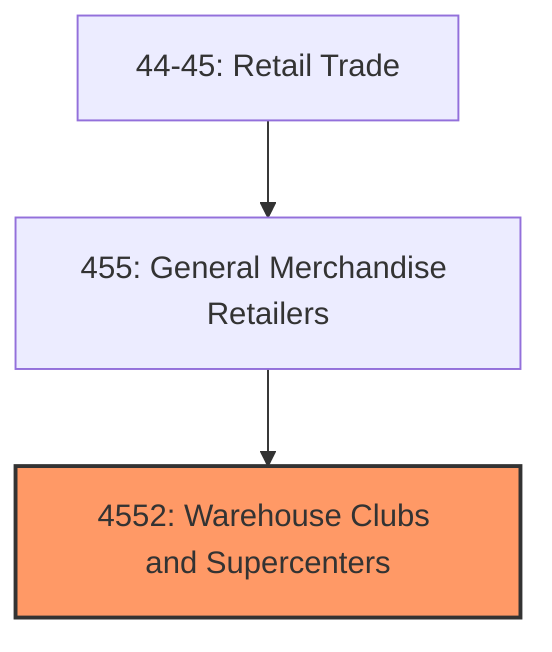
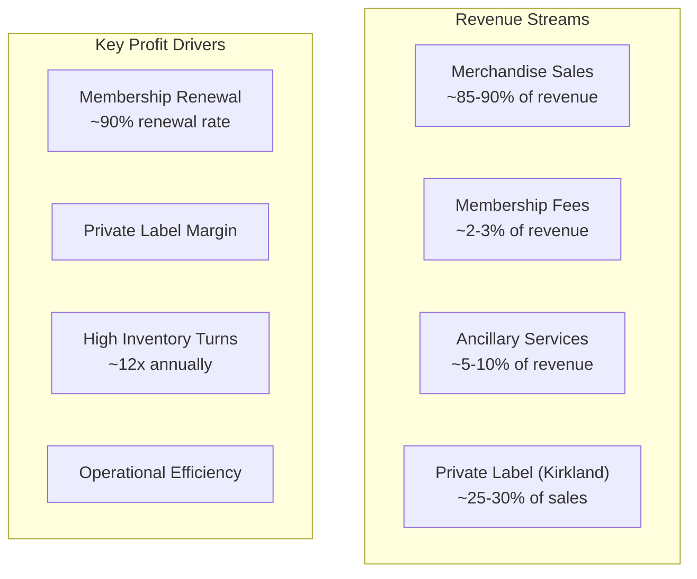
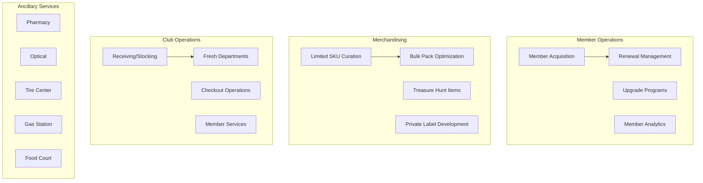

# Warehouse Clubs and Supercenters

> Establishments primarily engaged in retailing a general line of groceries and general merchandise in warehouse-style facilities, typically requiring membership and offering bulk quantities at competitive prices.

## Overview

Warehouse clubs and supercenters represent one of the most successful and rapidly growing retail formats, combining the efficiency of wholesale operations with consumer retail accessibility. These establishments operate large-format stores (typically 100,000-200,000+ square feet) that offer a limited assortment of products in bulk quantities at everyday low prices.

The membership-based warehouse club model, pioneered by Price Club (now Costco) in the 1970s, generates revenue through both merchandise sales and annual membership fees. This dual revenue stream enables clubs to operate on razor-thin merchandise margins (often 10-14%) while delivering exceptional value to members.

The U.S. warehouse club and supercenter market generates over $500 billion in annual revenue, making it one of the largest retail segments. The format has proven resilient through economic cycles, as value-conscious consumers increasingly prioritize price efficiency. The industry is dominated by three major players: Costco, Sam's Club (Walmart), and BJ's Wholesale Club.

## Industry Hierarchy

## Key Statistics

| Metric | Value |
|--------|-------|
| NAICS Code | 4552 |
| Level | Industry Group |
| US Establishments | ~1,200 warehouse clubs |
| Annual Revenue | $500+ billion |
| Employment | 600,000+ |
| Average Club Size | 140,000-150,000 sq ft |
| Average SKU Count | 3,500-4,500 |

## Illustrative Examples

- Membership warehouse clubs (Costco, Sam's Club, BJ's)
- Hybrid warehouse/supermarket formats
- Business-focused wholesale clubs
- Regional warehouse retailers

## Business Model

## Membership Structure

| Tier | Description |
|------|-------------|
| **Basic/Club** | Standard membership, core shopping benefits |
| **Executive/Plus** | Premium tier, cashback rewards, additional services |
| **Business** | Small business access, resale privileges |
| **Add-on Members** | Household cards, spouse/family access |

## Related Occupations

- [General and Operations Managers](/occupations/Management/GeneralAndOperationsManagers) - Oversee club operations
- [First-Line Supervisors of Retail Sales Workers](/occupations/Sales/FirstLineSupervisorsOfRetailSalesWorkers) - Supervise floor staff
- [Retail Salespersons](/occupations/Sales/RetailSalespersons) - Assist members and demonstrate products
- [Cashiers](/occupations/Sales/Cashiers) - Process high-volume transactions
- [Stock Clerks](/occupations/Transportation/StockClerks) - Manage pallet-level inventory
- [Forklift Operators](/occupations/Transportation/ForkliftOperators) - Move bulk merchandise
- [Meat Cutters](/occupations/Production/MeatCutters) - Operate fresh departments
- [Bakers](/occupations/Production/Bakers) - Produce in-house bakery items
- [Pharmacists](/occupations/Healthcare/Pharmacists) - Staff in-club pharmacies
- [Opticians](/occupations/Healthcare/Opticians) - Operate optical departments

## Core Business Processes

## Industry Value Chain

## Regulatory Environment

- **FTC** (Federal Trade Commission) - Membership terms, pricing practices, advertising
- **FDA** (Food and Drug Administration) - Food safety, pharmacy operations
- **USDA** - Meat and poultry inspection, organic certification
- **EPA** - Fuel station operations, environmental compliance
- **State Pharmacy Boards** - Pharmacy licensing and operations
- **State Liquor Control** - Alcohol sales (varies by state)
- **OSHA** - Warehouse safety, forklift operations
- **State Weights & Measures** - Pricing accuracy, scale calibration

## Technology & Tools

### Store Systems
- **POS Systems**: Custom proprietary systems, NCR, Toshiba
- **Membership Management**: Custom CRM, membership databases
- **Inventory Management**: Warehouse management systems (WMS)
- **Self-Checkout**: Scan-and-go apps, self-service kiosks

### Supply Chain
- **Distribution**: Cross-dock operations, vendor-managed inventory
- **Demand Forecasting**: Machine learning demand planning
- **Transportation**: Private fleet management, route optimization
- **Fresh Logistics**: Cold chain management, temperature monitoring

### Digital & E-commerce
- **E-commerce Platforms**: Costco.com, SamsClub.com
- **Instacart Integration**: Same-day delivery partnerships
- **Mobile Apps**: Digital membership cards, scan-and-go
- **Curbside Pickup**: Order ahead, contactless fulfillment

## Market Trends

### Growth Drivers
- **Value Focus**: Consumer prioritization of price/value
- **Bulk Buying**: Post-pandemic stocking behavior persistence
- **Private Label Growth**: Premium quality at value prices
- **Ancillary Services**: Gas, pharmacy, optical driving traffic

### Competitive Dynamics
- **E-commerce Investment**: Rapid digital capability buildout
- **Same-Day Delivery**: Partnerships and in-house fulfillment
- **Format Innovation**: Smaller urban formats, business centers
- **International Expansion**: Particularly Costco in Asia

### Emerging Opportunities
- **Retail Media**: Advertising platform monetization
- **Healthcare Services**: Expanded pharmacy, clinics, telehealth
- **Sustainable Products**: Clean label, organic, eco-friendly
- **Technology Integration**: Frictionless checkout, automated warehousing

## Competitive Landscape

| Operator | Clubs | Members | Differentiators |
|----------|-------|---------|-----------------|
| **Costco** | ~850 | 130M+ | Premium quality, employee culture, Kirkland brand |
| **Sam's Club** | ~600 | 47M+ | Walmart integration, scan-and-go technology |
| **BJ's** | ~240 | 7M+ | Accepts coupons, manufacturer coupons |

## Industry Outlook

The warehouse club format continues to outperform broader retail, driven by consumer value orientation and the unique membership model that creates customer loyalty and recurring revenue. The industry benefits from structural advantages including efficient operations, limited SKU assortments, and high inventory turnover.

Key growth vectors include e-commerce expansion (particularly same-day delivery), international market penetration, and ancillary service growth. The membership renewal rates exceeding 90% demonstrate strong customer loyalty and provide visibility into future revenue streams.

Challenges include labor cost inflation, supply chain complexity for fresh products, and competition for prime real estate suitable for large-format stores. However, the fundamental value proposition remains compelling across economic cycles.

---

*Source: NAICS 4552 - Warehouse Clubs and Supercenters*
