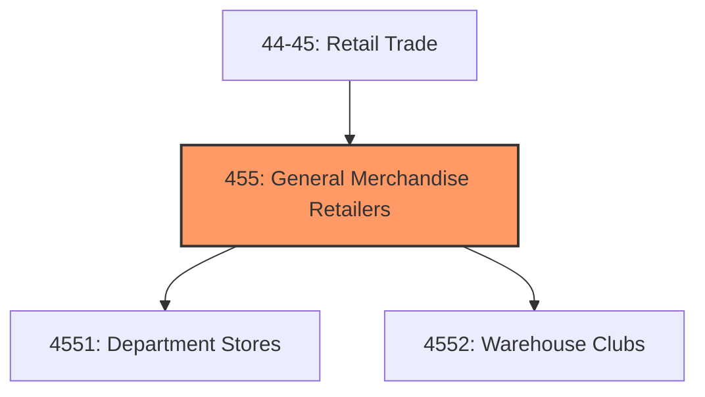
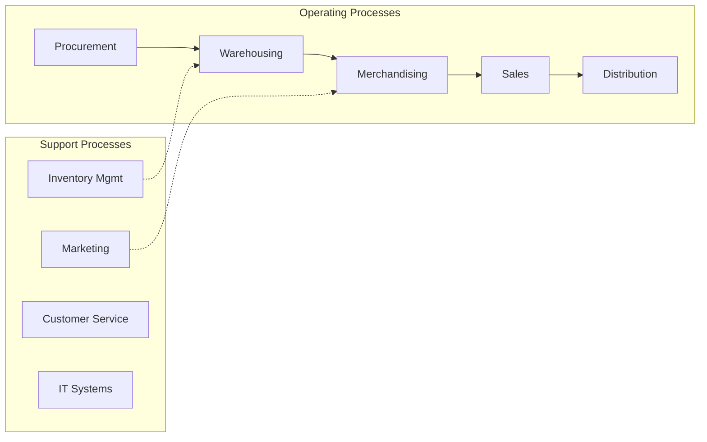

# General Merchandise Retailers

> Industries in the General Merchandise Retailers subsector retail new general merchandise.

## Overview

General Merchandise Retailers represents an important category within the Retail Trade sector (NAICS 44-45). This subsector encompasses establishments primarily engaged in general merchandise retailers.

Industries in the General Merchandise Retailers subsector retail new general merchandise. This subsector includes new and used general merchandise auction retailers and establishments generally known as department stores, warehouse clubs, superstores, or supercenters.

## Industry Hierarchy

## Key Statistics

| Metric | Value |
|--------|-------|
| NAICS Code | 455 |
| Level | Subsector |
| Child Industries | 2 |

## Sub-Industries

| Industry | Code | Description |
|----------|------|-------------|
| [Department Stores](./DepartmentStores/) | 4551 | Department Stores |
| [Warehouse Clubs](./WarehouseClubs/) | 4552 | Warehouse Clubs |

## Core Business Processes

## Industry Value Chain

```mermaid
graph LR
    subgraph Inputs["Inputs"]
        I1["Products"]
        I2["Inventory"]
        I3["Store/Warehouse"]
    end

    subgraph Primary["Primary Activities"]
        A1["Inbound Logistics"]
        A2["Core Operations"]
        A3["Quality Assurance"]
        A4["Outbound/Delivery"]
    end

    subgraph Outputs["Products/Services"]
        O1["Goods for Sale"]
        O2["Services"]
        O3["Delivery"]
    end

    subgraph Customers["Markets"]
        C1["Businesses"]
        C2["Consumers"]
        C3["Institutions"]
        C4["Government"]
    end

    Inputs --> Primary --> Outputs --> Customers
```

---

*Source: NAICS 455 - General Merchandise Retailers*
