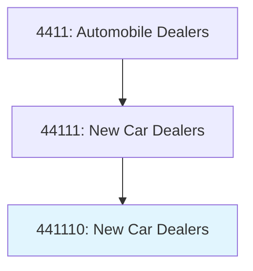
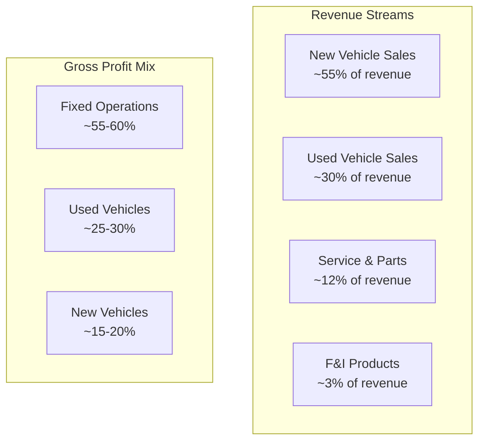
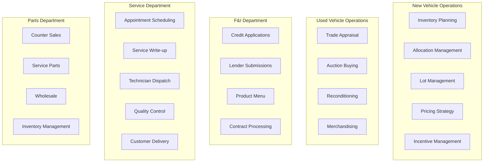
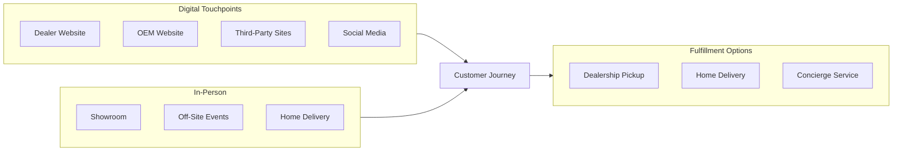

# New Car Dealers

> This industry comprises establishments primarily engaged in retailing new automobiles and light trucks, such as sport utility vehicles, and passenger and cargo vans, or retailing these new vehicles in combination with activities, such as repair services, retailing used cars, and selling replacement parts and accessories.

## Overview

New car dealers are franchised retail establishments authorized by vehicle manufacturers (OEMs) to sell new vehicles within designated market areas. These dealerships represent a critical component of the automotive distribution system, serving as the primary interface between manufacturers and consumers.

Beyond new vehicle sales, franchised dealers generate substantial revenue from used vehicle operations, service departments, parts sales, and finance & insurance (F&I) products. The typical dealer derives approximately 55-60% of gross profit from fixed operations (service and parts) despite these representing only 12-15% of total revenue.

## Industry Hierarchy

## Key Statistics

| Metric | Value |
|--------|-------|
| NAICS Code | 441110 |
| Level | National Industry |
| US Establishments | ~18,000 |
| Annual Revenue | $1.2+ trillion |
| Employment | 1.1+ million |
| Average Dealership Revenue | $65-70 million |

## Illustrative Examples

- Franchised automobile dealers (new cars)
- Franchised SUV dealers
- Franchised light truck dealers
- Franchised passenger van dealers
- New car dealers with used car departments

## Business Model

## Retail Formats

| Format | Characteristics |
|--------|-----------------|
| **Single-Point Dealer** | One brand, one location |
| **Multi-Point Dealer** | One brand, multiple locations |
| **Auto Mall/Group** | Multiple brands in proximity |
| **Mega Dealer** | Large-scale, regional operations |
| **Digital-First** | Online-focused with delivery |

## Franchise Relationship

The manufacturer-dealer relationship is governed by franchise agreements:

| Element | Description |
|---------|-------------|
| **Brand Representation** | Exclusive authorization to sell specific brands |
| **Territory** | Primary market area (PMA) designation |
| **Facility Requirements** | Image standards, signage, equipment |
| **Capital Requirements** | Floorplan, working capital, real estate |
| **Training/Certification** | Sales and service personnel requirements |
| **Inventory Allocation** | Vehicle allocation based on sales performance |
| **Warranty Work** | Obligation to perform warranty repairs |
| **Performance Standards** | Sales effectiveness, CSI scores |

## Core Business Processes

## F&I Products

Finance and Insurance departments offer various products:

| Product | Description |
|---------|-------------|
| **Retail Financing** | Vehicle loans through captive/third-party lenders |
| **Leasing** | Vehicle lease arrangements |
| **Extended Warranty** | Vehicle service contracts |
| **GAP Insurance** | Guaranteed asset protection |
| **Tire & Wheel** | Protection against road hazards |
| **Paint & Fabric** | Appearance protection |
| **Theft Deterrent** | Security systems |
| **Prepaid Maintenance** | Service packages |

## Omnichannel Strategies

## Regulatory Environment

New car dealers must comply with extensive regulations:

### Federal Regulations
- **FTC Used Car Rule**: Buyer's Guide requirements
- **FTC Safeguards Rule**: Information security
- **TILA/Regulation Z**: Finance disclosures
- **ECOA**: Equal credit opportunity
- **OFAC**: Sanctions compliance
- **EPA**: Fuel economy labels, emissions

### State Regulations
- Dealer licensing and bonding
- Franchise law compliance
- Sales tax collection
- Title and registration
- Advertising standards
- Lemon law compliance

## Technology & Innovation

### Current Technology Stack
- **DMS (Dealer Management System)**: CDK, Reynolds & Reynolds, Dealertrack
- **CRM**: VinSolutions, Elead, DealerSocket
- **Inventory Management**: vAuto, HomeNet
- **Digital Retailing**: Roadster, Darwin, Cox Digital Retailing
- **Service Scheduling**: Xtime, DealerFire

### Emerging Technologies
- **AI-Powered Lead Scoring**: Predictive customer behavior
- **Virtual Reality Showrooms**: Immersive product experiences
- **Digital Contracting**: E-signatures, remote closing
- **Subscription Services**: Vehicle subscription offerings
- **EV Charging Networks**: On-site customer charging

## EV Transition Impact

The shift to electric vehicles presents opportunities and challenges:

| Aspect | Impact |
|--------|--------|
| **Sales Process** | More education required, different value proposition |
| **Service Revenue** | Reduced maintenance needs, battery diagnostics |
| **Infrastructure** | Charging station installation, high-voltage equipment |
| **Training** | EV certification for technicians |
| **Inventory** | New allocation processes, longer order times |

## Competitive Landscape

- Traditional franchised dealers
- Publicly-traded dealer groups (AutoNation, Lithia, Penske)
- Private dealer groups
- Digital disruptors (Carvana, Vroom for used)
- Direct-to-consumer models (Tesla, Rivian)

## Cross-References

**Excluded from this industry:**
- Used car dealers (without new car franchise) - see [441120](./UsedCarDealers.mdx)
- Recreational vehicle dealers - see [441210](../OtherMotorVehicleDealers/RecreationalVehicleDealers.mdx)
- Motorcycle dealers - see [441227](../OtherMotorVehicleDealers/MotorcycleAndOtherVehicleDealers.mdx)

---

*Source: NAICS 441110 - New Car Dealers*
