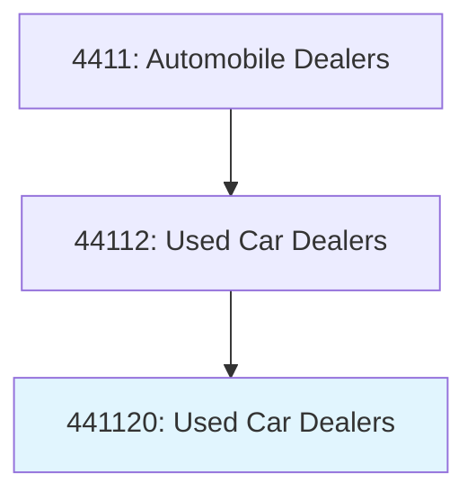
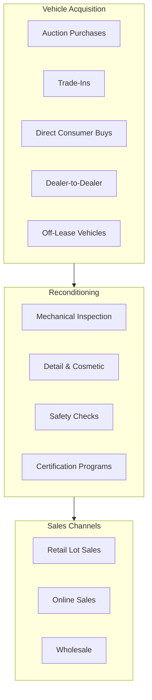
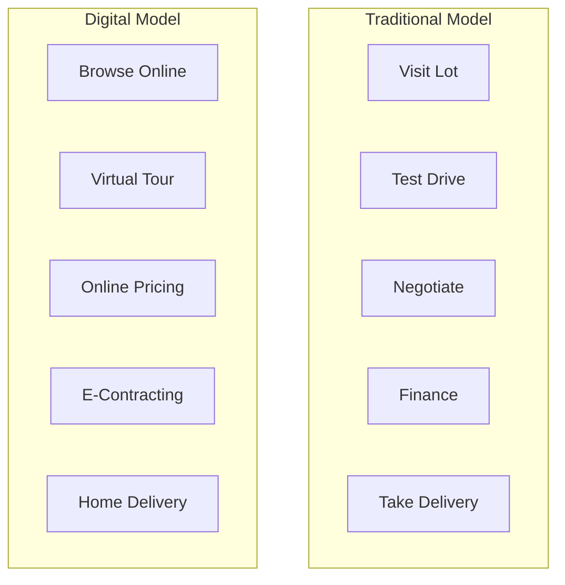

# Used Car Dealers

> This industry comprises establishments primarily engaged in retailing used automobiles and light trucks, such as sport utility vehicles, and passenger and cargo vans, or retailing these used vehicles in combination with activities, such as repair services and selling replacement parts and accessories.

## Overview

Used car dealers are independent retail establishments that specialize in selling pre-owned vehicles without new car franchise agreements. This industry encompasses a wide range of operations from small independent lots to large national chains and online-only retailers.

The used vehicle market has undergone significant transformation with the rise of digital retailing platforms, vehicle history reports, and certified pre-owned programs. Over 40 million used vehicles are sold annually in the United States, with independent dealers accounting for approximately 25% of these transactions.

## Industry Hierarchy

## Key Statistics

| Metric | Value |
|--------|-------|
| NAICS Code | 441120 |
| Level | National Industry |
| US Establishments | 40,000+ |
| Annual Unit Sales | 10+ million (dealer channel) |
| Average Transaction | $25,000-30,000 |

## Illustrative Examples

- Independent used car dealers
- Used automobile dealers
- Used car superstores
- Online used car retailers
- Buy-here-pay-here (BHPH) dealers

## Retail Formats

| Format | Characteristics | Examples |
|--------|-----------------|----------|
| **Traditional Lot** | Small inventory, local market | Independent dealers |
| **Used Car Superstore** | Large inventory, no-haggle | CarMax |
| **Online Retailer** | Digital-first, home delivery | Carvana, Vroom |
| **Buy-Here-Pay-Here** | In-house financing, subprime | Multiple regional |
| **Wholesale/Retail Hybrid** | Auction access, retail sales | ACV, Manheim |

## Business Model

## Vehicle Sourcing

Used car dealers acquire inventory from multiple channels:

| Source | Advantages | Challenges |
|--------|------------|------------|
| **Auctions** | Volume, variety | Condition uncertainty |
| **Trade-Ins** | Direct relationship | Limited volume |
| **Consumer Purchases** | Below market pricing | Acquisition costs |
| **Off-Lease** | Known history, condition | Competition, pricing |
| **Rental Fleet** | Volume, recent models | Higher mileage |

## Core Business Processes

```mermaid
flowchart LR
    subgraph Sourcing["Sourcing"]
        S1["Market Analysis"]
        S2["Auction Strategy"]
        S3["Appraisal Process"]
        S4["Purchase Decision"]
    end

    subgraph Recon["Reconditioning"]
        R1["Inspection"]
        R2["Mechanical Work"]
        R3["Detail/Cosmetic"]
        R4["Photography"]
    end

    subgraph Retail["Retail Operations"]
        M1["Pricing"]
        M2["Merchandising"]
        M3["Marketing"]
        M4["Sales Process"]
    end

    subgraph Finance["Financing"]
        F1["Credit Application"]
        F2["Lender Selection"]
        F3["Contract Execution"]
    end

    Sourcing --> Recon --> Retail --> Finance
```

## Pricing and Inventory Management

Successful used car operations rely on sophisticated inventory management:

| Metric | Target |
|--------|--------|
| **Inventory Turn** | 12-15x annually |
| **Days to Sale** | 30-45 days |
| **Gross Profit/Unit** | $1,500-3,000 |
| **Reconditioning Cost** | $800-1,500 |
| **Market Day Supply** | Monitor by segment |

## Financing Models

| Model | Target Customer | Characteristics |
|-------|-----------------|-----------------|
| **Prime/Near-Prime** | Credit scores 680+ | Bank/credit union financing |
| **Subprime** | Credit scores 550-680 | Higher rates, specialized lenders |
| **Deep Subprime** | Credit scores <550 | Very high rates, BHPH |
| **Buy-Here-Pay-Here** | Credit challenged | Dealer-held notes, repo risk |

## Digital Transformation

The used car industry has embraced digital retailing:

### Online Retailing Features
- 360-degree vehicle photography
- Video walkarounds
- Vehicle history reports (Carfax, AutoCheck)
- Online trade-in valuations
- Remote financing approval
- Home delivery and return policies

## Omnichannel Strategies

| Channel | Role |
|---------|------|
| **Website** | Primary discovery, inventory browsing |
| **Mobile App** | Saved searches, notifications |
| **Third-Party Sites** | Cars.com, Autotrader, Facebook |
| **Physical Lot** | Test drives, final decision |
| **Delivery** | Convenience, contact-free |

## Regulatory Environment

### Federal Requirements
- **FTC Used Car Rule**: Buyer's Guide disclosure
- **Odometer Disclosure**: Federal odometer requirements
- **FTC Safeguards Rule**: Customer data protection
- **TILA**: Financing disclosures
- **Fair Credit Reporting Act**: Credit report usage

### State Requirements
- Dealer licensing and bonding
- Implied warranty laws
- As-is sales disclosures
- Lemon law applicability
- Advertising regulations
- Sales tax collection

### Buyer's Guide Requirements

The FTC Buyer's Guide must disclose:
- Whether vehicle sold "as is" or with warranty
- Warranty coverage details
- Major defects that may occur
- Request for vehicle inspection

## Technology & Innovation

### Current Technologies
- **Inventory Management**: vAuto, DealerSocket
- **Vehicle Pricing**: Kelley Blue Book, Black Book, MMR
- **History Reports**: Carfax, AutoCheck
- **Inspection Tools**: ACV, BacklotCars
- **Digital Retailing**: Roadster, Gubagoo

### Emerging Trends
- AI-powered condition assessment
- Instant cash offer platforms
- Blockchain vehicle history
- Predictive inventory analytics
- Automated reconditioning tracking

## Competitive Landscape

### Market Participants
- **National Chains**: CarMax, Carvana, Vroom
- **Regional Groups**: Large independent groups
- **Local Dealers**: Independent lots
- **Franchised Dealers**: Used car operations
- **Private Sales**: Peer-to-peer

### Competitive Advantages
- Inventory selection and pricing
- Financing capabilities
- Customer experience
- Brand trust and reputation
- Digital capabilities

## Market Trends

- **Vehicle Age Increase**: Average vehicle age rising
- **Price Appreciation**: Used car values historically high
- **Digital Adoption**: Online buying becoming mainstream
- **Subscription/Rental**: Alternative ownership models
- **EV Growth**: Used EV market developing

## Cross-References

**Excluded from this industry:**
- New car dealers with used car operations - see [441110](./NewCarDealers.mdx)
- Recreational vehicle dealers - see [441210](../OtherMotorVehicleDealers/RecreationalVehicleDealers.mdx)
- Wholesale automobile auctions - see NAICS 425120

---

*Source: NAICS 441120 - Used Car Dealers*
