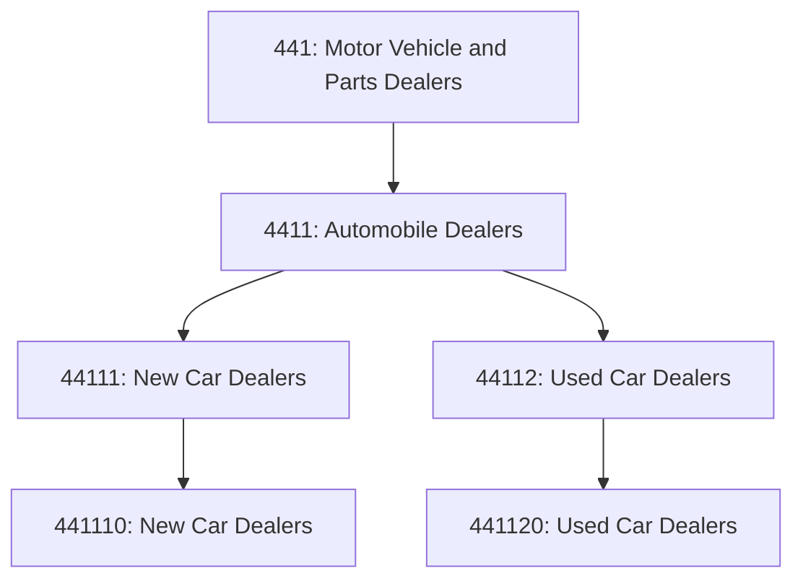

# Automobile Dealers

> This industry group comprises establishments primarily engaged in retailing new and used automobiles and light trucks, such as sport utility vehicles, and passenger and cargo vans.

## Overview

Automobile dealers represent the primary retail channel for passenger vehicles in North America. These establishments operate under franchise agreements with manufacturers (for new vehicles) or as independent used car operations. The industry combines vehicle sales with financing, insurance products, service, and parts operations to create a comprehensive automotive retail experience.

The automobile dealer channel handles over 40 million vehicle transactions annually in the United States, including approximately 15 million new vehicles and 25 million used vehicles.

## Industry Hierarchy

## Key Statistics

| Metric | Value |
|--------|-------|
| NAICS Code | 4411 |
| Level | Industry Group |
| Parent | [Motor Vehicle and Parts Dealers](../) |
| Industries | 2 |
| US Dealerships | ~18,000 franchised, 40,000+ independent |

## Sub-Industries

| Industry | Code | Description |
|----------|------|-------------|
| [New Car Dealers](./NewCarDealers.mdx) | 44111/441110 | Franchised new vehicle dealers |
| [Used Car Dealers](./UsedCarDealers.mdx) | 44112/441120 | Independent used vehicle dealers |

## Core Business Processes

```mermaid
flowchart LR
    subgraph Acquisition["Vehicle Acquisition"]
        A1["Factory Orders"]
        A2["Dealer Trades"]
        A3["Auction Purchases"]
        A4["Trade-Ins"]
    end

    subgraph Sales["Sales Process"]
        S1["Lead Generation"]
        S2["Customer Greeting"]
        S3["Needs Assessment"]
        S4["Vehicle Selection"]
        S5["Test Drive"]
        S6["Trade Appraisal"]
        S7["Negotiation"]
        S8["F&I"]
        S9["Delivery"]
    end

    subgraph AfterSales["After-Sales"]
        P1["Service Follow-up"]
        P2["Loyalty Programs"]
        P3["Repurchase Marketing"]
    end

    Acquisition --> Sales --> AfterSales
```

## Omnichannel Strategies

Modern automobile dealers are implementing omnichannel capabilities:

| Channel | Capability |
|---------|------------|
| **Website** | Inventory browsing, pricing, trade valuations |
| **Mobile** | Appointment scheduling, service status |
| **In-Store** | Traditional showroom experience |
| **Remote** | Video walkarounds, virtual F&I |
| **Delivery** | Home test drives, delivery to customer |

## Regulatory Environment

- State dealer licensing requirements
- Franchise law compliance
- Federal odometer disclosure requirements
- State lemon law compliance
- Truth in lending (TILA) requirements
- Buyer's Guide requirements for used vehicles
- EPA fuel economy labeling

## Technology & Innovation

- **Digital Retailing Platforms**: Upstart, Roadster, Cox Automotive
- **Inventory Pricing Tools**: vAuto, DealerSocket
- **CRM Systems**: DealerTrack, Elead
- **Virtual Sales**: Video calls, 360-degree vehicle views
- **AI Lead Scoring**: Predictive customer analytics

## Market Context

Retail connects products to consumers through various channels, with omnichannel strategies and e-commerce reshaping traditional retail models.

| Aspect | Details |
|--------|---------|
| Industry Sector | Retail |
| NAICS/SIC Code | 4411 |
| Market Segment | Automobile Dealers |

## Key Business Processes

- Merchandising and display
- Sales and customer service
- Inventory management
- Loss prevention
- Omnichannel fulfillment

## Common Occupations

- [Retail Managers](/occupations/Management/SalesManagers)
- [Retail Salespersons](/occupations/Sales/RetailSalespersons)
- [Cashiers](/occupations/Sales/Cashiers)
- [Stock Clerks](/occupations/Sales/StockClerksAndOrderFillers)

## Regulations and Standards

- Consumer protection laws
- Payment Card Industry (PCI) compliance
- Labor and employment regulations
- Product safety standards
- State retail licensing

## Technology and Tools

- Point-of-sale (POS) systems
- Inventory management software
- E-commerce platforms
- Customer relationship management (CRM)
- Mobile payment solutions

## Industry Trends

- Digital transformation and automation adoption
- Sustainability and environmental compliance focus
- Workforce development and skills training
- Supply chain resilience and optimization
- Customer experience enhancement

---

*Source: NAICS 4411 - Automobile Dealers*
