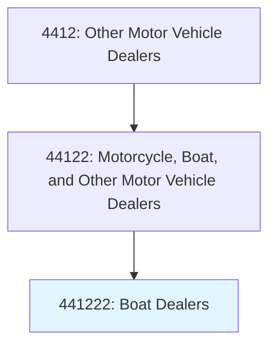
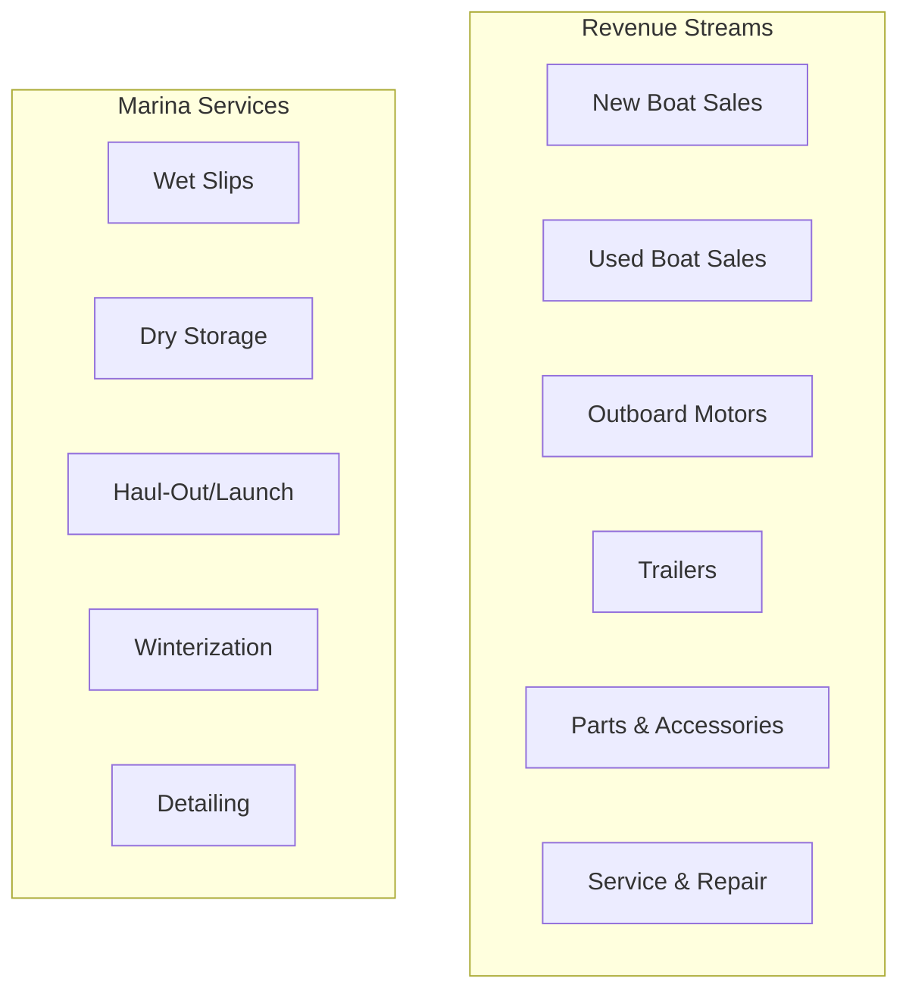
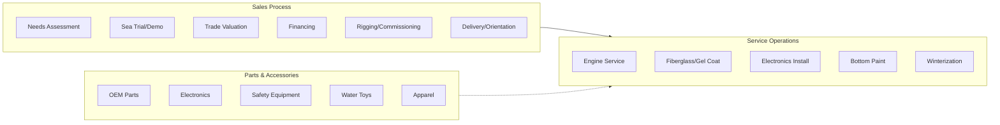

# Boat Dealers

> This U.S. industry comprises establishments primarily engaged in (1) retailing new and/or used boats or retailing new boats in combination with activities, such as repair services and selling replacement parts and accessories, and/or (2) retailing new and/or used outboard motors, boat trailers, marine supplies, parts, and accessories.

## Overview

Boat dealers serve recreational boaters with sales of powerboats, sailboats, and related marine products. These dealerships typically operate in coastal areas, lake regions, and other waterways where boating is popular. The business combines vessel sales with comprehensive marina services, parts operations, and accessories retail.

The marine industry is highly seasonal in most markets, with peak activity during spring and summer months. Dealers often provide storage, winterization, and off-season services to maintain customer relationships year-round.

## Industry Hierarchy

## Key Statistics

| Metric | Value |
|--------|-------|
| NAICS Code | 441222 |
| Level | National Industry |
| US Establishments | 4,500+ |
| Annual Retail Sales | $40+ billion |
| Registered Boats (US) | 12+ million |

## Illustrative Examples

- Boat dealers (power boats, rowboats, sailboats)
- Outboard motor dealers
- Marine supply dealers
- Boat trailer dealers
- Personal watercraft dealers (retail only)

## Product Categories

| Category | Description | Price Range |
|----------|-------------|-------------|
| **Center Console** | Fishing, versatile | $30,000-500,000+ |
| **Bowrider** | Day boating, family | $25,000-150,000 |
| **Pontoon** | Leisure, entertaining | $20,000-100,000 |
| **Deck Boat** | Versatile recreation | $30,000-80,000 |
| **Wakeboard/Ski** | Watersports | $50,000-200,000 |
| **Cabin Cruiser** | Overnight capable | $100,000-1,000,000+ |
| **Sailboat** | Wind-powered | $10,000-500,000+ |
| **PWC (Jet Ski)** | Personal watercraft | $6,000-20,000 |

## Business Model

## Core Business Processes

## Seasonal Business Patterns

| Season | Activities |
|--------|------------|
| **Winter** | Boat shows, storage services, service work |
| **Spring** | De-winterization, new deliveries, peak sales |
| **Summer** | Peak boating, road service, parts/accessories |
| **Fall** | End-of-season sales, winterization, haul-outs |

## Customer Segments

| Segment | Characteristics | Typical Purchase |
|---------|-----------------|------------------|
| **Anglers** | Fishing-focused | Center console, bass boats |
| **Families** | Recreation, watersports | Bowrider, pontoon |
| **Cruisers** | Extended trips, comfort | Cabin cruiser, yacht |
| **Watersports** | Skiing, wakeboarding | Ski/wake boats |
| **Sailors** | Wind enthusiasts | Sailboats |
| **Entry-Level** | First-time buyers | Used boats, PWC |

## Omnichannel Strategies

| Channel | Application |
|---------|-------------|
| **Website** | Inventory, virtual tours, spec sheets |
| **Boat Shows** | Major sales events, new model debuts |
| **Demo Days** | On-water demonstrations |
| **YouTube** | Product reviews, boating content |
| **Marina Events** | Owner appreciation, rallies |

## Regulatory Environment

- Coast Guard vessel documentation
- State boat registration and titling
- EPA emissions standards
- Hull identification number (HIN) requirements
- Safety equipment requirements
- Manufacturer warranty compliance
- Marine dealer licensing (state-specific)

## Technology & Innovation

- **Marine Electronics**: GPS, fishfinders, radar
- **Digital Switching**: Boat electrical systems
- **Virtual Tours**: 360-degree boat views
- **Service Software**: Marine-specific DMS
- **Telematics**: Engine monitoring, GPS tracking
- **Electric Propulsion**: Emerging electric boats

## Industry Associations

- **NMMA**: National Marine Manufacturers Association
- **MRAA**: Marine Retailers Association of the Americas
- **BoatUS**: Boat Owners Association

## Market Trends

- **Pontoon Growth**: Family-friendly, versatile
- **Outboard Power**: Shift from inboard/sterndrive
- **Technology Integration**: Connected boats
- **Electric/Hybrid**: Early adoption stage
- **Experiences**: Focus on boating lifestyle
- **Younger Buyers**: Digital-first expectations

## Cross-References

**Excluded from this industry:**
- Boat building and repair (manufacturing) - see NAICS 336612
- Marinas (without retail) - see NAICS 713930
- Boat rental - see NAICS 532284

---

*Source: NAICS 441222 - Boat Dealers*
