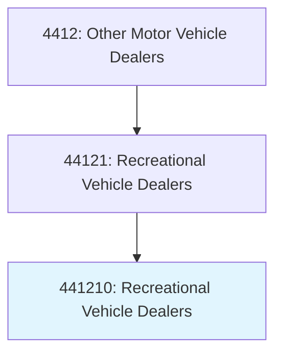
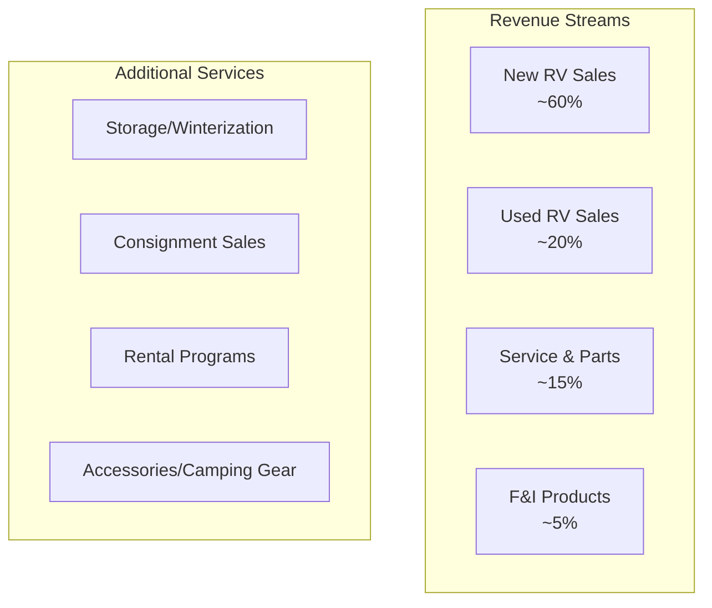
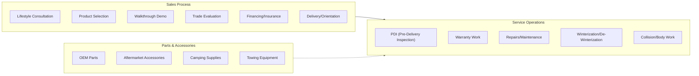

# Recreational Vehicle Dealers

> This industry comprises establishments primarily engaged in retailing new and/or used recreational vehicles commonly referred to as RVs, or retailing these new vehicles in combination with activities, such as repair services and selling replacement parts and accessories.

## Overview

Recreational vehicle dealers specialize in the sale and service of motorhomes, travel trailers, fifth-wheel trailers, campers, and other RV products. The RV industry serves a passionate customer base seeking mobile living, camping, and travel experiences. Dealers typically offer comprehensive services including financing, insurance, extended warranties, parts, accessories, and service/repair operations.

The RV market is highly seasonal and sensitive to economic conditions, fuel prices, and demographic trends (particularly retiree populations). The COVID-19 pandemic significantly boosted RV demand as consumers sought safe travel alternatives.

## Industry Hierarchy

## Key Statistics

| Metric | Value |
|--------|-------|
| NAICS Code | 441210 |
| Level | National Industry |
| US Establishments | 2,500+ |
| Annual Retail Sales | $50+ billion |
| RV Ownership | 11+ million households |

## Illustrative Examples

- Motorhome dealers
- Travel trailer dealers
- Fifth-wheel trailer dealers
- Camper dealers (pickup coaches)
- Pop-up camper dealers
- RV dealers with service departments

## RV Product Categories

| Type | Description | Price Range |
|------|-------------|-------------|
| **Class A Motorhome** | Bus-style, luxury amenities | $80,000-500,000+ |
| **Class B Motorhome** | Van conversion, compact | $50,000-200,000 |
| **Class C Motorhome** | Cab-over design, mid-size | $60,000-150,000 |
| **Fifth-Wheel** | Towed, hitch in truck bed | $30,000-150,000 |
| **Travel Trailer** | Bumper-pull towable | $15,000-80,000 |
| **Pop-Up/Folding** | Expandable, lightweight | $8,000-25,000 |
| **Truck Camper** | Mounts in pickup bed | $10,000-50,000 |

## Business Model

## Core Business Processes

## Seasonal Business Patterns

```mermaid
graph LR
    subgraph Q1["Q1: Winter"]
        W1["RV Shows"]
        W2["Early Orders"]
        W3["Service/Prep"]
    end

    subgraph Q2["Q2: Spring"]
        SP1["Peak Sales Start"]
        SP2["Delivery Season"]
        SP3["De-Winterization"]
    end

    subgraph Q3["Q3: Summer"]
        SU1["Peak Season"]
        SU2["Road Service"]
        SU3["Rental High"]
    end

    subgraph Q4["Q4: Fall"]
        F1["Sales Slowdown"]
        F2["Winterization"]
        F3["Storage Services"]
    end

    Q1 --> Q2 --> Q3 --> Q4
```

## Customer Segments

| Segment | Characteristics | Product Preferences |
|---------|-----------------|---------------------|
| **Full-Time RVers** | Live in RV year-round | Class A, luxury fifth-wheels |
| **Snowbirds** | Seasonal travel, retired | Class A/C, comfortable |
| **Weekend Warriors** | Short trips, families | Travel trailers, pop-ups |
| **Adventure Seekers** | Outdoor recreation | Class B, truck campers |
| **First-Time Buyers** | Entry-level, price conscious | Used units, travel trailers |

## F&I Products

| Product | Description |
|---------|-------------|
| **Financing** | RV-specific lenders, 10-20 year terms |
| **Extended Warranty** | Mechanical breakdown coverage |
| **GAP Insurance** | Loan/value gap protection |
| **Tire/Wheel** | Road hazard protection |
| **Trip Interruption** | Emergency travel expense coverage |
| **Total Loss Replacement** | New unit replacement |

## Omnichannel Strategies

| Channel | Application |
|---------|-------------|
| **Website** | Inventory browsing, virtual tours |
| **RV Shows** | Major sales events |
| **Showroom** | Product demonstrations |
| **Campground Events** | Rally sponsorships |
| **YouTube/Social** | Product reviews, lifestyle content |

## Regulatory Environment

- DOT vehicle standards and weights
- State titling and registration
- EPA generator emissions
- RVIA certification standards
- LP gas system certifications
- Manufacturer warranty obligations
- Consumer financing regulations

## Technology & Innovation

- **Virtual Tours**: 360-degree interior walkthroughs
- **RV-Specific CRM**: Seasonal buyer journey tracking
- **Service Scheduling**: Online appointment booking
- **Inventory Management**: Lot management, photo systems
- **Connected RV**: Telematics, remote monitoring
- **Digital Documentation**: E-contracting, title processing

## Industry Associations

- **RVIA**: Recreation Vehicle Industry Association
- **RVDA**: Recreation Vehicle Dealers Association
- **Go RVing**: Industry marketing coalition

## Market Trends

- **Younger Buyers**: Millennials entering the market
- **Remote Work**: Full-time RV living increasing
- **Compact/Vans**: Class B popularity growing
- **Electric**: Early EV RV development
- **Rentals**: Peer-to-peer platforms (Outdoorsy, RVshare)
- **Connected Features**: Smart RV systems

## Cross-References

**Excluded from this industry:**
- Motor home and travel trailer manufacturing - see NAICS 336214
- RV parks and campgrounds - see NAICS 721211

---

*Source: NAICS 441210 - Recreational Vehicle Dealers*
