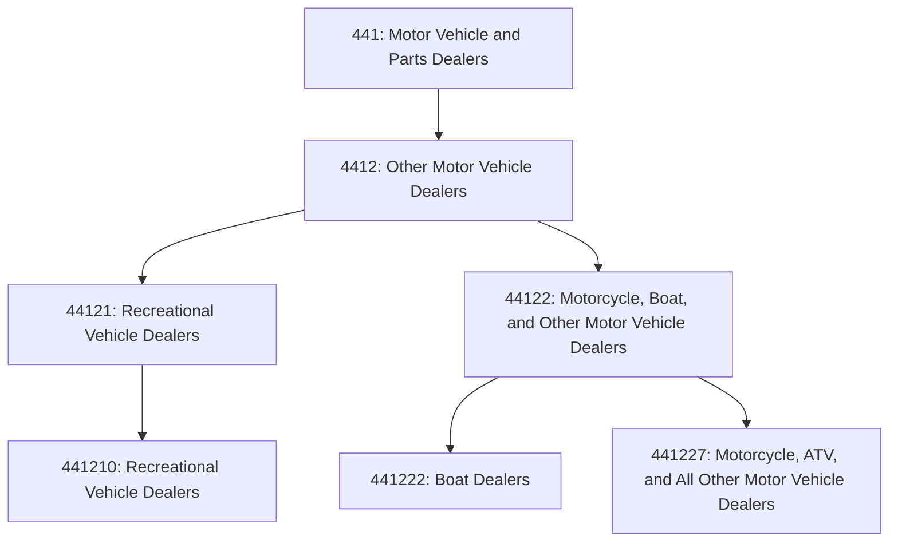
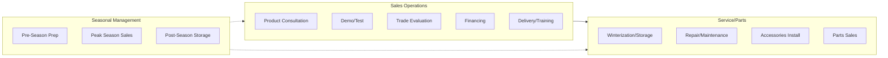

# Other Motor Vehicle Dealers

> This industry group comprises establishments primarily engaged in retailing new and used vehicles (except automobiles, light trucks, sport utility vehicles, and passenger and cargo vans).

## Overview

This industry group encompasses dealers specializing in recreational vehicles, motorcycles, boats, all-terrain vehicles (ATVs), personal watercraft, utility trailers, and other specialty motor vehicles. These dealers often combine sales with extensive service operations, parts departments, and accessories, as specialized knowledge is required for these product categories.

## Industry Hierarchy

## Key Statistics

| Metric | Value |
|--------|-------|
| NAICS Code | 4412 |
| Level | Industry Group |
| Parent | [Motor Vehicle and Parts Dealers](../) |
| Industries | 2 |
| National Industries | 3 |

## Sub-Industries

| Industry | Code | Description |
|----------|------|-------------|
| [Recreational Vehicle Dealers](./RecreationalVehicleDealers.mdx) | 441210 | Motorhomes, travel trailers, campers |
| [Boat Dealers](./BoatDealers.mdx) | 441222 | Power boats, sailboats, marine supplies |
| [Motorcycle, ATV, and Other Vehicle Dealers](./MotorcycleAndOtherVehicleDealers.mdx) | 441227 | Motorcycles, ATVs, snowmobiles, PWC |

## Core Business Processes

## Regulatory Environment

- DOT/NHTSA safety standards
- EPA emissions compliance
- State powersport licensing
- Watercraft registration (Coast Guard, state)
- Manufacturer franchise requirements
- Consumer financing regulations

## Technology & Innovation

- Virtual product tours and configurators
- Seasonal CRM and marketing automation
- Service scheduling platforms
- Inventory management for seasonal products
- Digital parts catalogs

---

*Source: NAICS 4412 - Other Motor Vehicle Dealers*
