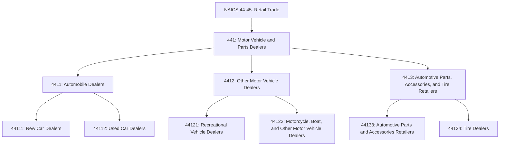
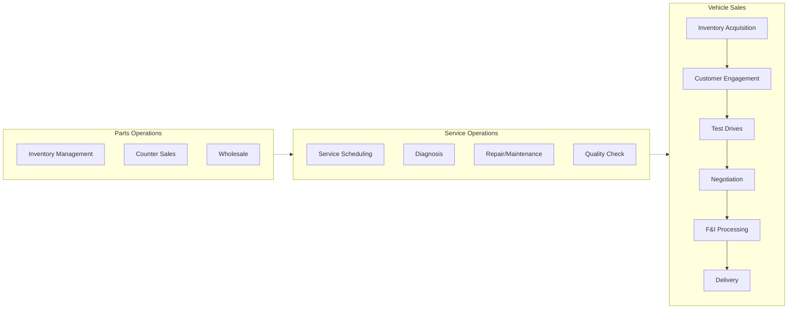
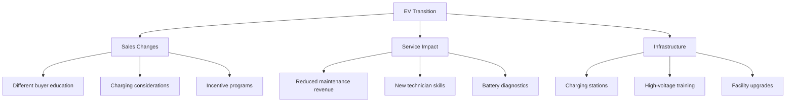

# Motor Vehicle and Parts Dealers

> Industries in the Motor Vehicle and Parts Dealers subsector retail motor vehicles and parts from fixed point-of-sale locations, often operating from showrooms and open lots where vehicles are displayed.

## Overview

This subsector comprises establishments that retail motor vehicles, including automobiles, light trucks, recreational vehicles, motorcycles, boats, and other motor vehicles. The subsector also includes establishments retailing automotive parts and accessories, including tires.

Dealerships typically combine sales operations with service departments, parts departments, and financing/insurance services. The personnel include sales staff familiar with vehicle registration and financing requirements, as well as parts experts and mechanics trained to provide repair and maintenance services.

## Industry Hierarchy

## Key Statistics

| Metric | Value |
|--------|-------|
| NAICS Code | 441 |
| Level | Subsector |
| Parent Sector | [Retail Trade](../) |
| Industry Groups | 3 |
| National Industries | 8 |
| Annual Sales | $1.4+ trillion |

## Sub-Industries

| Industry Group | Code | Description |
|----------------|------|-------------|
| [Automobile Dealers](./AutomobileDealers/) | 4411 | New and used car and light truck dealers |
| [Other Motor Vehicle Dealers](./OtherMotorVehicleDealers/) | 4412 | RVs, motorcycles, boats, ATVs, and other vehicles |
| [Automotive Parts, Accessories, and Tire Retailers](./AutomotivePartsAndTires/) | 4413 | Auto parts stores, tire dealers |

## Related Occupations

- [Automotive Service Technicians and Mechanics](/occupations/AutomotiveServiceTechniciansAndMechanics) - Vehicle repair and maintenance
- [Sales Representatives, Wholesale and Manufacturing](/occupations/SalesRepresentativesWholesaleAndManufacturing) - Vehicle sales
- [Parts Salespersons](/occupations/PartsSalespersons) - Automotive parts sales
- [Automotive Body and Related Repairers](/occupations/AutomotiveBodyAndRelatedRepairers) - Collision repair
- [First-Line Supervisors of Retail Sales Workers](/occupations/FirstLineSupervisorsOfRetailSalesWorkers) - Sales management

## Core Business Processes

### Vehicle Sales Process

Managing the complete vehicle sales cycle from inventory acquisition through delivery.

**Key Activities:**
- Acquire inventory from manufacturers and auctions
- Market vehicles through advertising and digital channels
- Engage customers and understand their needs
- Facilitate test drives and product demonstrations
- Negotiate pricing and trade-in valuations
- Process financing and insurance products (F&I)
- Complete paperwork and registration
- Deliver vehicles and provide orientation

### Service Department Operations

Providing maintenance and repair services to generate customer loyalty and revenue.

**Key Activities:**
- Schedule service appointments
- Perform manufacturer warranty work
- Diagnose and repair vehicle issues
- Conduct preventive maintenance
- Process recall repairs
- Manage technician productivity

## Industry Value Chain

```mermaid
graph LR
    subgraph Upstream["Upstream Partners"]
        U1["OEM Manufacturers"]
        U2["Vehicle Auctions"]
        U3["Parts Suppliers"]
        U4["Finance Companies"]
    end

    subgraph Dealer["Dealer Operations"]
        D1["New Vehicle Sales"]
        D2["Used Vehicle Sales"]
        D3["Service Department"]
        D4["Parts Department"]
        D5["F&I Department"]
    end

    subgraph Downstream["Customers"]
        C1["Individual Consumers"]
        C2["Fleet Buyers"]
        C3["Businesses"]
    end

    Upstream --> Dealer --> Downstream
```

## Franchise Model

Most new vehicle dealers operate under franchise agreements with manufacturers (OEMs):

| Aspect | Description |
|--------|-------------|
| **Territory Rights** | Exclusive geographic area for brand representation |
| **Facility Standards** | Manufacturer-specified building and signage requirements |
| **Inventory Requirements** | Minimum stocking levels and allocation systems |
| **Training Requirements** | Certified sales and service personnel |
| **Warranty Obligations** | Perform warranty repairs at manufacturer rates |
| **Advertising Co-op** | Shared marketing programs |

## Regulatory Environment

Motor vehicle dealers face extensive regulation:

- **FTC Safeguards Rule**: Data security for customer financial information
- **TILA/Regulation Z**: Truth in lending disclosures
- **State Franchise Laws**: Dealer protection statutes, territory rights
- **Lemon Laws**: State-level consumer protection for defective vehicles
- **EPA/CARB**: Emissions compliance, fuel economy labels
- **State DMV**: Dealer licensing, title and registration requirements
- **OFAC**: Sanctions compliance for financing
- **State Consumer Protection**: Advertising, pricing, used car disclosures

## Technology & Innovation

The automotive retail sector is experiencing significant transformation:

- **Digital Retailing**: Online vehicle shopping, remote deal structuring
- **Inventory Management**: Real-time pricing tools, market data analytics
- **CRM Systems**: Lead management, customer follow-up automation
- **Service Technology**: Digital vehicle inspections, text communication
- **EV Transition**: Charging infrastructure, new sales approaches
- **Connected Vehicles**: Telematics, over-the-air updates
- **Direct-to-Consumer**: Manufacturer online sales (Tesla model)

## Electric Vehicle Impact

The transition to EVs is reshaping the industry:

## Related Industries

- [Motor Vehicle Manufacturing](/industries/Manufacturing/MotorVehicles/) - Upstream manufacturers
- [Automotive Repair and Maintenance](/industries/Services/AutomotiveRepair/) - Independent service providers
- [Finance and Insurance](/industries/Finance/) - Vehicle financing and insurance
- [Gasoline Stations](../GasolineStations/) - Fuel retailing

---

*Source: NAICS 441 - Motor Vehicle and Parts Dealers*
