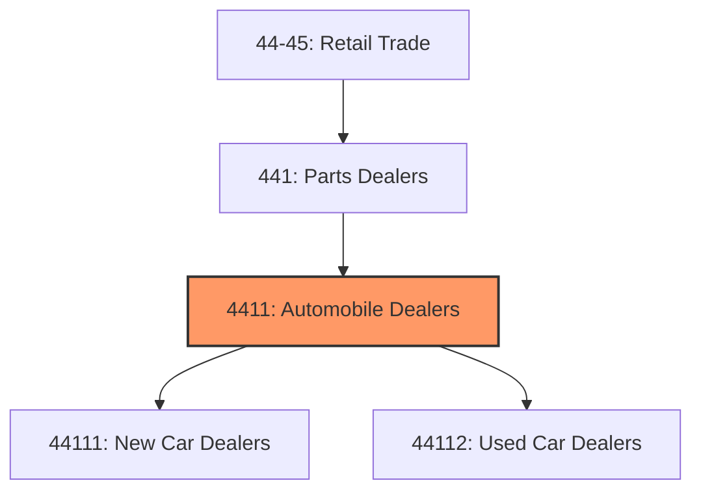
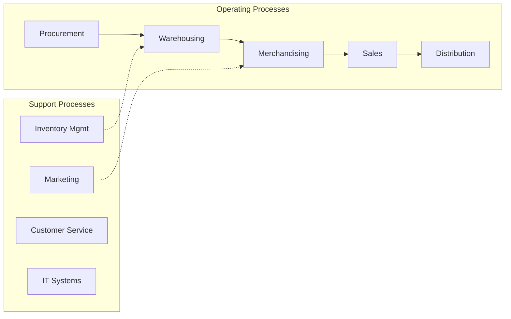

# Automobile Dealers

> This industry group comprises establishments primarily engaged in retailing new and used automobiles and light trucks, such as sport utility vehicles, and passenger and cargo vans.

## Overview

Automobile Dealers represents an important category within the Retail Trade sector (NAICS 44-45). This industry group encompasses establishments primarily engaged in automobile dealers.

This industry group comprises establishments primarily engaged in retailing new and used automobiles and light trucks, such as sport utility vehicles, and passenger and cargo vans.

## Industry Hierarchy

## Key Statistics

| Metric | Value |
|--------|-------|
| NAICS Code | 4411 |
| Level | Industry Group |
| Parent | [Parts Dealers](../) |
| Child Industries | 2 |

## Sub-Industries

| Industry | Code | Description |
|----------|------|-------------|
| [New Car Dealers](./NewCarDealers/) | 44111 | See industry description for 441110 |
| [Used Car Dealers](./UsedCarDealers/) | 44112 | See industry description for 441120 |

## Related Occupations

- [Sales Managers](/occupations/Management/SalesManagers) - Direct sales teams and set goals
- [Retail Salespersons](/occupations/Sales/RetailSalespersons) - Sell merchandise in retail settings
- [Cashiers](/occupations/Sales/Cashiers) - Process customer transactions
- [First-Line Supervisors of Retail Sales Workers](/occupations/Sales/FirstLineSupervisorsOfRetailSalesWorkers) - Supervise retail staff

## Core Business Processes

## Industry Value Chain

```mermaid
graph LR
    subgraph Inputs["Inputs"]
        I1["Products"]
        I2["Inventory"]
        I3["Store/Warehouse"]
    end

    subgraph Primary["Primary Activities"]
        A1["Inbound Logistics"]
        A2["Core Operations"]
        A3["Quality Assurance"]
        A4["Outbound/Delivery"]
    end

    subgraph Outputs["Products/Services"]
        O1["Goods for Sale"]
        O2["Services"]
        O3["Delivery"]
    end

    subgraph Customers["Markets"]
        C1["Businesses"]
        C2["Consumers"]
        C3["Institutions"]
        C4["Government"]
    end

    Inputs --> Primary --> Outputs --> Customers
```

## Regulatory Environment

- **FTC** (Federal Trade Commission) - Enforces consumer protection and truth-in-advertising
- **CPSC** (Consumer Product Safety Commission) - Regulates product safety in retail
- **State Consumer Protection Agencies** - Handle retail licensing and consumer complaints
- **ADA** (Americans with Disabilities Act) - Governs accessibility requirements for retail spaces

## Technology & Innovation

- **E-commerce and Omnichannel** - Unified online/offline shopping experiences and last-mile delivery
- **AI Personalization** - Machine learning product recommendations and dynamic pricing
- **Cashierless Stores** - Computer vision and sensor-based automated checkout
- **Augmented Reality** - Virtual try-on, in-store navigation, and product visualization

## Industry Outlook

The retail sector continues its omnichannel evolution, with seamless integration between physical stores and digital channels becoming essential. AI-driven personalization, last-mile delivery innovation, and experiential retail are key differentiators. Consumer preferences for sustainability and social responsibility are influencing product sourcing and business practices across the industry.

---

*Source: NAICS 4411 - Automobile Dealers*
