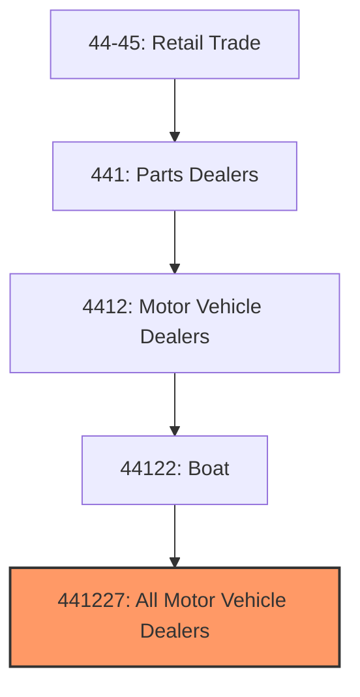
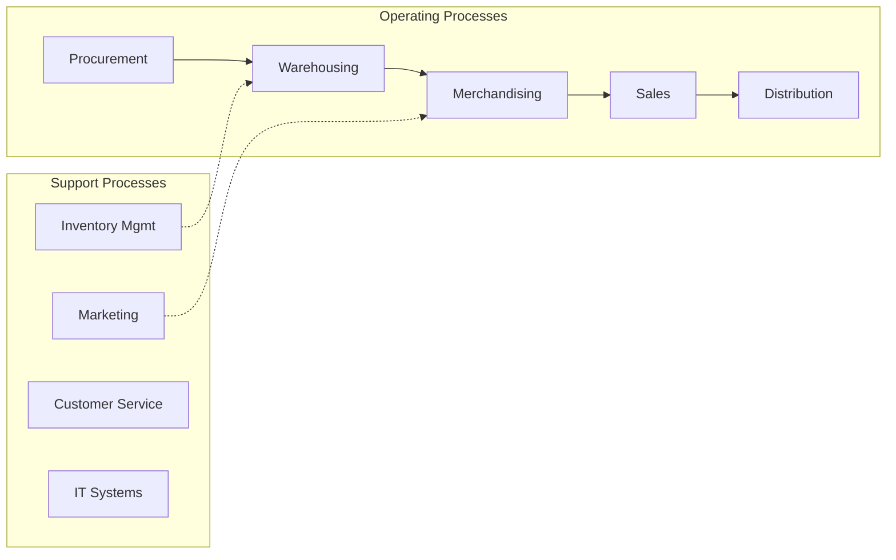

# All Motor Vehicle Dealers

> This U.S. industry comprises establishments primarily engaged in retailing new and/or used motorcycles, motor scooters, motorbikes, mopeds, off-road all-terrain vehicles (ATV), personal watercraft, utility trailers, and other motor vehicles (except automobiles, light trucks, recreational vehicles, and boats) or retailing these new vehicles in combination with activities, such as repair services and selling replacement parts and accessories.
## Overview

All Motor Vehicle Dealers represents a specialized segment within the Retail Trade sector (NAICS 44-45). This national industry encompasses establishments primarily engaged in all motor vehicle dealers.

This U.S. industry comprises establishments primarily engaged in retailing new and/or used motorcycles, motor scooters, motorbikes, mopeds, off-road all-terrain vehicles (ATV), personal watercraft, utility trailers, and other motor vehicles (except automobiles, light trucks, recreational vehicles, and boats) or retailing these new vehicles in combination with activities, such as repair services and selling replacement parts and accessories. Illustrative Examples: All-terrain vehicle (ATV) dealers Motorcycle dealers Moped dealers Motorcycle parts and accessories dealers Personal watercraft dealers Aircraft dealers Snowmobile dealers Powered golf cart dealers Utility trailer dealers Cross-References. Establishments primarily engaged in--

## Industry Hierarchy

## Key Statistics

| Metric | Value |
|--------|-------|
| NAICS Code | 441227 |
| Level | National Industry |
| Parent | [Boat](../) |
| Child Industries | 0 |

## Core Business Processes

## Industry Value Chain

```mermaid
graph LR
    subgraph Inputs["Inputs"]
        I1["Products"]
        I2["Inventory"]
        I3["Store/Warehouse"]
    end

    subgraph Primary["Primary Activities"]
        A1["Inbound Logistics"]
        A2["Core Operations"]
        A3["Quality Assurance"]
        A4["Outbound/Delivery"]
    end

    subgraph Outputs["Products/Services"]
        O1["Goods for Sale"]
        O2["Services"]
        O3["Delivery"]
    end

    subgraph Customers["Markets"]
        C1["Businesses"]
        C2["Consumers"]
        C3["Institutions"]
        C4["Government"]
    end

    Inputs --> Primary --> Outputs --> Customers
```

## Market Context

Retail connects products to consumers through various channels, with omnichannel strategies and e-commerce reshaping traditional retail models.

| Aspect | Details |
|--------|---------|
| Industry Sector | Retail |
| NAICS/SIC Code | 441227 |
| Market Segment | All Motor Vehicle Dealers |

## Key Business Processes

- Merchandising and display
- Sales and customer service
- Inventory management
- Loss prevention
- Omnichannel fulfillment

## Common Occupations

- [Retail Managers](/occupations/Management/SalesManagers)
- [Retail Salespersons](/occupations/Sales/RetailSalespersons)
- [Cashiers](/occupations/Sales/Cashiers)
- [Stock Clerks](/occupations/Sales/StockClerksAndOrderFillers)

## Regulations and Standards

- Consumer protection laws
- Payment Card Industry (PCI) compliance
- Labor and employment regulations
- Product safety standards
- State retail licensing

## Technology and Tools

- Point-of-sale (POS) systems
- Inventory management software
- E-commerce platforms
- Customer relationship management (CRM)
- Mobile payment solutions

## Industry Trends

- Digital transformation and automation adoption
- Sustainability and environmental compliance focus
- Workforce development and skills training
- Supply chain resilience and optimization
- Customer experience enhancement

---

*Source: NAICS 441227 - All Motor Vehicle Dealers*
