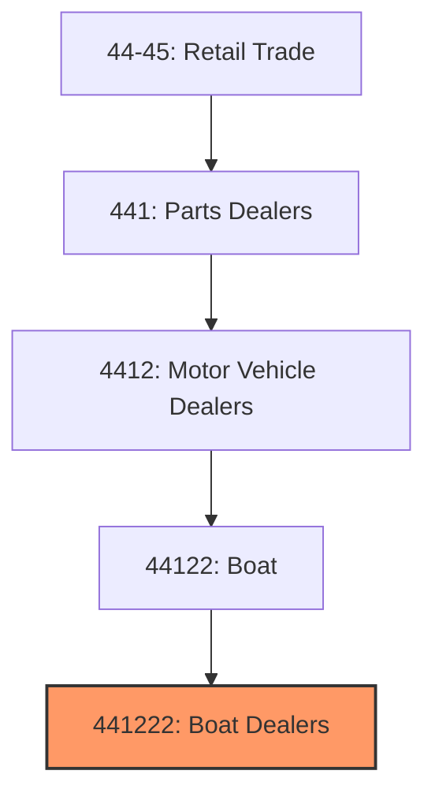
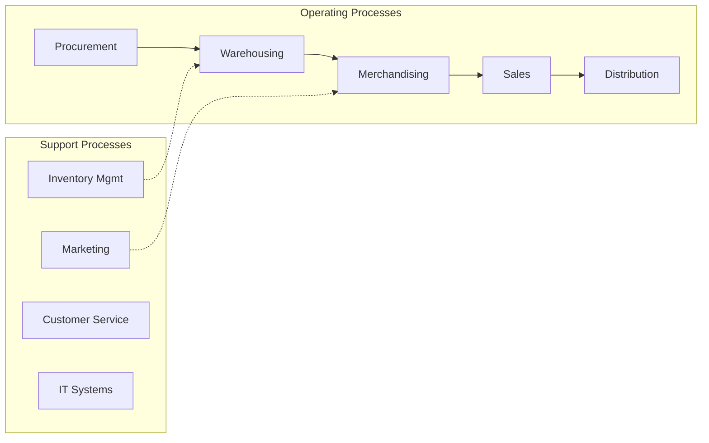

# Boat Dealers

> This U.S. industry comprises establishments primarily engaged in (1) retailing new and/or used boats or retailing new boats in combination with activities, such as repair services and selling replacement parts and accessories, and/or (2) retailing new and/or used outboard motors, boat trailers, marine supplies, parts, and accessories.
## Overview

Boat Dealers represents a specialized segment within the Retail Trade sector (NAICS 44-45). This national industry encompasses establishments primarily engaged in boat dealers.

This U.S. industry comprises establishments primarily engaged in (1) retailing new and/or used boats or retailing new boats in combination with activities, such as repair services and selling replacement parts and accessories, and/or (2) retailing new and/or used outboard motors, boat trailers, marine supplies, parts, and accessories. Illustrative Examples: Boat dealers (e.g., power boats, rowboats, sailboats) Outboard motor dealers Marine supply dealers Cross-References. Establishments primarily engaged in--

## Industry Hierarchy

## Key Statistics

| Metric | Value |
|--------|-------|
| NAICS Code | 441222 |
| Level | National Industry |
| Parent | [Boat](../) |
| Child Industries | 0 |

## Core Business Processes

## Industry Value Chain

```mermaid
graph LR
    subgraph Inputs["Inputs"]
        I1["Products"]
        I2["Inventory"]
        I3["Store/Warehouse"]
    end

    subgraph Primary["Primary Activities"]
        A1["Inbound Logistics"]
        A2["Core Operations"]
        A3["Quality Assurance"]
        A4["Outbound/Delivery"]
    end

    subgraph Outputs["Products/Services"]
        O1["Goods for Sale"]
        O2["Services"]
        O3["Delivery"]
    end

    subgraph Customers["Markets"]
        C1["Businesses"]
        C2["Consumers"]
        C3["Institutions"]
        C4["Government"]
    end

    Inputs --> Primary --> Outputs --> Customers
```

---

*Source: NAICS 441222 - Boat Dealers*
