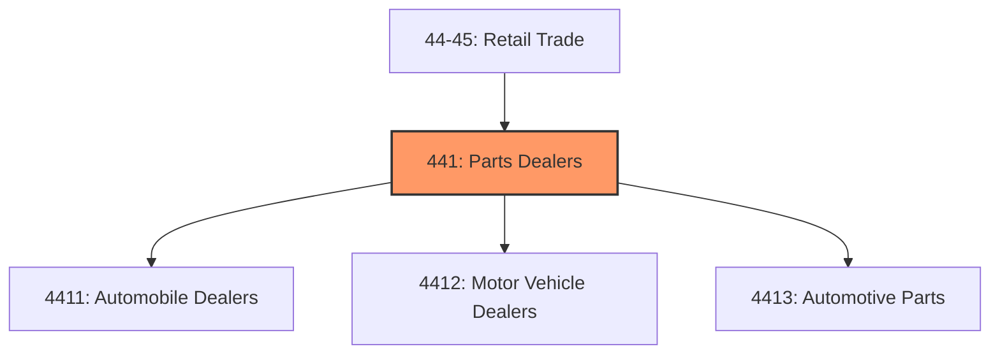
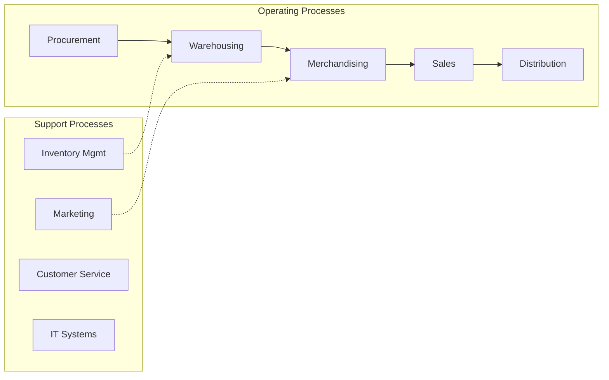

# Parts Dealers

> Industries in the Motor Vehicle and Parts Dealers subsector retail motor vehicles and parts.

## Overview

Parts Dealers represents an important category within the Retail Trade sector (NAICS 44-45). This subsector encompasses establishments primarily engaged in parts dealers.

Industries in the Motor Vehicle and Parts Dealers subsector retail motor vehicles and parts. Establishments in this subsector often operate from a showroom and/or an open lot where the vehicles are on display. The display of vehicles and the related parts require little by way of display equipment. The personnel generally include both the sales and sales support staff familiar with the requirements for registering and financing a vehicle as well as a staff of parts experts and mechanics trained to provide repair and maintenance services for the vehicles. Specific industries included in this subsector identify the type of vehicle being retailed. Sales of capital or durable nonconsumer goods, such as medium- and heavy-duty trucks, are always included in wholesale trade.

## Industry Hierarchy

## Key Statistics

| Metric | Value |
|--------|-------|
| NAICS Code | 441 |
| Level | Subsector |
| Child Industries | 3 |

## Sub-Industries

| Industry | Code | Description |
|----------|------|-------------|
| [Automobile Dealers](./AutomobileDealers/) | 4411 | This industry group comprises establishments primarily engaged in retailing new  |
| [Motor Vehicle Dealers](./MotorVehicleDealers/) | 4412 | This industry group comprises establishments primarily engaged in retailing new  |
| [Automotive Parts](./AutomotiveParts/) | 4413 | This industry group comprises establishments primarily engaged in retailing new, |

## Core Business Processes

## Industry Value Chain

```mermaid
graph LR
    subgraph Inputs["Inputs"]
        I1["Products"]
        I2["Inventory"]
        I3["Store/Warehouse"]
    end

    subgraph Primary["Primary Activities"]
        A1["Inbound Logistics"]
        A2["Core Operations"]
        A3["Quality Assurance"]
        A4["Outbound/Delivery"]
    end

    subgraph Outputs["Products/Services"]
        O1["Goods for Sale"]
        O2["Services"]
        O3["Delivery"]
    end

    subgraph Customers["Markets"]
        C1["Businesses"]
        C2["Consumers"]
        C3["Institutions"]
        C4["Government"]
    end

    Inputs --> Primary --> Outputs --> Customers
```

## Market Context

Retail connects products to consumers through various channels, with omnichannel strategies and e-commerce reshaping traditional retail models.

| Aspect | Details |
|--------|---------|
| Industry Sector | Retail |
| NAICS/SIC Code | 441 |
| Market Segment | Parts Dealers |

## Key Business Processes

- Merchandising and display
- Sales and customer service
- Inventory management
- Loss prevention
- Omnichannel fulfillment

## Common Occupations

- [Retail Managers](/occupations/Management/SalesManagers)
- [Retail Salespersons](/occupations/Sales/RetailSalespersons)
- [Cashiers](/occupations/Sales/Cashiers)
- [Stock Clerks](/occupations/Sales/StockClerksAndOrderFillers)

## Regulations and Standards

- Consumer protection laws
- Payment Card Industry (PCI) compliance
- Labor and employment regulations
- Product safety standards
- State retail licensing

## Technology and Tools

- Point-of-sale (POS) systems
- Inventory management software
- E-commerce platforms
- Customer relationship management (CRM)
- Mobile payment solutions

## Industry Trends

- Digital transformation and automation adoption
- Sustainability and environmental compliance focus
- Workforce development and skills training
- Supply chain resilience and optimization
- Customer experience enhancement

---

*Source: NAICS 441 - Parts Dealers*
