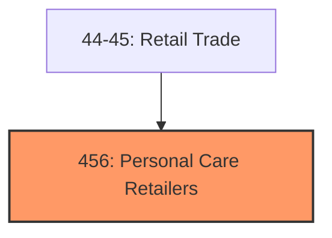
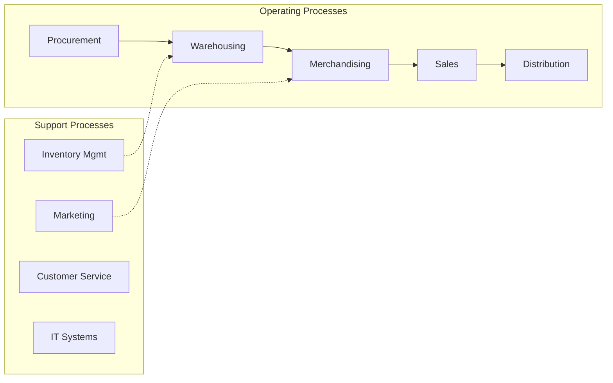

# Personal Care Retailers

> Industries in the Health and Personal Care Retailers subsector retail health and personal care merchandise.

## Overview

Personal Care Retailers represents an important category within the Retail Trade sector (NAICS 44-45). This subsector encompasses establishments primarily engaged in personal care retailers.

Industries in the Health and Personal Care Retailers subsector retail health and personal care merchandise. Establishments in this subsector are characterized principally by the products they retail, and some health and personal care retailers have specialized staff including pharmacists, opticians, and other professionals engaged in retailing, advising customers, and/or fitting the product sold to the customer's needs.

## Industry Hierarchy

## Key Statistics

| Metric | Value |
|--------|-------|
| NAICS Code | 456 |
| Level | Subsector |
| Child Industries | 0 |

## Core Business Processes

## Industry Value Chain

```mermaid
graph LR
    subgraph Inputs["Inputs"]
        I1["Products"]
        I2["Inventory"]
        I3["Store/Warehouse"]
    end

    subgraph Primary["Primary Activities"]
        A1["Inbound Logistics"]
        A2["Core Operations"]
        A3["Quality Assurance"]
        A4["Outbound/Delivery"]
    end

    subgraph Outputs["Products/Services"]
        O1["Goods for Sale"]
        O2["Services"]
        O3["Delivery"]
    end

    subgraph Customers["Markets"]
        C1["Businesses"]
        C2["Consumers"]
        C3["Institutions"]
        C4["Government"]
    end

    Inputs --> Primary --> Outputs --> Customers
```

---

*Source: NAICS 456 - Personal Care Retailers*
