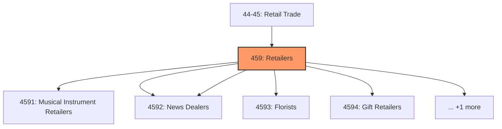
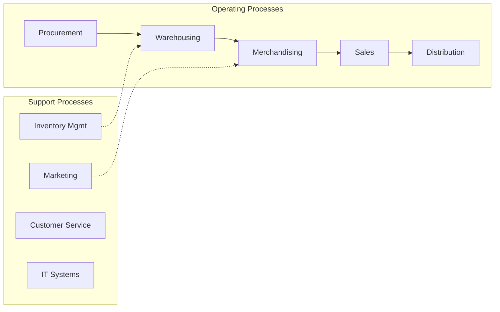

# Retailers

> Industries in the Sporting Goods, Hobby, Musical Instrument, Book, and Miscellaneous Retailers subsector retail new sporting goods; new toys, games, and hobby supplies; new sewing supplies and needlework accessories; new musical instruments; new books, newspapers, magazines, and other periodicals; and other specialized lines of merchandise, such as cut flowers and floral arrangements, new office supplies and stationery, new gifts, novelty merchandise, and souvenirs, used merchandise, pets and pet supplies, art, new or used manufactured (mobile) homes, and tobacco, electronic cigarettes, and other smoking supplies.

## Overview

Retailers represents an important category within the Retail Trade sector (NAICS 44-45).

Industries in the Sporting Goods, Hobby, Musical Instrument, Book, and Miscellaneous Retailers subsector retail new sporting goods; new toys, games, and hobby supplies; new sewing supplies and needlework accessories; new musical instruments; new books, newspapers, magazines, and other periodicals; and other specialized lines of merchandise, such as cut flowers and floral arrangements, new office supplies and stationery, new gifts, novelty merchandise, and souvenirs, used merchandise, pets and pet supplies, art, new or used manufactured (mobile) homes, and tobacco, electronic cigarettes, and other smoking supplies.

## Industry Hierarchy

## Key Statistics

| Metric | Value |
|--------|-------|
| NAICS Code | 459 |
| Level | Subsector |
| Child Industries | 6 |

## Sub-Industries

| Industry | Code | Description |
|----------|------|-------------|
| [Musical Instrument Retailers](./MusicalInstrumentRetailers/) | 4591 | This industry group comprises establishments primarily engaged in retailing new  |
| [Book Retailers](./BookRetailers/) | 4592 | Book Retailers |
| [News Dealers](./NewsDealers/) | 4592 | News Dealers |
| [Florists](./Florists/) | 4593 | Florists |
| [Gift Retailers](./GiftRetailers/) | 4594 | This industry group comprises establishments primarily engaged in retailing new  |
| [Used Merchandise Retailers](./UsedMerchandiseRetailers/) | 4595 | Used Merchandise Retailers |

## Related Occupations

See the [occupations directory](/occupations) for roles commonly found in this industry.

## Core Business Processes

## Industry Value Chain

---

*Source: NAICS 459 - Retailers*
