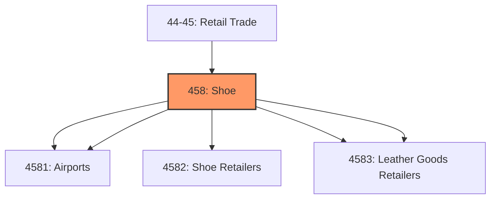
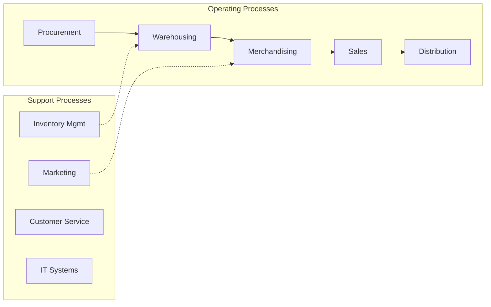

# Shoe

> Industries in the Clothing, Clothing Accessories, Shoe, and Jewelry Retailers subsector retail new clothing, clothing accessories, shoes, jewelry, luggage, and leather goods.

## Overview

Shoe represents an important category within the Retail Trade sector (NAICS 44-45).

Industries in the Clothing, Clothing Accessories, Shoe, and Jewelry Retailers subsector retail new clothing, clothing accessories, shoes, jewelry, luggage, and leather goods.

## Industry Hierarchy

## Key Statistics

| Metric | Value |
|--------|-------|
| NAICS Code | 458 |
| Level | Subsector |
| Child Industries | 4 |

## Sub-Industries

| Industry | Code | Description |
|----------|------|-------------|
| [Clothing Accessories Retailers](./ClothingAccessoriesRetailers/) | 4581 | Clothing Accessories Retailers |
| [Shoe Retailers](./ShoeRetailers/) | 4582 | Shoe Retailers |
| [Luggage](./Luggage/) | 4583 | This industry group comprises establishments primarily engaged in retailing new  |
| [Leather Goods Retailers](./LeatherGoodsRetailers/) | 4583 | This industry group comprises establishments primarily engaged in retailing new  |

## Related Occupations

See the [occupations directory](/occupations) for roles commonly found in this industry.

## Core Business Processes

## Industry Value Chain

```mermaid
graph LR
    subgraph Inputs["Inputs"]
        I1["Products"]
        I2["Inventory"]
        I3["Store/Warehouse"]
    end

    subgraph Primary["Primary Activities"]
        A1["Inbound Logistics"]
        A2["Core Operations"]
        A3["Quality Assurance"]
        A4["Outbound/Delivery"]
    end

    subgraph Outputs["Products/Services"]
        O1["Goods for Sale"]
        O2["Services"]
        O3["Delivery"]
    end

    subgraph Customers["Markets"]
        C1["Businesses"]
        C2["Consumers"]
        C3["Institutions"]
        C4["Government"]
    end

    Inputs --> Primary --> Outputs --> Customers
```

---

*Source: NAICS 458 - Shoe*
