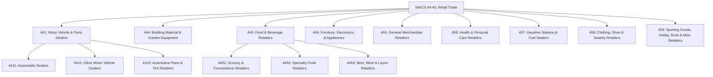
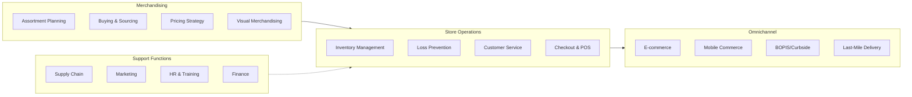
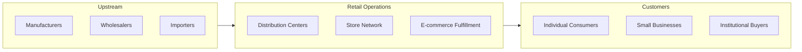
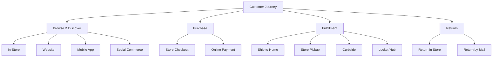

# Retail Trade

> The Retail Trade sector comprises establishments engaged in retailing merchandise, generally without transformation, and rendering services incidental to the sale of merchandise.

## Overview

The Retail Trade sector (NAICS 44-45) is one of the largest economic sectors in the United States, encompassing establishments that sell merchandise to end consumers for personal or household consumption. Retailers are the final link in the distribution chain, connecting manufacturers and wholesalers with consumers.

The retailing process involves organizing and displaying merchandise to attract consumer purchases. Retailers typically operate from stores, but also use direct selling methods (catalogs, TV shopping, internet retailing) and vending machines. The sector is characterized by:

- **Fixed point-of-sale locations** designed for customer traffic
- **Extensive merchandise displays** to encourage consumer browsing
- **Customer service orientation** with sales assistance
- **Omnichannel capabilities** integrating physical and digital commerce

## Industry Hierarchy

## Key Statistics

| Metric | Value |
|--------|-------|
| NAICS Code | 44-45 |
| Level | Sector |
| Subsectors | 9 |
| Industry Groups | 27 |
| National Industries | 60+ |
| Annual Revenue | $7+ trillion |
| Employment | 15+ million |

## Sub-Industries

| Subsector | Code | Description |
|-----------|------|-------------|
| [Motor Vehicle and Parts Dealers](./MotorVehicles/) | 441 | Retailing new and used vehicles and automotive parts |
| [Building Material and Garden Equipment](./BuildingMaterials/) | 444 | Home centers, hardware stores, garden equipment |
| [Food and Beverage Retailers](./FoodAndBeverage/) | 445 | Supermarkets, grocery stores, specialty food |
| [Furniture, Home Furnishings, Electronics](./FurnitureAndElectronics/) | 449 | Furniture, floor coverings, appliances, electronics |
| [General Merchandise Retailers](./GeneralMerchandise/) | 455 | Department stores, warehouse clubs, supercenters |
| [Health and Personal Care Retailers](./HealthAndPersonalCare/) | 456 | Pharmacies, cosmetics, optical goods |
| [Gasoline Stations and Fuel Dealers](./GasolineStations/) | 457 | Fuel retailing with and without convenience stores |
| [Clothing, Shoe, and Jewelry Retailers](./ClothingAndAccessories/) | 458 | Apparel, footwear, jewelry, luggage |
| [Sporting Goods, Hobby, Book, and Misc](./SpecialtyRetail/) | 459 | Sporting goods, toys, books, gifts, pets |

## Related Occupations

- [Retail Salespersons](/occupations/Sales/RetailSalespersons) - Assist customers and process transactions
- [Cashiers](/occupations/Sales/Cashiers) - Handle payments and customer checkout
- [First-Line Supervisors of Retail Sales Workers](/occupations/Sales/FirstLineSupervisorsOfRetailSalesWorkers) - Manage retail operations
- [Stock Clerks and Order Fillers](/occupations/StockClerksAndOrderFillers) - Merchandise handling and inventory
- [Store Managers](/occupations/Management/GeneralAndOperationsManagers) - Overall store operations

## Core Business Processes

### Merchandising and Buying

Selecting, procuring, and presenting merchandise to meet customer demand and drive sales.

**Key Activities:**
- Analyze consumer trends and demand patterns
- Negotiate with suppliers and manage vendor relationships
- Develop pricing and promotional strategies
- Design store layouts and visual displays
- Manage private label and exclusive products

### Store Operations

Managing day-to-day retail store activities to maximize sales and customer satisfaction.

**Key Activities:**
- Staff scheduling and workforce management
- Inventory replenishment and stock management
- Customer service and sales assistance
- Loss prevention and security
- Facility maintenance and housekeeping

### Omnichannel Fulfillment

Integrating physical and digital channels to provide seamless shopping experiences.

**Key Activities:**
- E-commerce platform management
- Buy online, pick up in store (BOPIS)
- Ship-from-store capabilities
- Returns processing across channels
- Unified inventory visibility

## Industry Value Chain

## Retail Formats

| Format | Characteristics | Examples |
|--------|-----------------|----------|
| **Department Stores** | Full-line, organized departments | Macy's, Nordstrom |
| **Discount Stores** | Low prices, broad assortment | Walmart, Target |
| **Warehouse Clubs** | Membership, bulk quantities | Costco, Sam's Club |
| **Specialty Stores** | Focused categories, expertise | Best Buy, Sephora |
| **Convenience Stores** | Limited assortment, quick trips | 7-Eleven, Wawa |
| **Supermarkets** | Full grocery assortment | Kroger, Publix |
| **E-commerce** | Online-only retailers | Amazon, Wayfair |

## Regulatory Environment

Retail operations are subject to numerous federal, state, and local regulations:

- **FTC Regulations**: Truth in advertising, pricing, product labeling
- **Consumer Protection**: Warranties, refunds, credit terms (TILA, Fair Credit)
- **Labor Laws**: Minimum wage, overtime, scheduling laws (varies by state)
- **Product Safety**: CPSC regulations, recalls, age-restricted products
- **Health & Safety**: Food safety (FDA/USDA), ADA compliance, OSHA
- **Privacy**: PCI-DSS for payments, state privacy laws (CCPA, etc.)
- **Environmental**: E-waste, plastic bag restrictions, packaging

Key compliance considerations:
- Sales tax collection and remittance (nexus rules)
- Age verification for alcohol, tobacco, cannabis
- Accessibility requirements (ADA)
- Data breach notification requirements

## Technology & Innovation

The retail industry is experiencing rapid digital transformation:

- **Unified Commerce**: Integrated systems across channels for seamless customer experience
- **AI/ML Applications**: Demand forecasting, personalization, chatbots, dynamic pricing
- **Checkout Innovation**: Self-checkout, scan-and-go, cashierless stores
- **Supply Chain Tech**: RFID tracking, automated warehouses, predictive analytics
- **Customer Experience**: AR/VR try-on, mobile apps, loyalty platforms
- **Payments**: Contactless, digital wallets, BNPL (buy now pay later)
- **Sustainability**: Carbon tracking, circular economy initiatives, ethical sourcing

## Omnichannel Strategies

## Related Industries

- [Wholesale Trade](/industries/Wholesale/) - Upstream suppliers and distributors
- [Transportation and Warehousing](/industries/Transportation/) - Logistics and fulfillment
- [Information Technology](/industries/Information/) - E-commerce platforms and systems
- [Real Estate](/industries/RealEstate/) - Retail property and leasing

---

*Source: NAICS 44-45 - Retail Trade*
