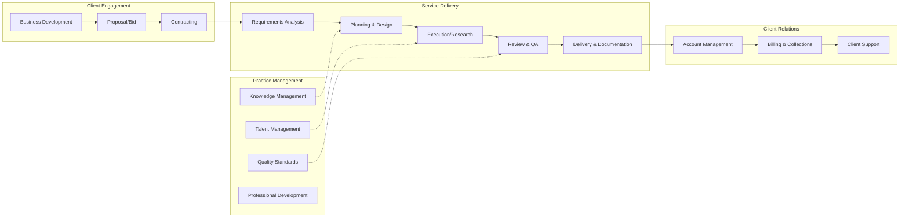
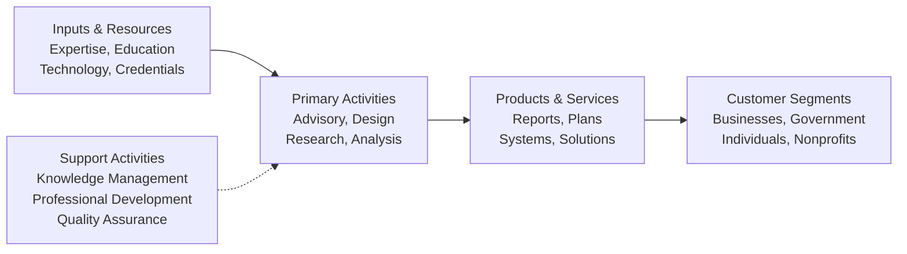

# Professional, Scientific, and Technical Services

> The Professional, Scientific, and Technical Services sector comprises establishments that specialize in performing professional, scientific, and technical activities for others. These activities require a high degree of expertise and training.

## Overview

This sector encompasses establishments that specialize according to their expertise and provide specialized services to clients across a wide variety of industries and, in some cases, to households. The defining characteristic is that they require a high degree of specialized knowledge, expertise, and formal training.

Activities performed within this sector include:

- **Legal Services**: Legal advice, representation, and title services
- **Accounting and Tax Services**: Auditing, bookkeeping, payroll, and tax preparation
- **Architectural and Engineering Services**: Design, planning, surveying, and testing
- **Computer Systems Design**: Custom programming, systems integration, and IT consulting
- **Management Consulting**: Strategic, operational, and technical advisory services
- **Research and Development**: Scientific and technological research across disciplines
- **Advertising and Marketing**: Campaign development, media buying, and market research
- **Specialized Design**: Industrial, interior, and graphic design
- **Other Professional Services**: Photography, translation, veterinary services

This sector excludes establishments providing day-to-day office administrative services such as financial planning, billing, recordkeeping, personnel supply, and logistics, which are classified in Sector 56 (Administrative and Support Services).

## Industry Hierarchy

```mermaid
graph TD
    S54["NAICS 54: Professional, Scientific, and Technical Services"]
    S54 --> SS5411["5411: Legal Services"]
    S54 --> SS5412["5412: Accounting, Tax, Bookkeeping, Payroll"]
    S54 --> SS5413["5413: Architectural, Engineering, Related"]
    S54 --> SS5414["5414: Specialized Design Services"]
    S54 --> SS5415["5415: Computer Systems Design"]
    S54 --> SS5416["5416: Management, Scientific, Technical Consulting"]
    S54 --> SS5417["5417: Scientific R&D Services"]
    S54 --> SS5418["5418: Advertising, Public Relations"]
    S54 --> SS5419["5419: Other Professional, Scientific, Technical"]

    SS5411 --> I54111["54111: Offices of Lawyers"]
    SS5411 --> I54112["54112: Offices of Notaries"]
    SS5411 --> I54119["54119: Title Abstract and Settlement"]

    SS5413 --> I54131["54131: Architectural Services"]
    SS5413 --> I54132["54132: Landscape Architectural Services"]
    SS5413 --> I54133["54133: Engineering Services"]
    SS5413 --> I54134["54134: Drafting Services"]
    SS5413 --> I54138["54138: Testing Laboratories"]

    SS5415 --> I541511["541511: Custom Computer Programming"]
    SS5415 --> I541512["541512: Computer Systems Design"]
    SS5415 --> I541513["541513: Computer Facilities Management"]
    SS5415 --> I541519["541519: Other Computer Related"]

    SS5416 --> I54161["54161: Management Consulting"]
    SS5416 --> I54162["54162: Environmental Consulting"]

    SS5417 --> I54171["54171: R&D in Physical, Engineering, Life Sciences"]
    SS5417 --> I54172["54172: R&D in Social Sciences and Humanities"]
```

## Key Statistics

| Metric | Value |
|--------|-------|
| NAICS Code | 54 |
| Level | Sector |
| Subsectors | 9 |
| Industry Groups | 35+ |
| Industries | 60+ |

## Sub-Industries

| Subsector | Code | Description |
|-----------|------|-------------|
| Legal Services | 5411 | Offices of lawyers, notaries, and title and settlement services |
| Accounting, Tax Preparation, Bookkeeping, Payroll | 5412 | CPA offices, tax preparers, bookkeeping, and payroll processing |
| Architectural, Engineering, and Related Services | 5413 | Architecture, engineering, drafting, surveying, and testing labs |
| Specialized Design Services | 5414 | Interior, industrial, and graphic design services |
| Computer Systems Design and Related Services | 5415 | Custom programming, systems integration, and IT services |
| Management, Scientific, and Technical Consulting | 5416 | Management, environmental, and technical advisory services |
| Scientific Research and Development Services | 5417 | Basic and applied research in physical, life, and social sciences |
| Advertising, Public Relations, and Related Services | 5418 | Advertising agencies, PR firms, media buying, and marketing services |
| Other Professional, Scientific, and Technical Services | 5419 | Market research, photography, translation, and veterinary services |

## Related Occupations

- [Lawyers](/occupations/Legal/Lawyers) - Legal representation and advisory
- [Accountants and Auditors](/occupations/Business/Financial/AccountantsAndAuditors) - Financial statement preparation and audit
- [Architects](/occupations/Architecture/Architects) - Building and landscape design
- [Civil Engineers](/occupations/Architecture/CivilEngineers) - Infrastructure design and planning
- [Software Developers](/occupations/Technology/SoftwareDevelopers) - Application and systems development
- [Management Analysts](/occupations/Business/Operations/ManagementAnalysts) - Business process improvement
- [Market Research Analysts](/occupations/MarketResearchAnalysts) - Market analysis and forecasting
- [Graphic Designers](/occupations/ArtsMedia/GraphicDesigners) - Visual communication design
- [Veterinarians](/occupations/HealthcarePractitioners/Veterinarians) - Animal health services
- [Biochemists](/occupations/Science/Biochemists) - Life sciences research

## Core Business Processes

### Client Engagement and Business Development

Acquiring and securing professional engagements through marketing, proposal development, and contract negotiation.

**Key Activities:**
- Identify and qualify prospective clients
- Develop proposals and respond to RFPs
- Negotiate engagement terms and scope
- Establish fee structures and payment terms
- Manage conflicts of interest screening

### Professional Service Delivery

Executing specialized services according to professional standards and client requirements.

**Key Activities:**
- Gather requirements and define scope
- Develop work plans and methodologies
- Apply specialized expertise and knowledge
- Perform quality reviews and validations
- Document findings and deliverables
- Present results and recommendations

### Knowledge and Practice Management

Maintaining and developing the intellectual capital and professional capabilities of the firm.

**Key Activities:**
- Recruit and retain expert talent
- Develop training and certification programs
- Maintain knowledge repositories and best practices
- Ensure compliance with professional standards
- Foster innovation and methodology development

## Industry Value Chain

## Service Delivery Models

### Project-Based Services
Discrete engagements with defined scope, timeline, and deliverables. Common in consulting, engineering, and design services. Typically fixed-fee or time-and-materials billing.

### Retainer and Ongoing Services
Continuous service relationships with recurring fees. Common in legal, accounting, and IT managed services. Provides predictable revenue and deeper client relationships.

### Research and Development
Systematic investigation to generate new knowledge or applications. May be contract research for clients or proprietary research programs. Common in life sciences and technology sectors.

### Contingency and Success-Based Services
Compensation tied to outcomes or results achieved. Common in legal (contingency fees) and some consulting arrangements.

## Regulatory Environment

Professional services operate under significant regulatory oversight and professional standards:

- **State Licensing Boards**: Professional licensing for lawyers, CPAs, architects, engineers, and veterinarians
- **Bar Associations**: Legal profession ethics and discipline
- **AICPA/PCAOB**: Accounting standards and auditor oversight
- **State Boards of Architecture/Engineering**: Design professional licensing
- **Professional Ethics Standards**: Codes of conduct and conflict rules
- **Data Protection**: HIPAA, privacy regulations for client data
- **Export Controls**: ITAR/EAR for technical services with national security implications
- **FTC and State AG**: Advertising and marketing regulations

### Liability and Insurance
Professional liability insurance (errors and omissions) is typically required or strongly recommended for licensed professionals to protect against claims of negligence or inadequate service.

## Technology & Innovation

The professional services sector is experiencing significant transformation through technology:

- **Cloud-Based Practice Management**: Integrated systems for client management, billing, and document management
- **Legal Tech**: E-discovery, contract analytics, legal research AI, and document automation
- **Accounting Technology**: Cloud accounting platforms, automated audit procedures, and blockchain verification
- **BIM and CAD**: Building information modeling, 3D design, and virtual reality visualization
- **AI and Machine Learning**: Predictive analytics, pattern recognition, and automated research
- **Collaboration Platforms**: Remote work enablement, virtual meetings, and document sharing
- **Data Analytics**: Business intelligence, data visualization, and decision support
- **Cybersecurity**: Protection of confidential client information and intellectual property
- **Automation**: Robotic process automation for routine professional tasks

## Market Dynamics

### Competitive Landscape
The sector ranges from solo practitioners to global professional services firms. Competition is based on expertise, reputation, industry specialization, and client relationships.

### Talent and Human Capital
Success depends heavily on attracting and retaining skilled professionals. Firms compete for talent through compensation, career development, culture, and work-life balance.

### Fee Pressure and Value Demonstration
Increasing client sophistication and procurement processes create pressure on fees and demand for demonstrated value and measurable outcomes.

### Specialization Trends
Growing complexity drives specialization by industry vertical, technical discipline, or client segment. Boutique firms compete effectively with generalists in specialized niches.

---

*Source: NAICS 54 - Professional, Scientific, and Technical Services*
