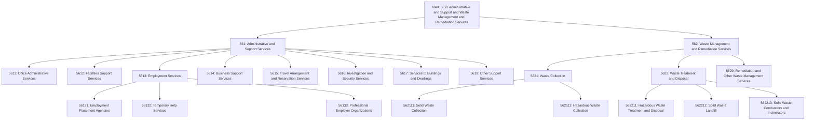
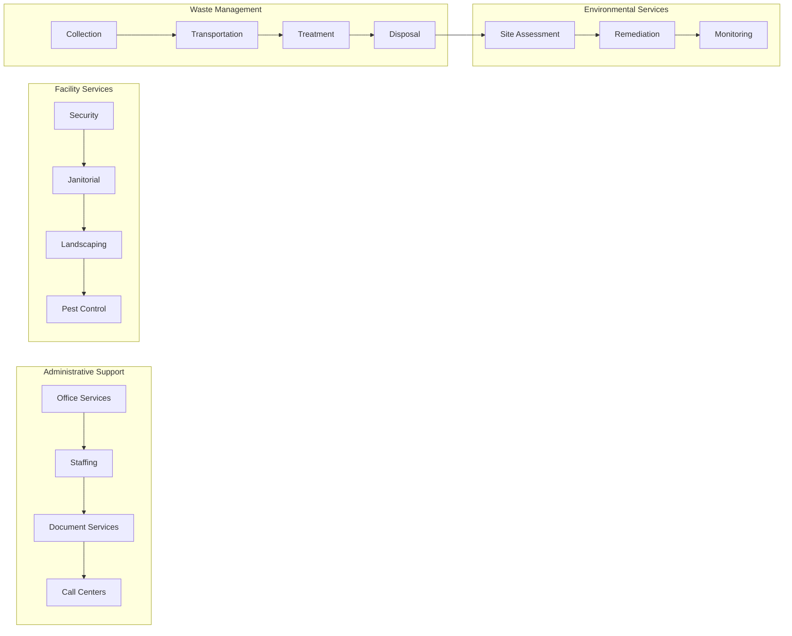
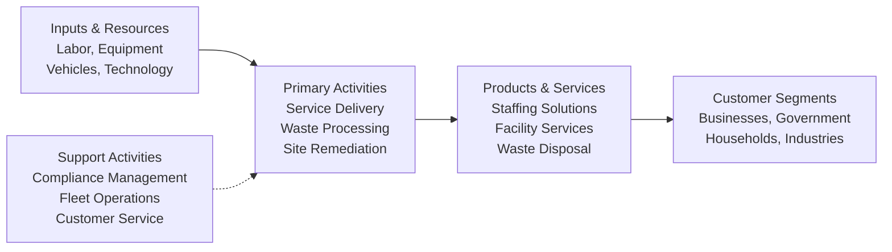

# Administrative and Support and Waste Management and Remediation Services

> The Administrative and Support and Waste Management and Remediation Services sector comprises establishments performing routine support activities for the day-to-day operations of other organizations, including office administration, hiring and placing personnel, document preparation, security services, cleaning, and waste disposal services.

## Overview

This sector encompasses establishments that specialize in performing essential support activities that are often undertaken in-house by organizations across all industries. By specializing in these functions, establishments in this sector can provide services more efficiently to clients in a variety of industries and, in some cases, to households.

Activities performed include: office administration, hiring and placing of personnel, document preparation and clerical services, solicitation, collection, security and surveillance services, cleaning, and waste disposal services. The administrative and management activities in this sector are typically performed on a contract or fee basis.

The sector combines two distinct but complementary areas: (1) Administrative and Support Services (Subsector 561) providing business support functions, and (2) Waste Management and Remediation Services (Subsector 562) providing environmental services including waste collection, treatment, disposal, and site remediation.

## Industry Hierarchy

## Key Statistics

| Metric | Value |
|--------|-------|
| NAICS Code | 56 |
| Level | Sector |
| Subsectors | 2 |
| Industry Groups | 11 |
| Industries | 30+ |

## Sub-Industries

| Subsector | Code | Description |
|-----------|------|-------------|
| [Administrative and Support Services](../Administrative/) | 561 | Office administration, employment services, business support, travel arrangement, security services, and services to buildings |
| Waste Management and Remediation Services | 562 | Waste collection, treatment, disposal, remediation, and environmental cleanup services |

## Related Occupations

- [Office and Administrative Support Workers](/occupations/Administrative/OfficeAndAdministrativeSupportWorkers) - General office support functions
- [Human Resources Specialists](/occupations/Business/Operations/HumanResourcesSpecialists) - Recruitment and staffing
- [Security Guards](/occupations/PublicSafety/SecurityGuards) - Protection and surveillance services
- [Janitors and Cleaners](/occupations/JanitorsAndCleaners) - Building maintenance and cleaning
- [Landscaping Workers](/occupations/LandscapingWorkers) - Grounds maintenance services
- [Refuse and Recyclable Material Collectors](/occupations/RefuseCollectors) - Waste collection operations
- [Hazardous Materials Removal Workers](/occupations/HazmatWorkers) - Environmental remediation
- [Travel Agents](/occupations/Sales/TravelAgents) - Travel arrangement services

## Core Business Processes

### Administrative and Support Services

Providing specialized business support functions that organizations often outsource to achieve efficiency and cost savings.

**Key Activities:**
- Provide office administrative and clerical services
- Recruit, screen, and place personnel
- Operate call centers and telemarketing services
- Deliver document preparation and copying services
- Arrange travel and reservations

### Facility and Building Services

Managing the physical environment of buildings and grounds through specialized service delivery.

**Key Activities:**
- Provide security guard and patrol services
- Deliver janitorial and cleaning services
- Maintain landscaping and grounds
- Perform pest control and extermination
- Install and monitor security systems

### Employment Services

Connecting workers with employers through various staffing models including temporary, permanent, and professional employer arrangements.

**Key Activities:**
- Operate employment placement agencies
- Provide temporary staffing services
- Deliver executive search and recruitment
- Manage professional employer organizations (PEOs)
- Administer payroll and HR functions for clients

### Waste Management and Remediation

Collecting, treating, and disposing of waste materials while protecting environmental and public health.

**Key Activities:**
- Collect solid and hazardous waste
- Operate transfer stations and landfills
- Treat and dispose of hazardous materials
- Remediate contaminated sites
- Recover and recycle materials

## Industry Value Chain

## Administrative and Support Services Detail

### Office Administrative Services (5611)

Providing a range of day-to-day office administrative services including financial planning, billing and recordkeeping, personnel, and physical distribution and logistics.

### Facilities Support Services (5612)

Providing operating staff to perform a combination of support services within client facilities.

### Employment Services (5613)

| Service Type | Description |
|--------------|-------------|
| Employment Placement Agencies | Listing vacancies and placing applicants |
| Temporary Help Services | Supplying workers on a temporary basis |
| Professional Employer Organizations | Providing HR management and payroll services |
| Executive Search Services | Recruiting senior-level professionals |

### Business Support Services (5614)

| Service Type | Description |
|--------------|-------------|
| Document Preparation | Typing, word processing, editing services |
| Telephone Call Centers | Answering services and telemarketing |
| Business Service Centers | Copy shops, mailbox rental, mailing services |
| Collection Agencies | Debt collection services |
| Credit Bureaus | Credit reporting and scoring |

### Travel Arrangement Services (5615)

Arranging transportation, accommodations, and tours for travelers.

### Investigation and Security Services (5616)

| Service Type | Description |
|--------------|-------------|
| Investigation Services | Private detective and background check services |
| Security Guard Services | Guard and patrol services |
| Armored Car Services | Secure transportation of valuables |
| Security Systems Services | Alarm installation and monitoring |
| Locksmiths | Lock installation and repair |

### Services to Buildings and Dwellings (5617)

| Service Type | Description |
|--------------|-------------|
| Exterminating and Pest Control | Pest elimination services |
| Janitorial Services | Building cleaning and maintenance |
| Landscaping Services | Grounds care and maintenance |
| Carpet and Upholstery Cleaning | Specialized cleaning services |

## Waste Management Services Detail

### Waste Collection (5621)

| Service Type | Description |
|--------------|-------------|
| Solid Waste Collection | Collecting nonhazardous solid waste (garbage) |
| Hazardous Waste Collection | Collecting and hauling hazardous materials |
| Recyclable Materials Collection | Collecting mixed recyclables |

### Waste Treatment and Disposal (5622)

| Service Type | Description |
|--------------|-------------|
| Hazardous Waste Treatment | Operating hazardous waste treatment facilities |
| Solid Waste Landfill | Operating nonhazardous waste landfills |
| Solid Waste Combustors | Operating waste incinerators |
| Other Waste Treatment | Operating other treatment facilities |

### Remediation and Other Services (5629)

| Service Type | Description |
|--------------|-------------|
| Remediation Services | Environmental cleanup of contaminated sites |
| Materials Recovery Facilities | Sorting and processing recyclables |
| Septic Tank Services | Septic pumping and portable toilet services |
| Other Waste Management | Specialized waste handling services |

## Regulatory Environment

This sector operates under extensive regulatory oversight:

- **Occupational Safety and Health Administration (OSHA)**: Workplace safety for all subsectors
- **Environmental Protection Agency (EPA)**: Waste management, hazardous materials, and remediation
- **Resource Conservation and Recovery Act (RCRA)**: Hazardous and solid waste management
- **Comprehensive Environmental Response, Compensation, and Liability Act (CERCLA)**: Superfund site remediation
- **State Environmental Agencies**: State-specific waste and environmental regulations
- **Department of Labor**: Employment and staffing regulations
- **State Licensing Boards**: Security, private investigation, and contractor licensing

### Key Regulatory Considerations

- Hazardous waste handling, storage, and disposal permits
- Landfill siting, operation, and closure requirements
- Security guard licensing and training requirements
- Employment agency bonding and licensing
- Background check and privacy regulations
- Environmental remediation standards and cleanup levels

## Technology & Innovation

The sector is embracing technological advancement across all service areas:

- **Workforce Management**: Digital scheduling, time tracking, and deployment optimization
- **Smart Buildings**: IoT sensors for facility monitoring and predictive maintenance
- **Waste Technology**: Smart bins, route optimization, and recycling automation
- **Security Technology**: Video analytics, access control systems, and remote monitoring
- **Environmental Monitoring**: Real-time contamination detection and remediation tracking
- **Mobile Applications**: Field service management and customer communication
- **Robotics**: Autonomous cleaning equipment and waste sorting systems
- **Data Analytics**: Predictive analytics for staffing needs and service optimization

## Sector Distinctions

### Distinguished from Management of Companies (Sector 55)

Establishments involved in administering, overseeing, and managing other establishments of the company or enterprise are classified in Sector 55, Management of Companies and Enterprises. Sector 55 establishments normally undertake the strategic and organizational planning and decision-making role of the company.

### Distinguished from Public Administration (Sector 92)

Government establishments engaged in administering, overseeing, and managing governmental programs are classified in Sector 92, Public Administration.

### Key Characteristic

Establishments in this sector perform routine support activities on a **contract or fee basis**, serving multiple clients across various industries rather than being part of the company or enterprise whose activities they support.

---

*Source: NAICS 56 - Administrative and Support and Waste Management and Remediation Services*
