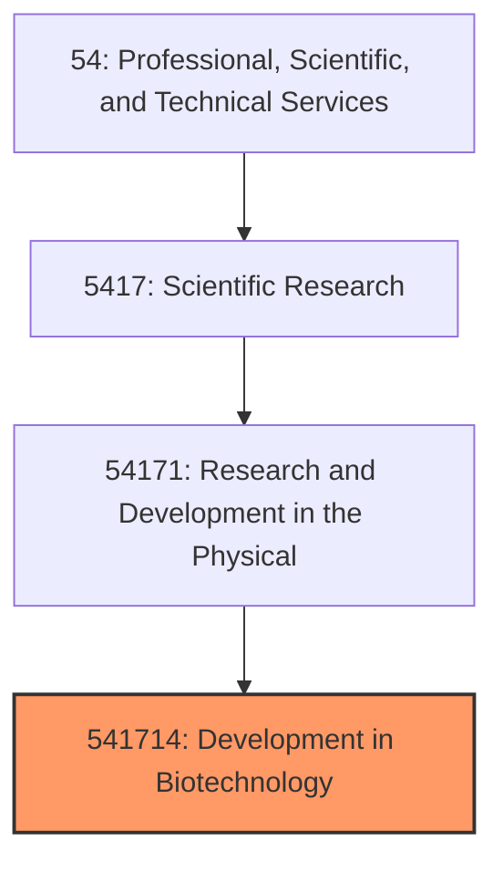
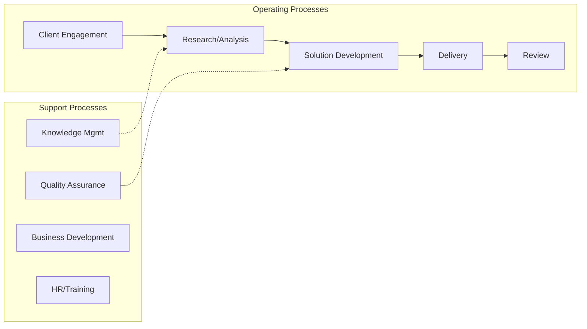

# Development in Biotechnology

> This U.

## Overview

Development in Biotechnology represents a specialized segment within the Professional, Scientific, and Technical Services sector (NAICS 54).

This U.S. industry comprises establishments primarily engaged in conducting biotechnology (except nanobiotechnology) research and experimental development. Biotechnology (except nanobiotechnology) research and experimental development involves the study of the use of microorganisms and cellular and biomolecular processes to develop or alter living or non-living materials. This research and development in biotechnology (except nanobiotechnology) may result in development of new biotechnology (except nanobiotechnology) processes or in prototypes of new or genetically-altered products that may be reproduced, utilized, or implemented by various industries. Illustrative Examples: Cloning research and experimental development laboratories DNA technologies (e.g., microarrays) research and experimental development laboratories Nucleic acid chemistry research and experimental development laboratories Protein engineering research and experimental development laboratories Recombinant DNA research and experimental development laboratories Cross-References. Establishments primarily engaged in--

## Industry Hierarchy

## Key Statistics

| Metric | Value |
|--------|-------|
| NAICS Code | 541714 |
| Level | National Industry |
| Parent | [Research and Development in the Physical](../) |
| Child Industries | 0 |

## Related Occupations

See the [occupations directory](/occupations) for roles commonly found in this industry.

## Core Business Processes

## Industry Value Chain

## Market Context

Manufacturing transforms raw materials into finished goods, with Industry 4.0 driving automation, digitalization, and smart factory implementations.

| Aspect | Details |
|--------|---------|
| Industry Sector | TechnicalServices |
| NAICS/SIC Code | 541714 |
| Market Segment | Development in Biotechnology |

## Key Business Processes

- Production planning
- Manufacturing operations
- Quality assurance
- Inventory management
- Distribution and logistics

## Common Occupations

- [Industrial Production Managers](/occupations/Management/IndustrialProductionManagers)
- [Production Workers](/occupations/Production/ProductionWorkers)
- [Quality Control Inspectors](/occupations/Production/QualityControlInspectors)
- [Industrial Engineers](/occupations/Engineering/IndustrialEngineers)

## Regulations and Standards

- OSHA Manufacturing Standards
- EPA Environmental Regulations
- FDA regulations (where applicable)
- ISO quality standards
- Industry-specific certifications

## Technology and Tools

- Industrial automation and robotics
- Enterprise Resource Planning (ERP)
- Quality management systems
- Predictive maintenance
- IoT and smart manufacturing

## Industry Trends

- Digital transformation and automation adoption
- Sustainability and environmental compliance focus
- Workforce development and skills training
- Supply chain resilience and optimization
- Customer experience enhancement

---

*Source: NAICS 541714 - Development in Biotechnology*
