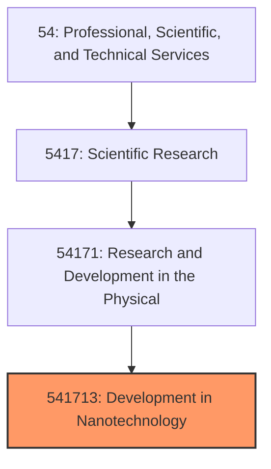
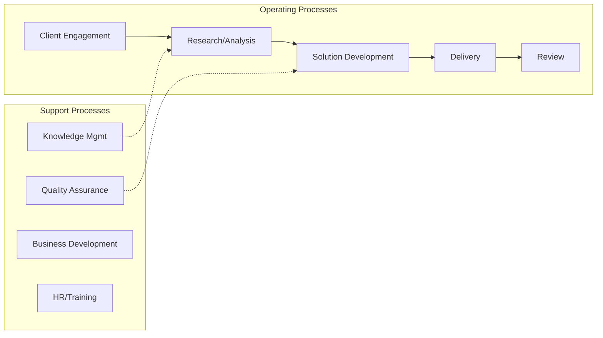

# Development in Nanotechnology

> This U.

## Overview

Development in Nanotechnology represents a specialized segment within the Professional, Scientific, and Technical Services sector (NAICS 54).

This U.S. industry comprises establishments primarily engaged in conducting nanotechnology research and experimental development. Nanotechnology research and experimental development involves the study of matter at the nanoscale (i.e., a scale of about 1 to 100 nanometers). This research and development in nanotechnology may result in development of new nanotechnology processes or in prototypes of new or altered materials and/or products that may be reproduced, utilized, or implemented by various industries. Cross-References. Establishments primarily engaged in--

## Industry Hierarchy

## Key Statistics

| Metric | Value |
|--------|-------|
| NAICS Code | 541713 |
| Level | National Industry |
| Parent | [Research and Development in the Physical](../) |
| Child Industries | 0 |

## Related Occupations

See the [occupations directory](/occupations) for roles commonly found in this industry.

## Core Business Processes

## Industry Value Chain

```mermaid
graph LR
    subgraph Inputs["Inputs"]
        I1["Resources"]
        I2["Expertise"]
        I3["Technology"]
    end

    subgraph Primary["Primary Activities"]
        A1["Inbound Logistics"]
        A2["Core Operations"]
        A3["Quality Assurance"]
        A4["Outbound/Delivery"]
    end

    subgraph Outputs["Products/Services"]
        O1["Products"]
        O2["Services"]
        O3["Solutions"]
    end

    subgraph Customers["Markets"]
        C1["Businesses"]
        C2["Consumers"]
        C3["Government"]
        C4["Institutions"]
    end

    Inputs --> Primary --> Outputs --> Customers
```

---

*Source: NAICS 541713 - Development in Nanotechnology*
