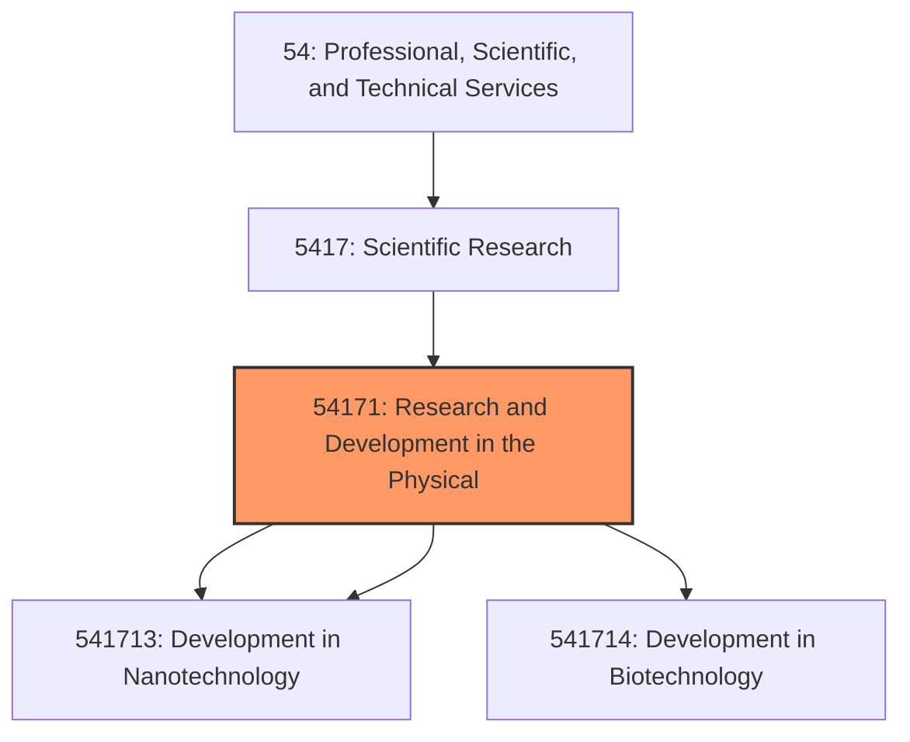
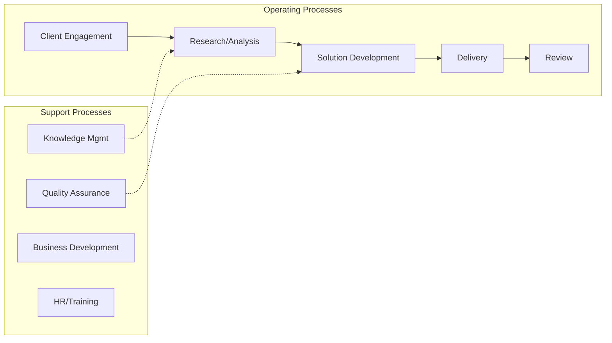

# Research and Development in the Physical

> This industry comprises establishments primarily engaged in conducting research and experimental development in the physical, engineering, and life sciences, such as agriculture, electronics, environmental, biology, botany, biotechnology, computers, chemistry, food, fisheries, forests, geology, health, mathematics, medicine, nanotechnology, oceanography, pharmacy, physics, veterinary, and other allied subjects.

## Overview

Research and Development in the Physical represents an important category within the Professional, Scientific, and Technical Services sector (NAICS 54).

This industry comprises establishments primarily engaged in conducting research and experimental development in the physical, engineering, and life sciences, such as agriculture, electronics, environmental, biology, botany, biotechnology, computers, chemistry, food, fisheries, forests, geology, health, mathematics, medicine, nanotechnology, oceanography, pharmacy, physics, veterinary, and other allied subjects. Cross-References. Establishments primarily engaged in--

## Industry Hierarchy

## Key Statistics

| Metric | Value |
|--------|-------|
| NAICS Code | 54171 |
| Level | Industry |
| Parent | [Scientific Research](../) |
| Child Industries | 3 |

## Sub-Industries

| Industry | Code | Description |
|----------|------|-------------|
| [Research](./Research.mdx) | 541713 | This U |
| [Development in Nanotechnology](./DevelopmentInNanotechnology.mdx) | 541713 | This U |
| [Development in Biotechnology](./DevelopmentInBiotechnology.mdx) | 541714 | This U |

## Related Occupations

See the [occupations directory](/occupations) for roles commonly found in this industry.

## Core Business Processes

## Industry Value Chain

## Market Context

Manufacturing transforms raw materials into finished goods, with Industry 4.0 driving automation, digitalization, and smart factory implementations.

| Aspect | Details |
|--------|---------|
| Industry Sector | TechnicalServices |
| NAICS/SIC Code | 54171 |
| Market Segment | Research and Development in the Physical |

## Key Business Processes

- Production planning
- Manufacturing operations
- Quality assurance
- Inventory management
- Distribution and logistics

## Common Occupations

- [Industrial Production Managers](/occupations/Management/IndustrialProductionManagers)
- [Production Workers](/occupations/Production/ProductionWorkers)
- [Quality Control Inspectors](/occupations/Production/QualityControlInspectors)
- [Industrial Engineers](/occupations/Engineering/IndustrialEngineers)

## Regulations and Standards

- OSHA Manufacturing Standards
- EPA Environmental Regulations
- FDA regulations (where applicable)
- ISO quality standards
- Industry-specific certifications

## Technology and Tools

- Industrial automation and robotics
- Enterprise Resource Planning (ERP)
- Quality management systems
- Predictive maintenance
- IoT and smart manufacturing

## Industry Trends

- Digital transformation and automation adoption
- Sustainability and environmental compliance focus
- Workforce development and skills training
- Supply chain resilience and optimization
- Customer experience enhancement

---

*Source: NAICS 54171 - Research and Development in the Physical*
