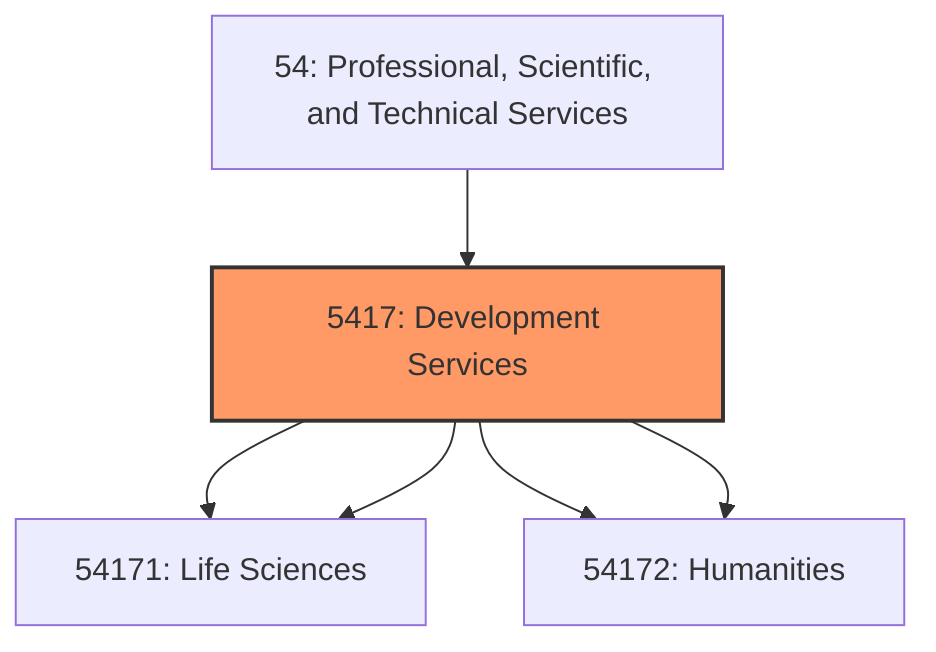
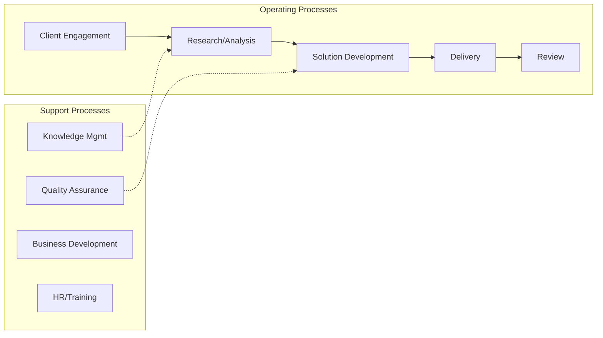

# Development Services

> This industry group comprises establishments engaged in conducting original investigation undertaken on a systematic basis to gain new knowledge (research) and/or the application of research findings or other scientific knowledge for the creation of new or significantly improved products or processes (experimental development).

## Overview

Development Services represents an important category within the Professional, Scientific, and Technical Services sector (NAICS 54).

This industry group comprises establishments engaged in conducting original investigation undertaken on a systematic basis to gain new knowledge (research) and/or the application of research findings or other scientific knowledge for the creation of new or significantly improved products or processes (experimental development). Techniques may include modeling and simulation. The industries within this industry group are defined on the basis of the domain of research; that is, on the scientific expertise of the establishment.

## Industry Hierarchy

## Key Statistics

| Metric | Value |
|--------|-------|
| NAICS Code | 5417 |
| Level | Industry Group |
| Child Industries | 4 |

## Sub-Industries

| Industry | Code | Description |
|----------|------|-------------|
| [Research and Development in the Physical](./ResearchAndDevelopmentInThePhysical/) | 54171 | This industry comprises establishments primarily engaged in conducting research  |
| [Life Sciences](./LifeSciences/) | 54171 | This industry comprises establishments primarily engaged in conducting research  |
| [Development in the Social Sciences](./DevelopmentInTheSocialSciences/) | 54172 | See industry description for 541720 |
| [Humanities](./Humanities/) | 54172 | See industry description for 541720 |

## Related Occupations

See the [occupations directory](/occupations) for roles commonly found in this industry.

## Core Business Processes

## Industry Value Chain

## Market Context

Manufacturing transforms raw materials into finished goods, with Industry 4.0 driving automation, digitalization, and smart factory implementations.

| Aspect | Details |
|--------|---------|
| Industry Sector | TechnicalServices |
| NAICS/SIC Code | 5417 |
| Market Segment | Development Services |

## Key Business Processes

- Production planning
- Manufacturing operations
- Quality assurance
- Inventory management
- Distribution and logistics

## Common Occupations

- [Industrial Production Managers](/occupations/Management/IndustrialProductionManagers)
- [Production Workers](/occupations/Production/ProductionWorkers)
- [Quality Control Inspectors](/occupations/Production/QualityControlInspectors)
- [Industrial Engineers](/occupations/Engineering/IndustrialEngineers)

## Regulations and Standards

- OSHA Manufacturing Standards
- EPA Environmental Regulations
- FDA regulations (where applicable)
- ISO quality standards
- Industry-specific certifications

## Technology and Tools

- Industrial automation and robotics
- Enterprise Resource Planning (ERP)
- Quality management systems
- Predictive maintenance
- IoT and smart manufacturing

## Industry Trends

- Digital transformation and automation adoption
- Sustainability and environmental compliance focus
- Workforce development and skills training
- Supply chain resilience and optimization
- Customer experience enhancement

---

*Source: NAICS 5417 - Development Services*
