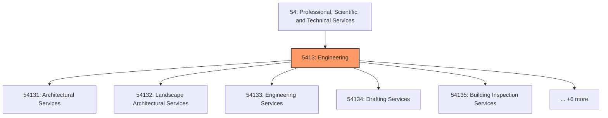
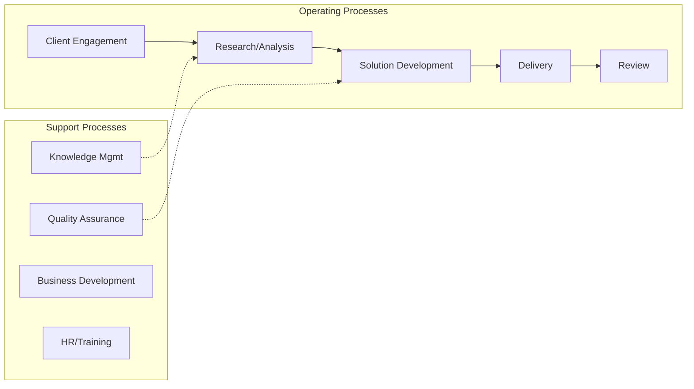

# Engineering

> This industry group comprises establishments primarily engaged in architectural, engineering, and related services, such as drafting services, building inspection services, geophysical surveying and mapping services, surveying and mapping (except geophysical) services, and testing services.

## Overview

Engineering represents an important category within the Professional, Scientific, and Technical Services sector (NAICS 54).

This industry group comprises establishments primarily engaged in architectural, engineering, and related services, such as drafting services, building inspection services, geophysical surveying and mapping services, surveying and mapping (except geophysical) services, and testing services.

## Industry Hierarchy

## Key Statistics

| Metric | Value |
|--------|-------|
| NAICS Code | 5413 |
| Level | Industry Group |
| Child Industries | 11 |

## Sub-Industries

| Industry | Code | Description |
|----------|------|-------------|
| [Architectural Services](./ArchitecturalServices/) | 54131 | See industry description for 541310 |
| [Landscape Architectural Services](./LandscapeArchitecturalServices/) | 54132 | See industry description for 541320 |
| [Engineering Services](./EngineeringServices/) | 54133 | See industry description for 541330 |
| [Drafting Services](./DraftingServices/) | 54134 | See industry description for 541340 |
| [Building Inspection Services](./BuildingInspectionServices/) | 54135 | See industry description for 541350 |
| [Geophysical Surveying](./GeophysicalSurveying/) | 54136 | See industry description for 541360 |
| [Mapping Services](./MappingServices/) | 54136 | See industry description for 541360 |
| [Surveying](./Surveying/) | 54137 | See industry description for 541370 |
| [Mapping (](./Mapping/) | 54137 | See industry description for 541370 |
| [Testing Laboratories](./TestingLaboratories/) | 54138 | See industry description for 541380 |
| [Services](./Services/) | 54138 | See industry description for 541380 |

## Related Occupations

See the [occupations directory](/occupations) for roles commonly found in this industry.

## Core Business Processes

## Industry Value Chain

## Market Context

Manufacturing transforms raw materials into finished goods, with Industry 4.0 driving automation, digitalization, and smart factory implementations.

| Aspect | Details |
|--------|---------|
| Industry Sector | TechnicalServices |
| NAICS/SIC Code | 5413 |
| Market Segment | Engineering |

## Key Business Processes

- Production planning
- Manufacturing operations
- Quality assurance
- Inventory management
- Distribution and logistics

## Common Occupations

- [Industrial Production Managers](/occupations/Management/IndustrialProductionManagers)
- [Production Workers](/occupations/Production/ProductionWorkers)
- [Quality Control Inspectors](/occupations/Production/QualityControlInspectors)
- [Industrial Engineers](/occupations/Engineering/IndustrialEngineers)

## Regulations and Standards

- OSHA Manufacturing Standards
- EPA Environmental Regulations
- FDA regulations (where applicable)
- ISO quality standards
- Industry-specific certifications

## Technology and Tools

- Industrial automation and robotics
- Enterprise Resource Planning (ERP)
- Quality management systems
- Predictive maintenance
- IoT and smart manufacturing

## Industry Trends

- Digital transformation and automation adoption
- Sustainability and environmental compliance focus
- Workforce development and skills training
- Supply chain resilience and optimization
- Customer experience enhancement

---

*Source: NAICS 5413 - Engineering*
