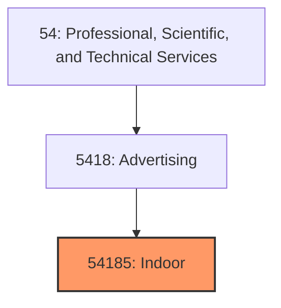
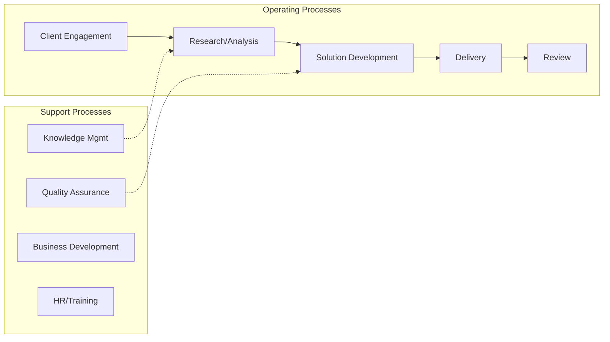

# Indoor

> See industry description for 541850.

## Overview

Indoor represents an important category within the Professional, Scientific, and Technical Services sector (NAICS 54).

## Industry Hierarchy

## Key Statistics

| Metric | Value |
|--------|-------|
| NAICS Code | 54185 |
| Level | Industry |
| Parent | [Advertising](../) |
| Child Industries | 0 |

## Related Occupations

- [Management Analysts](/occupations/Business/Operations/ManagementAnalysts) - Propose ways to improve organizational efficiency
- [Computer and Information Research Scientists](/occupations/Technology/ComputerAndInformationResearchScientists) - Conduct research in computing
- [Architects](/occupations/Architecture/ArchitectsExceptLandscapeAndNaval) - Plan and design structures
- [Lawyers](/occupations/LawyersAndJudicialWorkers) - Advise and represent on legal matters

## Core Business Processes

## Industry Value Chain

## Regulatory Environment

- **State Licensing Boards** - Regulate professional services (legal, accounting, engineering)
- **SEC** (Securities and Exchange Commission) - Oversees consulting and advisory firms
- **EPA** (Environmental Protection Agency) - Governs environmental consulting standards
- **Patent and Trademark Office** - Manages intellectual property protections

## Technology & Innovation

- **AI and Machine Learning** - Automated analysis, predictive modeling, and generative tools
- **Cloud Collaboration** - Remote work platforms, virtual whiteboards, and real-time co-editing
- **Digital Twin Technology** - Virtual modeling for engineering, architecture, and scientific research
- **Low-Code Platforms** - Rapid application development and process automation

## Industry Outlook

The professional, scientific, and technical services sector continues to grow as organizations seek specialized expertise in technology, compliance, and strategy. AI and automation are augmenting professional workflows while creating demand for new advisory services. Remote work has expanded the talent pool and global service delivery, while cybersecurity and data analytics consulting see particularly strong demand.

## Market Context

Manufacturing transforms raw materials into finished goods, with Industry 4.0 driving automation, digitalization, and smart factory implementations.

| Aspect | Details |
|--------|---------|
| Industry Sector | TechnicalServices |
| NAICS/SIC Code | 54185 |
| Market Segment | Indoor |

## Key Business Processes

- Production planning
- Manufacturing operations
- Quality assurance
- Inventory management
- Distribution and logistics

## Common Occupations

- [Industrial Production Managers](/occupations/Management/IndustrialProductionManagers)
- [Production Workers](/occupations/Production/ProductionWorkers)
- [Quality Control Inspectors](/occupations/Production/QualityControlInspectors)
- [Industrial Engineers](/occupations/Engineering/IndustrialEngineers)

## Regulations and Standards

- OSHA Manufacturing Standards
- EPA Environmental Regulations
- FDA regulations (where applicable)
- ISO quality standards
- Industry-specific certifications

## Technology and Tools

- Industrial automation and robotics
- Enterprise Resource Planning (ERP)
- Quality management systems
- Predictive maintenance
- IoT and smart manufacturing

## Industry Trends

- Digital transformation and automation adoption
- Sustainability and environmental compliance focus
- Workforce development and skills training
- Supply chain resilience and optimization
- Customer experience enhancement

---

*Source: NAICS 54185 - Indoor*
