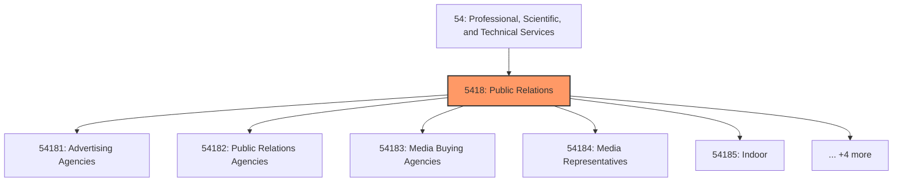
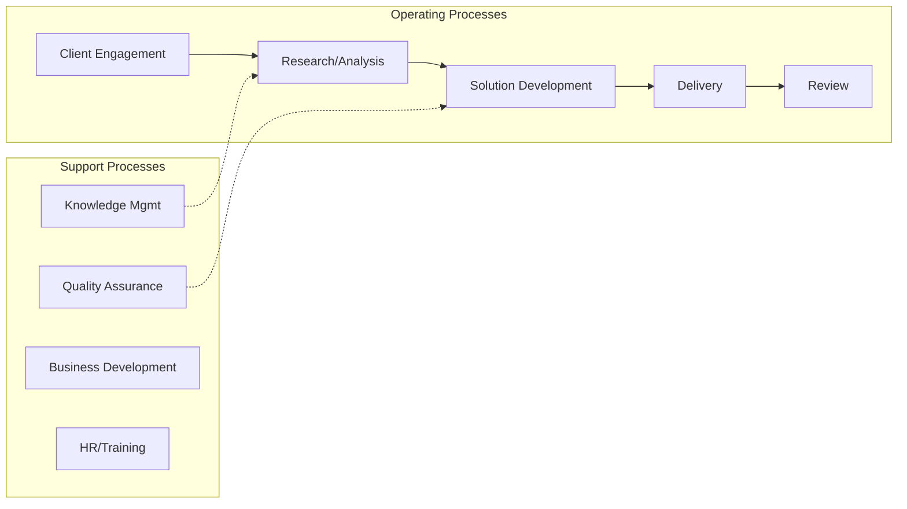

# Public Relations

> This industry group comprises establishments primarily engaged in advertising, public relations, and related services, such as media buying, independent media representation, indoor and outdoor display advertising, direct mail advertising, advertising material distribution services, and other services related to advertising.

## Overview

Public Relations represents an important category within the Professional, Scientific, and Technical Services sector (NAICS 54).

This industry group comprises establishments primarily engaged in advertising, public relations, and related services, such as media buying, independent media representation, indoor and outdoor display advertising, direct mail advertising, advertising material distribution services, and other services related to advertising.

## Industry Hierarchy

## Key Statistics

| Metric | Value |
|--------|-------|
| NAICS Code | 5418 |
| Level | Industry Group |
| Child Industries | 9 |

## Sub-Industries

| Industry | Code | Description |
|----------|------|-------------|
| [Advertising Agencies](./AdvertisingAgencies/) | 54181 | See industry description for 541810 |
| [Public Relations Agencies](./PublicRelationsAgencies/) | 54182 | See industry description for 541820 |
| [Media Buying Agencies](./MediaBuyingAgencies/) | 54183 | See industry description for 541830 |
| [Media Representatives](./MediaRepresentatives/) | 54184 | See industry description for 541840 |
| [Indoor](./Indoor/) | 54185 | See industry description for 541850 |
| [Outdoor Display Advertising](./OutdoorDisplayAdvertising/) | 54185 | See industry description for 541850 |
| [Direct Mail Advertising](./DirectMailAdvertising/) | 54186 | See industry description for 541860 |
| [Advertising Material Distribution Services](./AdvertisingMaterialDistributionServices/) | 54187 | See industry description for 541870 |
| [Services Related to Advertising](./ServicesRelatedToAdvertising/) | 54189 | See industry description for 541890 |

## Related Occupations

See the [occupations directory](/occupations) for roles commonly found in this industry.

## Core Business Processes

## Industry Value Chain

---

*Source: NAICS 5418 - Public Relations*
