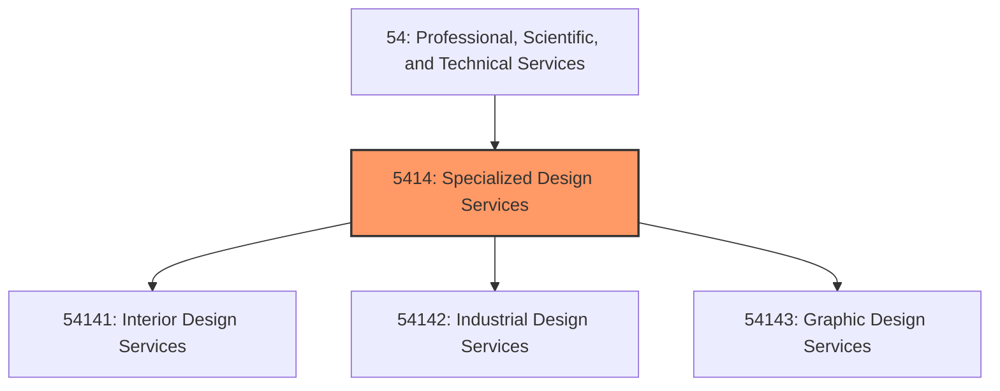
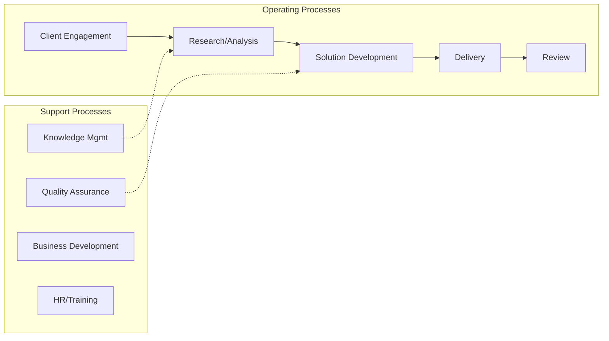

# Specialized Design Services

> This industry group comprises establishments providing specialized design services (except architectural, engineering, and computer systems design).

## Overview

Specialized Design Services represents an important category within the Professional, Scientific, and Technical Services sector (NAICS 54).

This industry group comprises establishments providing specialized design services (except architectural, engineering, and computer systems design).

## Industry Hierarchy

## Key Statistics

| Metric | Value |
|--------|-------|
| NAICS Code | 5414 |
| Level | Industry Group |
| Child Industries | 3 |

## Sub-Industries

| Industry | Code | Description |
|----------|------|-------------|
| [Interior Design Services](./InteriorDesignServices/) | 54141 | See industry description for 541410 |
| [Industrial Design Services](./IndustrialDesignServices/) | 54142 | See industry description for 541420 |
| [Graphic Design Services](./GraphicDesignServices/) | 54143 | See industry description for 541430 |

## Related Occupations

See the [occupations directory](/occupations) for roles commonly found in this industry.

## Core Business Processes

## Industry Value Chain

```mermaid
graph LR
    subgraph Inputs["Inputs"]
        I1["Resources"]
        I2["Expertise"]
        I3["Technology"]
    end

    subgraph Primary["Primary Activities"]
        A1["Inbound Logistics"]
        A2["Core Operations"]
        A3["Quality Assurance"]
        A4["Outbound/Delivery"]
    end

    subgraph Outputs["Products/Services"]
        O1["Products"]
        O2["Services"]
        O3["Solutions"]
    end

    subgraph Customers["Markets"]
        C1["Businesses"]
        C2["Consumers"]
        C3["Government"]
        C4["Institutions"]
    end

    Inputs --> Primary --> Outputs --> Customers
```

---

*Source: NAICS 5414 - Specialized Design Services*
