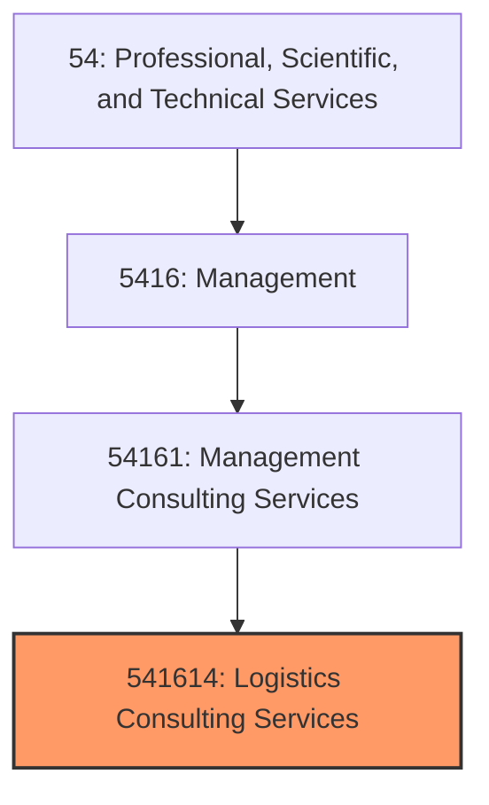
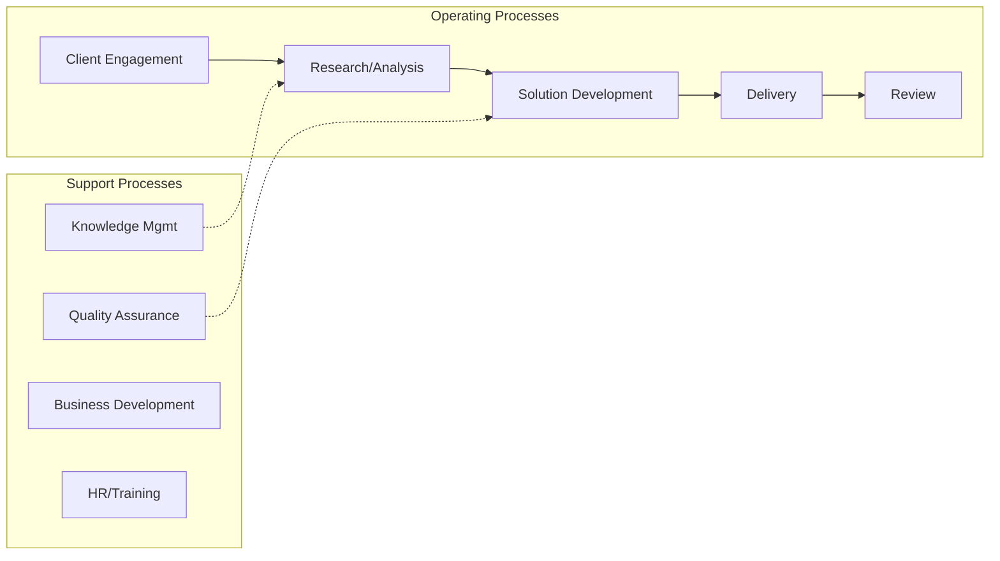

# Logistics Consulting Services

> This U.

## Overview

Logistics Consulting Services represents a specialized segment within the Professional, Scientific, and Technical Services sector (NAICS 54).

This U.S. industry comprises establishments primarily engaged in providing operating advice and assistance to businesses and other organizations in: (1) manufacturing operations improvement; (2) productivity improvement; (3) production planning and control; (4) quality assurance and quality control; (5) inventory management; (6) distribution networks; (7) warehouse use, operations, and utilization; (8) transportation and shipment of goods and materials; and (9) materials management and handling. Illustrative Examples: Freight rate or tariff rate consulting services Productivity improvement consulting services Manufacturing management consulting services Inventory planning and control management consulting services Transportation management consulting services Cross-References. Establishments primarily engaged in--

## Industry Hierarchy

## Key Statistics

| Metric | Value |
|--------|-------|
| NAICS Code | 541614 |
| Level | National Industry |
| Parent | [Management Consulting Services](../) |
| Child Industries | 0 |

## Related Occupations

See the [occupations directory](/occupations) for roles commonly found in this industry.

## Core Business Processes

## Industry Value Chain

```mermaid
graph LR
    subgraph Inputs["Inputs"]
        I1["Resources"]
        I2["Expertise"]
        I3["Technology"]
    end

    subgraph Primary["Primary Activities"]
        A1["Inbound Logistics"]
        A2["Core Operations"]
        A3["Quality Assurance"]
        A4["Outbound/Delivery"]
    end

    subgraph Outputs["Products/Services"]
        O1["Products"]
        O2["Services"]
        O3["Solutions"]
    end

    subgraph Customers["Markets"]
        C1["Businesses"]
        C2["Consumers"]
        C3["Government"]
        C4["Institutions"]
    end

    Inputs --> Primary --> Outputs --> Customers
```

---

*Source: NAICS 541614 - Logistics Consulting Services*
