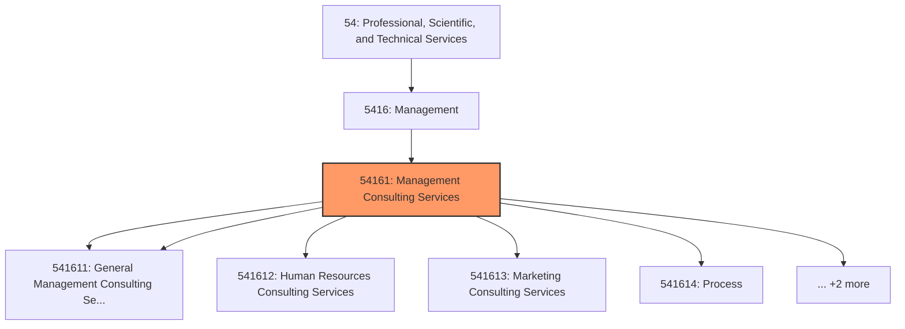
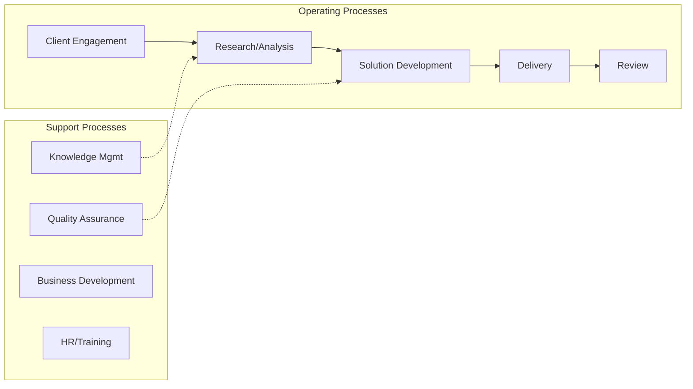

# Management Consulting Services

> This industry comprises establishments primarily engaged in providing advice and assistance to businesses and other organizations on management issues, such as strategic and organizational planning; financial planning and budgeting; marketing objectives and policies; human resource policies, practices, and planning; production scheduling; and control planning.

## Overview

Management Consulting Services represents an important category within the Professional, Scientific, and Technical Services sector (NAICS 54).

This industry comprises establishments primarily engaged in providing advice and assistance to businesses and other organizations on management issues, such as strategic and organizational planning; financial planning and budgeting; marketing objectives and policies; human resource policies, practices, and planning; production scheduling; and control planning. Illustrative Examples: Actuarial, benefit, and compensation consulting services Human resources consulting services Marketing consulting services Administrative and general management consulting services Process, physical distribution, and logistics consulting services Cross-References.

## Industry Hierarchy

## Key Statistics

| Metric | Value |
|--------|-------|
| NAICS Code | 54161 |
| Level | Industry |
| Parent | [Management](../) |
| Child Industries | 7 |

## Sub-Industries

| Industry | Code | Description |
|----------|------|-------------|
| [Administrative Management](./AdministrativeManagement.mdx) | 541611 | This U |
| [General Management Consulting Services](./GeneralManagementConsultingServices.mdx) | 541611 | This U |
| [Human Resources Consulting Services](./HumanResourcesConsultingServices.mdx) | 541612 | This U |
| [Marketing Consulting Services](./MarketingConsultingServices.mdx) | 541613 | This U |
| [Process](./Process.mdx) | 541614 | This U |
| [Physical Distribution](./PhysicalDistribution.mdx) | 541614 | This U |
| [Logistics Consulting Services](./LogisticsConsultingServices.mdx) | 541614 | This U |

## Related Occupations

See the [occupations directory](/occupations) for roles commonly found in this industry.

## Core Business Processes

## Industry Value Chain

```mermaid
graph LR
    subgraph Inputs["Inputs"]
        I1["Resources"]
        I2["Expertise"]
        I3["Technology"]
    end

    subgraph Primary["Primary Activities"]
        A1["Inbound Logistics"]
        A2["Core Operations"]
        A3["Quality Assurance"]
        A4["Outbound/Delivery"]
    end

    subgraph Outputs["Products/Services"]
        O1["Products"]
        O2["Services"]
        O3["Solutions"]
    end

    subgraph Customers["Markets"]
        C1["Businesses"]
        C2["Consumers"]
        C3["Government"]
        C4["Institutions"]
    end

    Inputs --> Primary --> Outputs --> Customers
```

---

*Source: NAICS 54161 - Management Consulting Services*
