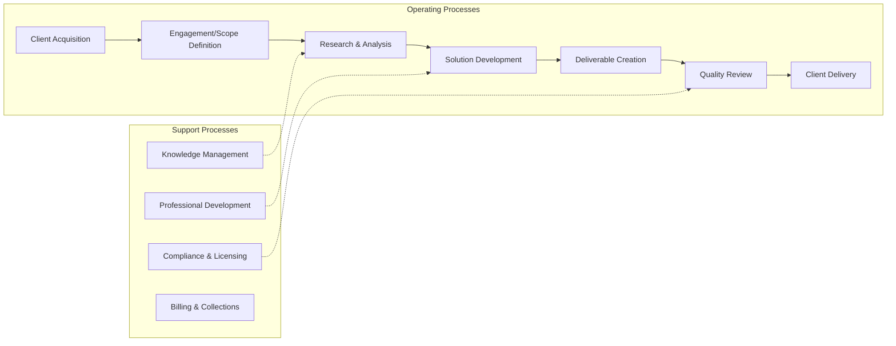
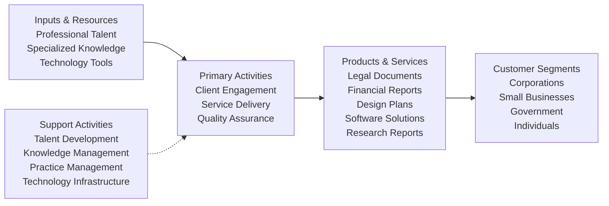

# Professional, Scientific, and Technical Services

> The Professional, Scientific, and Technical Services sector comprises establishments that specialize in performing professional, scientific, and technical activities for others. These activities require a high degree of expertise and training.

## Overview

This sector encompasses establishments that specialize according to expertise and provide services to clients in a variety of industries and, in some cases, to households. Activities performed include: legal advice and representation; accounting, bookkeeping, and payroll services; architectural, engineering, and specialized design services; computer services; consulting services; research services; advertising services; photographic services; translation and interpretation services; veterinary services; and other professional, scientific, and technical services.

The establishments in this sector are characterized by their reliance on highly trained professionals and specialized knowledge. Unlike administrative support services (classified in Sector 56), professional services require significant expertise, education, and often professional licensing or certification.

## Industry Hierarchy

```mermaid
graph TD
    S54["NAICS 54: Professional, Scientific, and Technical Services"]
    S54 --> SS5411["5411: Legal Services"]
    S54 --> SS5412["5412: Accounting, Tax Preparation, Bookkeeping"]
    S54 --> SS5413["5413: Architectural, Engineering, and Related"]
    S54 --> SS5414["5414: Specialized Design Services"]
    S54 --> SS5415["5415: Computer Systems Design"]
    S54 --> SS5416["5416: Management, Scientific, Technical Consulting"]
    S54 --> SS5417["5417: Scientific Research and Development"]
    S54 --> SS5418["5418: Advertising, Public Relations"]
    S54 --> SS5419["5419: Other Professional, Scientific, Technical"]

    SS5411 --> I54111["54111: Offices of Lawyers"]
    SS5411 --> I54112["54112: Offices of Notaries"]
    SS5411 --> I54119["54119: Other Legal Services"]

    SS5413 --> I54131["54131: Architectural Services"]
    SS5413 --> I54132["54132: Landscape Architectural"]
    SS5413 --> I54133["54133: Engineering Services"]
    SS5413 --> I54138["54138: Testing Laboratories"]

    SS5415 --> I541511["541511: Custom Programming"]
    SS5415 --> I541512["541512: Systems Design"]
    SS5415 --> I541513["541513: Facilities Management"]

    SS5417 --> I54171["54171: Physical, Engineering, Life Sciences R&D"]
    SS5417 --> I54172["54172: Social Sciences, Humanities R&D"]
```

## Key Statistics

| Metric | Value |
|--------|-------|
| NAICS Code | 54 |
| Level | Sector |
| Subsectors | 9 |
| Industry Groups | 35+ |
| Industries | 60+ |

## Sub-Industries

| Subsector | Code | Description |
|-----------|------|-------------|
| Legal Services | 5411 | Legal advice and representation, notaries, title abstract offices, paralegal services |
| Accounting, Tax Preparation, Bookkeeping, Payroll Services | 5412 | CPAs, tax preparation, bookkeeping services, payroll processing |
| Architectural, Engineering, and Related Services | 5413 | Architectural design, landscape architecture, engineering, drafting, surveying, testing |
| Specialized Design Services | 5414 | Interior design, industrial design, graphic design, other specialized design |
| Computer Systems Design and Related Services | 5415 | Custom programming, systems integration, facilities management, IT consulting |
| Management, Scientific, and Technical Consulting Services | 5416 | Management consulting, environmental consulting, scientific/technical consulting |
| Scientific Research and Development Services | 5417 | R&D in physical, engineering, life sciences, social sciences, and humanities |
| Advertising, Public Relations, and Related Services | 5418 | Advertising agencies, PR firms, media buying, display advertising, direct mail |
| Other Professional, Scientific, and Technical Services | 5419 | Marketing research, photography, translation, veterinary services |

## Related Occupations

- [Lawyers](/occupations/Lawyers) - Legal representation and counsel
- [Accountants and Auditors](/occupations/AccountantsAndAuditors) - Financial accounting and auditing
- [Architects](/occupations/Architects) - Building design and planning
- [Civil Engineers](/occupations/CivilEngineers) - Infrastructure engineering
- [Software Developers](/occupations/SoftwareDevelopers) - Computer programming and systems design
- [Management Analysts](/occupations/ManagementAnalysts) - Business consulting
- [Market Research Analysts](/occupations/MarketResearchAnalysts) - Marketing research and analysis
- [Graphic Designers](/occupations/GraphicDesigners) - Visual design services
- [Veterinarians](/occupations/Veterinarians) - Animal health services

## Core Business Processes

### Client Engagement Management

Managing the full lifecycle of client relationships from initial contact through project completion and ongoing relationship maintenance.

**Key Activities:**
- Assess client needs and requirements
- Develop proposals and statements of work
- Negotiate engagement terms and contracts
- Manage client communications and expectations

### Professional Service Delivery

Executing specialized professional work requiring advanced training, expertise, and often professional licensing or certification.

**Key Activities:**
- Apply specialized knowledge and methodologies
- Conduct research, analysis, and testing
- Develop recommendations and solutions
- Document findings and create deliverables

### Quality Assurance and Compliance

Ensuring work products meet professional standards, regulatory requirements, and client specifications.

**Key Activities:**
- Review work products for accuracy and completeness
- Ensure compliance with professional standards
- Maintain required licenses and certifications
- Implement quality management systems

## Industry Value Chain

## Regulatory Environment

This sector is subject to extensive professional licensing and regulatory requirements:

- **State Bar Associations**: Licensing and ethical standards for legal professionals
- **State Boards of Accountancy**: CPA licensing and continuing education requirements
- **State Licensing Boards**: Architects, engineers, surveyors, veterinarians
- **Professional Standards Bodies**: AICPA, AIA, NSPE, IEEE standards
- **Federal Agencies**: SEC regulations for auditing public companies, EPA for environmental consulting
- **Data Protection**: GDPR, CCPA, HIPAA compliance for client data handling

Professional liability insurance (errors and omissions coverage) is typically required or strongly recommended for most professional service providers.

## Technology & Innovation

The sector is experiencing significant technological transformation:

- **Artificial Intelligence**: AI-assisted legal research, automated accounting processes, generative AI for content creation
- **Cloud Computing**: SaaS platforms for practice management, collaboration tools, remote service delivery
- **Data Analytics**: Advanced analytics for market research, financial analysis, and business intelligence
- **Building Information Modeling (BIM)**: 3D modeling and simulation for architecture and engineering
- **Low-Code/No-Code Platforms**: Enabling faster software development and customization
- **Blockchain**: Smart contracts, secure document management, cryptocurrency accounting
- **Remote Work Technologies**: Virtual collaboration, digital signatures, online client portals
- **Specialized Software**: CAD/CAM, tax preparation software, legal case management, project management

## Market Trends

- **Specialization**: Increasing focus on niche expertise and industry-specific knowledge
- **Alternative Fee Arrangements**: Movement away from hourly billing toward value-based pricing
- **Globalization**: International expansion and cross-border service delivery
- **Consolidation**: Mergers and acquisitions creating larger multi-disciplinary firms
- **Alternative Legal Providers**: Growth of legal tech companies and non-traditional service providers
- **Sustainability Consulting**: Growing demand for environmental and ESG advisory services
- **Cybersecurity Services**: Expanding need for security consulting and compliance

## Related Industries

- [Administrative and Support Services](../Administrative/) - Day-to-day office administrative services
- [Management of Companies](../Management/) - Corporate headquarters and holding companies
- [Information](../Information/) - Software publishing (vs. custom development)
- [Finance and Insurance](../Finance/) - Financial services and investment advice

---

*Source: NAICS 54 - Professional, Scientific, and Technical Services*
