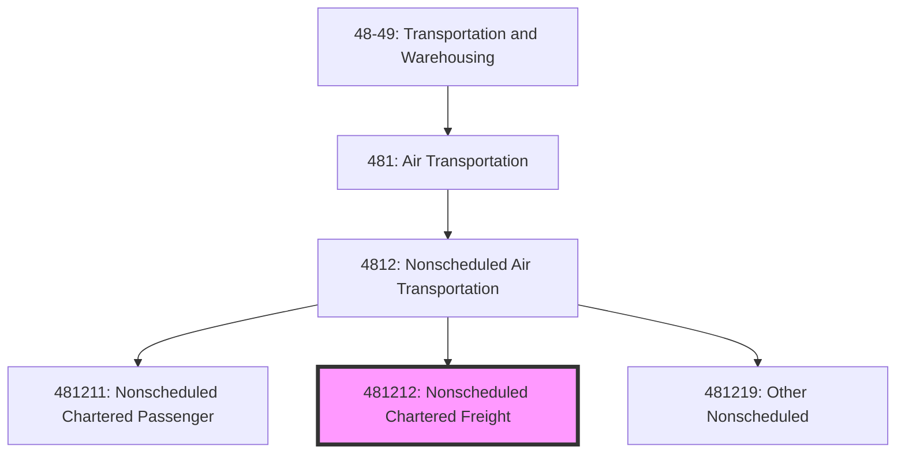
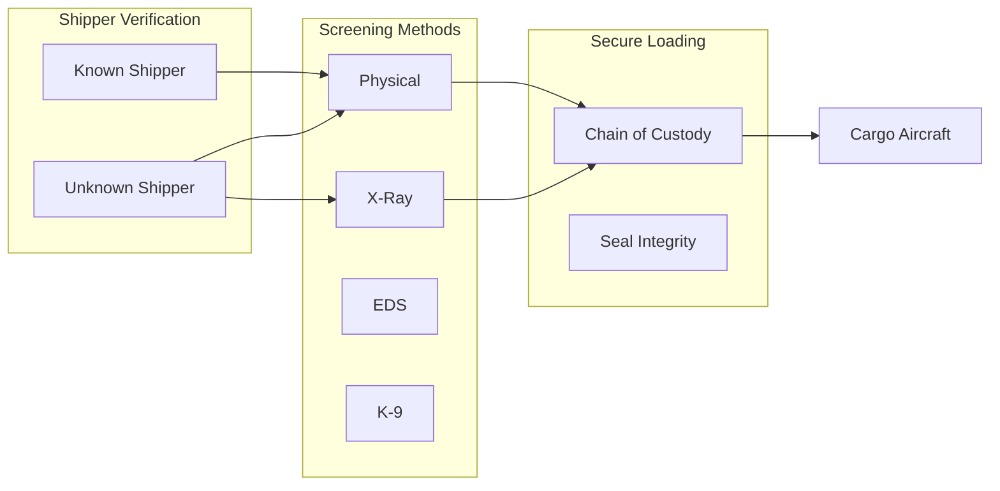
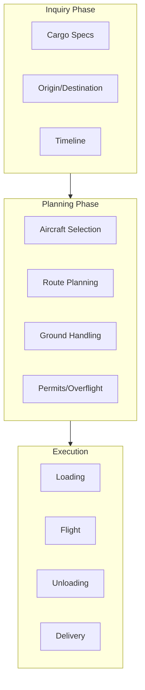

# Nonscheduled Chartered Freight Air Transportation

> This U.S. industry comprises establishments primarily engaged in providing air transportation of cargo without transporting passengers with no regular routes and regular schedules.

## Overview

Nonscheduled Chartered Freight Air Transportation (NAICS 481212) includes all-cargo charter operators providing on-demand freight services. These operators serve markets requiring urgent, oversized, or specialized cargo transport not available through scheduled services. Key applications include:

- Emergency logistics and AOG (aircraft on ground) parts
- Project cargo and oversized shipments
- Humanitarian aid and disaster relief
- Military and government contracts
- Seasonal surge capacity for express carriers
- Livestock and live animal transport

## NAICS Hierarchy

## Key Statistics

| Metric | Value |
|--------|-------|
| NAICS Code | 481212 |
| Level | National Industry (6-digit) |
| Parent | [4812: Nonscheduled Air Transportation](./) |
| US Employment | ~15,000 |
| Annual Revenue | ~$8 billion |
| Number of Establishments | ~100 |

## Industry Segments

### ACMI Providers

| Operator | Fleet | Specialization |
|----------|-------|----------------|
| Atlas Air | 747, 767, 777 | Wide-body ACMI, CMI |
| Kalitta Air | 747, 767 | Charter, ACMI |
| Western Global | 747 | Charter, wet lease |
| Air Transport Int'l | 767 | Amazon, DHL, ACMI |

### Specialized Cargo Charter

| Segment | Aircraft Types | Typical Cargo |
|---------|----------------|---------------|
| Heavy Lift | AN-124, 747 | Aerospace, industrial equipment |
| Oversized | IL-76, AN-124 | Helicopters, construction equipment |
| Temperature-Controlled | 767, 777 | Pharmaceuticals, perishables |
| Livestock | 747 combi | Horses, cattle |

### Government/Military

| Program | Service | Aircraft |
|---------|---------|----------|
| CRAF | Civil Reserve Air Fleet | Cargo-configured |
| AMC Contract | Air Mobility Command | Various |
| FEMA | Disaster response | As needed |

## Regulatory Framework

### FAA Part 121 (All-Cargo)

Charter cargo operations under Part 121:
- Certificate requirements
- Crew qualifications
- Maintenance programs
- Operations specifications

### TSA Cargo Security

## Logistics Models

### Charter Cargo Operations

### ACMI vs. CMI Model

| Model | Provider Supplies | Client Supplies |
|-------|-------------------|-----------------|
| ACMI | Aircraft, Crew, Maintenance, Insurance | Fuel, Airport fees, Ground handling |
| CMI | Crew, Maintenance, Insurance | Aircraft, Fuel, Airport fees |
| Wet Lease | Everything | Operational control |
| Dry Lease | Aircraft only | Everything else |

## Technology

### Operations Systems

| System | Function |
|--------|----------|
| Load Control | Weight & balance calculations |
| ULD Tracking | Container management |
| Flight Planning | Fuel, route optimization |
| Revenue Management | Charter pricing |

### Cargo Handling Technology

| Technology | Application |
|------------|-------------|
| ULD Loaders | Container loading |
| Cargo Nets | Bulk cargo securing |
| Roller Systems | Pallet movement |
| Load Sensors | Weight verification |

## Competitive Dynamics

### Market Drivers

| Driver | Impact |
|--------|--------|
| E-commerce growth | Surge capacity demand |
| Supply chain disruptions | Emergency logistics |
| Defense spending | Government contracts |
| Humanitarian crises | Relief flights |

### Key Success Factors

1. **Fleet availability and reliability**
2. **Aircraft nose-loading capability**
3. **Global operating permits**
4. **Dangerous goods certification**
5. **24/7 operational capability**
6. **Rapid response time**

## Related Industries

- [Scheduled Freight Air Transportation](../ScheduledAirTransportation/ScheduledFreightAirTransportation.mdx) - Scheduled cargo
- [Freight Transportation Arrangement](../../SupportActivities/FreightArrangement/) - Charter brokers
- [Couriers and Messengers](../../CouriersAndMessengers/) - Express integration

## Related Occupations

| Occupation | Role | Employer |
|------------|------|----------|
| Freighter Pilot | All-cargo aircraft operation | Charter operator |
| Loadmaster | Cargo loading supervision | Large operators |
| Flight Engineer | 747 classic operations | Legacy fleets |
| Charter Sales | Customer relations | All operators |

---

*Source: NAICS 481212 - U.S. Census Bureau, FAA, Air Charter Association*
