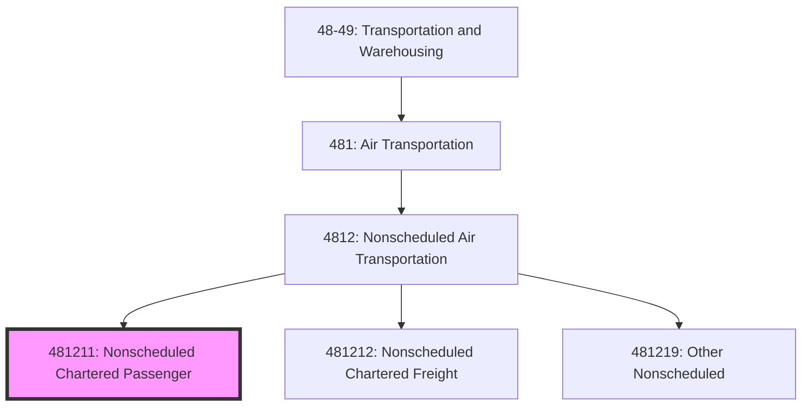
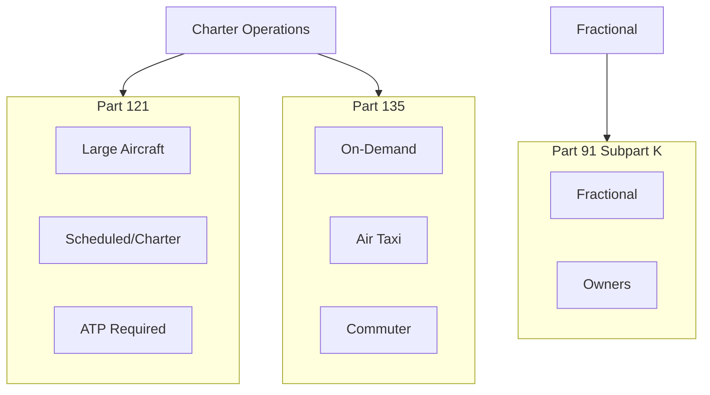
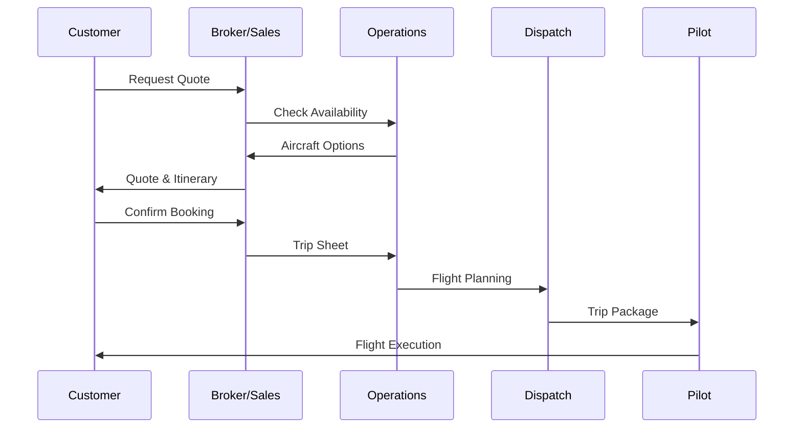

# Nonscheduled Chartered Passenger Air Transportation

> This U.S. industry comprises establishments primarily engaged in providing air transportation of passengers or passengers and cargo with no regular routes and regular schedules.

## Overview

Nonscheduled Chartered Passenger Air Transportation (NAICS 481211) includes charter airlines and air taxi operators providing on-demand passenger service. Services range from large aircraft charters for groups to private jet services for individuals and corporations. The industry serves diverse markets including:

- Group charters (sports teams, tour groups, corporate events)
- Private/business aviation
- Air ambulance (patient transport)
- Government and military contracts
- Casino and entertainment junkets

## NAICS Hierarchy

## Key Statistics

| Metric | Value |
|--------|-------|
| NAICS Code | 481211 |
| Level | National Industry (6-digit) |
| Parent | [4812: Nonscheduled Air Transportation](./) |
| US Employment | ~30,000 |
| Annual Revenue | ~$15 billion |
| Number of Establishments | ~2,000 |

## Industry Segments

### Large Aircraft Charter

| Operator | Fleet | Specialization |
|----------|-------|----------------|
| Swift Air | 737, 757 | Sports, government |
| iAero Airways | 737 | Government, DoD |
| Miami Air | 737 | Sports, corporate |
| Eastern Airlines | 767, 777 | Tours, charters |

### Business Aviation

| Segment | Description | Examples |
|---------|-------------|----------|
| Fractional | Shared ownership | NetJets, Flexjet |
| Jet Cards | Prepaid hours | Sentient, VistaJet |
| Charter | On-demand rental | XO, Wheels Up |
| Management | Owner aircraft | Priester, Executive Jet |

### Air Ambulance

| Type | Service | Aircraft |
|------|---------|----------|
| Fixed-wing | Long-distance patient transport | Learjet, King Air |
| Helicopter | Local emergency transport | EC135, Bell 429 |
| Neonatal | Infant transport | Specialized interiors |

## Regulatory Framework

### FAA Certification

### TSA Requirements

- Large aircraft security program (12,500+ lbs)
- Passenger manifest transmission
- Charter broker documentation
- Crew member screening (varies)

## Logistics Models

### Charter Booking Process

### Fleet Utilization Model

| Metric | Target | Industry Avg |
|--------|--------|--------------|
| Annual Hours | 800-1,200 | 400-600 |
| Load Factor | N/A (charter) | 6-8 pax |
| Positioning Ratio | <20% | 15-25% |
| Maintenance Ratio | 10-15% | 12% |

## Technology

### Charter Marketplaces

| Platform | Type | Function |
|----------|------|----------|
| Avinode | B2B | Broker-to-operator marketplace |
| CharterSync | B2B | Pricing, availability |
| XO | B2C | Consumer booking app |
| Wheels Up | B2C | Membership platform |

### Operations Technology

| System | Function |
|--------|----------|
| Scheduling | Trip planning, crew assignment |
| Quoting | Dynamic pricing, margin optimization |
| CRM | Customer relationship management |
| Safety Management | SMS, risk assessment |

## Competitive Dynamics

### Business Models

| Model | Revenue | Customer |
|-------|---------|----------|
| Ad-hoc Charter | Per trip | Occasional flyers |
| Jet Card | Prepaid hours | Frequent flyers |
| Fractional | Ownership share | Heavy users |
| Membership | Annual + hourly | Mid-frequency |
| ACMI | Block hours | Airlines |

### Key Success Factors

1. **Fleet reliability and availability**
2. **Geographic positioning**
3. **Safety reputation**
4. **Price competitiveness**
5. **Customer service excellence**
6. **Crew qualifications and training**

## Related Industries

- [Nonscheduled Chartered Freight](./NonscheduledCharteredFreight.mdx) - Cargo charters
- [Scheduled Passenger Air Transportation](../ScheduledAirTransportation/ScheduledPassengerAirTransportation.mdx) - Commercial alternative
- [Support Activities for Air Transportation](../../SupportActivities/AirTransportSupport/) - FBO services

## Related Occupations

| Occupation | Role | Certification |
|------------|------|---------------|
| Corporate Pilot | Aircraft operation | ATP preferred |
| Charter Sales | Client relations | None required |
| Scheduler | Trip coordination | None required |
| Flight Attendant | Cabin service | FAA (Part 121) |

---

*Source: NAICS 481211 - U.S. Census Bureau, FAA, NBAA*
