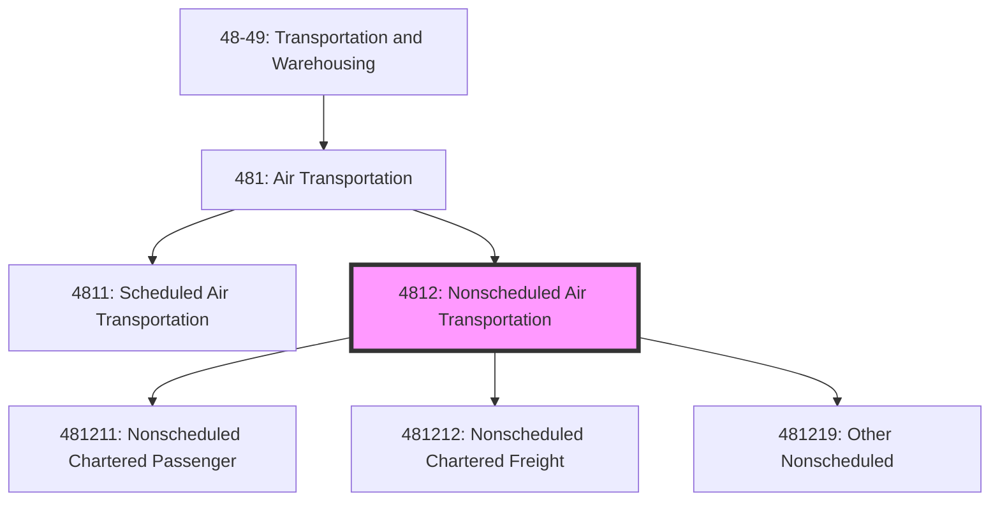
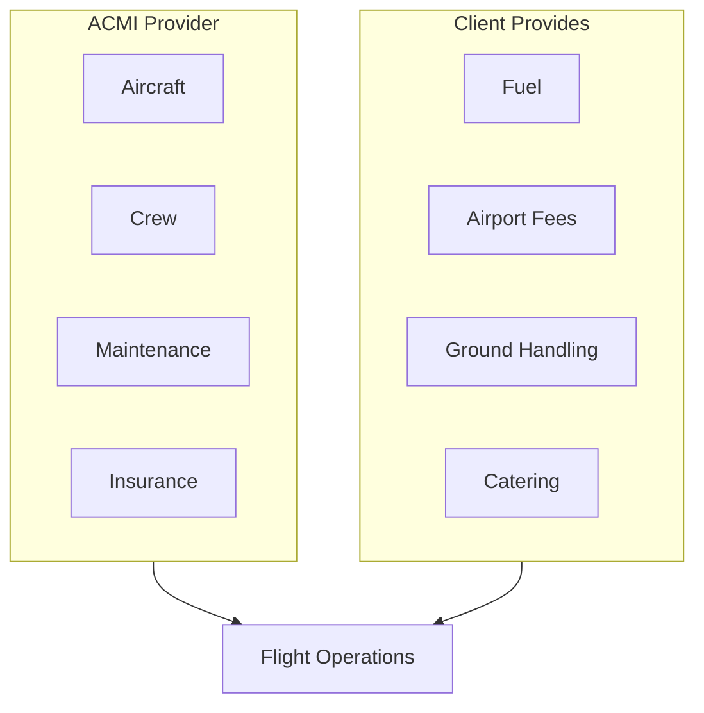

# Nonscheduled Air Transportation

> This industry group comprises establishments primarily engaged in providing air transportation with no regular routes and regular schedules.

## Overview

Nonscheduled Air Transportation (NAICS 4812) includes charter airlines, air taxi services, and specialty flying operations that do not operate on fixed schedules. These establishments offer flexibility in routes, timing, and services, catering to customers with specific transportation needs not met by scheduled carriers.

Key segments:
- Charter passenger airlines (vacation, sports teams, casinos)
- Charter cargo operations (ACMI, wet lease)
- Air taxi and on-demand services
- Specialty flying (aerial surveying, firefighting, ambulance)

## NAICS Hierarchy

## Key Statistics

| Metric | Value |
|--------|-------|
| NAICS Code | 4812 |
| Level | Industry Group |
| Parent | [481: Air Transportation](../) |
| National Industries | 3 |
| US Employment | ~50,000 |
| Annual Revenue | ~$25 billion |

## National Industries

| Code | National Industry | Description |
|------|-------------------|-------------|
| 481211 | [Nonscheduled Chartered Passenger](./NonscheduledCharteredPassenger.mdx) | Charter passenger transportation |
| 481212 | [Nonscheduled Chartered Freight](./NonscheduledCharteredFreight.mdx) | Charter cargo transportation |
| 481219 | [Other Nonscheduled Air Transportation](./OtherNonscheduledAir.mdx) | Air ambulance, aerial surveying, firefighting |

## Regulatory Framework

### FAA Part 135 Operations

On-demand and charter operations under Part 135:
- Commuter operations (scheduled, <10 seats)
- On-demand operations (charter, air taxi)
- Specific pilot requirements (ATP for turbine multiengine)
- Aircraft maintenance requirements
- Operational control requirements

### FAA Part 91 Subpart K

Fractional ownership programs:
- Management companies
- Dry lease arrangements
- Owner training requirements
- Maintenance programs

### DOT Economic Authority

- Part 298: Air taxi operators
- Part 380: Public charter operations
- Fitness determinations for charter brokers

## Logistics Models

### Charter Operations Model

### ACMI Leasing Model

## Technology

### On-Demand Platforms

| Platform | Function |
|----------|----------|
| Charter Marketplaces | Real-time pricing, booking |
| Fleet Management | Aircraft tracking, maintenance |
| Crew Management | Scheduling, duty time tracking |
| FBO Integration | Ground handling coordination |

### Operational Technology

| System | Function |
|--------|----------|
| Trip Planning | Route, fuel, weather optimization |
| Dispatch | Flight following, release |
| Weight & Balance | Load calculations |
| Passenger Manifesting | TSA compliance |

## Related Industries

- [Scheduled Air Transportation](../ScheduledAirTransportation/) - Scheduled services
- [Support Activities for Air Transportation](../../SupportActivities/AirTransportSupport/) - FBO services
- [Travel Arrangement](/industries/Services/TravelArrangement/) - Charter booking

## Related Occupations

| Occupation | Role | Certification |
|------------|------|---------------|
| Charter Pilot | Aircraft operation | ATP or Commercial |
| Flight Attendant | Cabin service (large aircraft) | FAA |
| Dispatcher | Flight planning, release | FAA Dispatcher |
| Charter Sales | Client relations, pricing | None |

---

*Source: NAICS 4812 - U.S. Census Bureau, FAA, NBAA*
