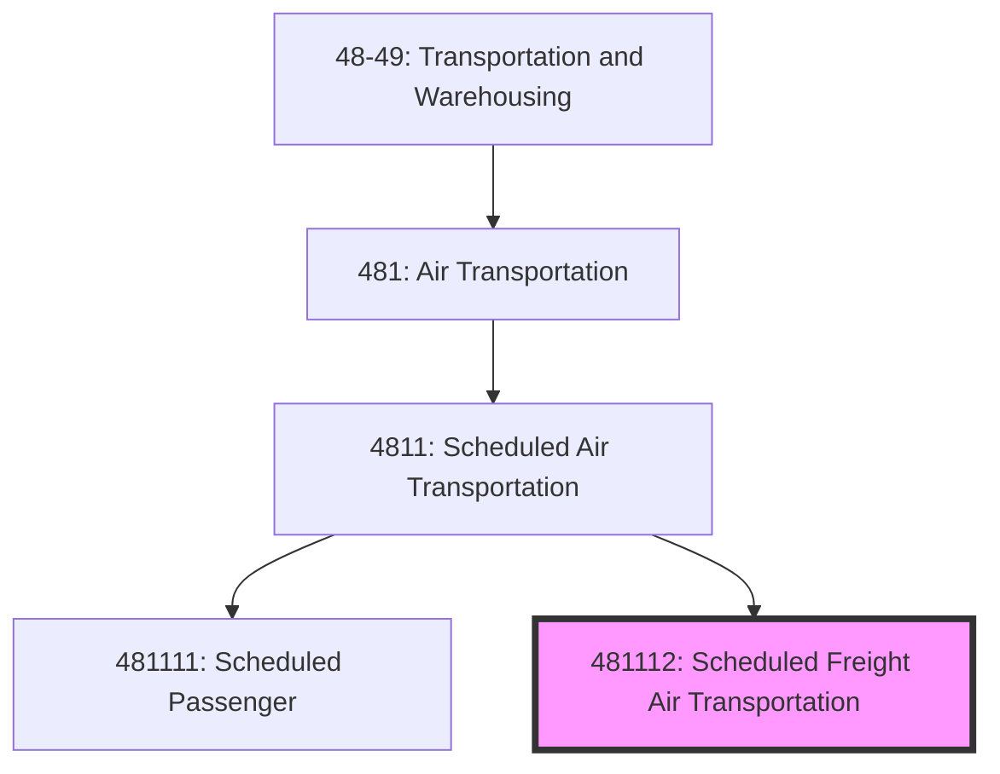
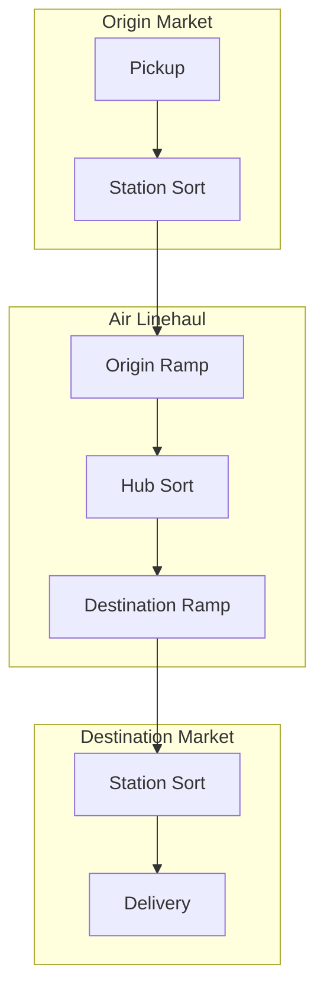
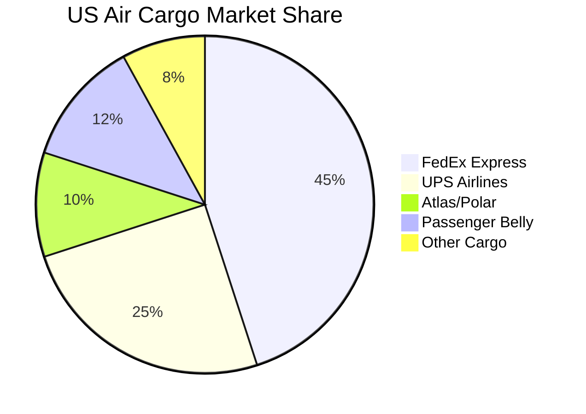

# Scheduled Freight Air Transportation

> This U.S. industry comprises establishments primarily engaged in providing air transportation of cargo without transporting passengers over regular routes and on regular schedules.

## Overview

Scheduled Freight Air Transportation (NAICS 481112) includes all-cargo airlines operating regular freight services. This industry is dominated by integrated express carriers (FedEx Express, UPS Airlines) and dedicated cargo carriers (Atlas Air, Kalitta Air). Establishments operate on fixed schedules, often at night to enable next-day delivery services.

Key characteristics:
- Hub-based sorting operations (typically 10 PM - 3 AM)
- Time-definite delivery commitments
- Integration with ground transportation networks
- High aircraft utilization through night flights
- Growing e-commerce driven demand

## NAICS Hierarchy

## Key Statistics

| Metric | Value |
|--------|-------|
| NAICS Code | 481112 |
| Level | National Industry (6-digit) |
| Parent | [4811: Scheduled Air Transportation](./) |
| US Employment | ~75,000 |
| Annual Revenue | ~$70 billion |
| Number of Establishments | ~50 |

## Industry Segments

### Integrated Express Carriers

| Carrier | Hub | Fleet Size | Daily Packages |
|---------|-----|------------|----------------|
| FedEx Express | MEM | 680+ | 17M+ |
| UPS Airlines | SDF | 290+ | 25M+ |
| DHL Express (US) | CVG | 50+ | Partnership |

### All-Cargo Airlines

| Carrier | Specialization | Aircraft Types |
|---------|---------------|----------------|
| Atlas Air | ACMI, charter, scheduled | 747, 767, 777 |
| Kalitta Air | Charter, scheduled, CMI | 747, 767 |
| ABX Air | DHL feeder, ACMI | 767 |
| Polar Air Cargo | Transpacific freight | 747 |

### Cargo-Only Mail Carriers

- Contract air mail carriers (CASS)
- Regional air cargo feeders

## Regulatory Framework

### FAA Part 121 (All-Cargo)

All-cargo operations have specific exemptions:
- No flight attendant requirements
- Different crew rest rules
- Modified emergency equipment
- Cargo-specific fire suppression

### TSA Air Cargo Security

### 100% Cargo Screening Mandate

All cargo on passenger aircraft must be screened:
- CCSP (Certified Cargo Screening Program)
- IAC (Indirect Air Carrier) certification
- CCSF (Certified Cargo Screening Facility)

## Logistics Models

### Hub Sort Operations

```mermaid
gantt
    title FedEx Memphis Hub Timeline (Typical Night)
    dateFormat HH:mm
    axisFormat %H:%M

    section Inbound
    Aircraft Arrivals     :22:00, 90min
    Unloading            :22:30, 120min

    section Sort
    Primary Sort         :23:00, 180min
    Secondary Sort       :00:00, 120min

    section Outbound
    Loading              :01:30, 120min
    Aircraft Departures  :03:00, 90min
```

### Service Levels

| Service | Transit Time | Cutoff | Use Case |
|---------|--------------|--------|----------|
| Same Day | Hours | Varies | Critical parts, documents |
| Next Day AM | Overnight | 8 PM | Business documents |
| Next Day PM | Overnight | 8 PM | General priority |
| 2-Day | 48 hours | 6 PM | Cost-conscious urgent |
| 3-Day | 72 hours | 6 PM | Economy express |

### Network Design

## Technology

### Cargo Tracking Systems

| Technology | Function |
|------------|----------|
| Barcode Scanning | Package identification, tracking |
| RFID | ULD tracking, high-value items |
| GPS | Vehicle and aircraft tracking |
| IoT Sensors | Temperature, shock monitoring |
| Blockchain | Chain of custody verification |

### Operations Technology

| System | Function |
|--------|----------|
| ACARS | Aircraft position, fuel, cargo data |
| Load Planning | Weight and balance optimization |
| Revenue Management | Pricing, capacity allocation |
| Ground Operations | Vehicle routing, dock scheduling |

## Competitive Dynamics

### Market Structure

### E-Commerce Impact

| Trend | Impact |
|-------|--------|
| Volume Growth | 10-15% annual increase |
| Residential Delivery | More stops per route |
| Peak Season | Extended holiday periods |
| Returns | Reverse logistics complexity |
| Cross-Border | International e-commerce growth |

## Related Industries

- [Scheduled Passenger Air Transportation](./ScheduledPassengerAirTransportation.mdx) - Belly cargo
- [Couriers and Messengers](../../CouriersAndMessengers/) - Integrated operations
- [Nonscheduled Air Transportation](../NonscheduledAirTransportation/) - Charter cargo
- [Freight Transportation Arrangement](../../SupportActivities/FreightArrangement/) - Freight forwarders

## Related Occupations

| Occupation | Role | Employer |
|------------|------|----------|
| Cargo Pilot | Freighter aircraft operation | Cargo airline |
| Load Planner | Weight and balance | Cargo airline |
| Sort Facility Manager | Hub operations | Integrated carrier |
| Ramp Agent | Aircraft loading/unloading | All carriers |
| Cargo Handler | Package sorting | All carriers |

---

*Source: NAICS 481112 - U.S. Census Bureau, FAA, Air Cargo Association*
