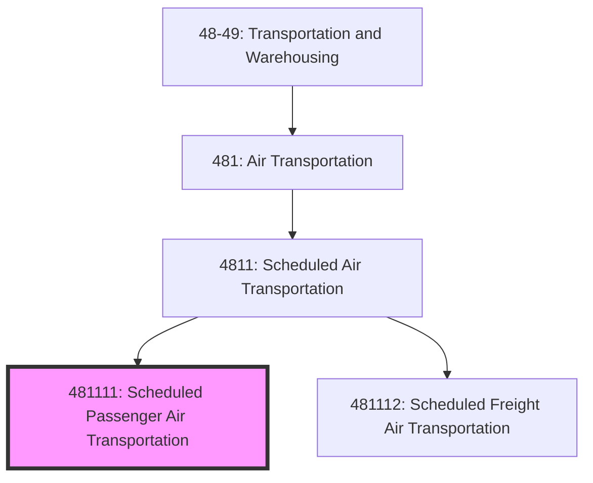
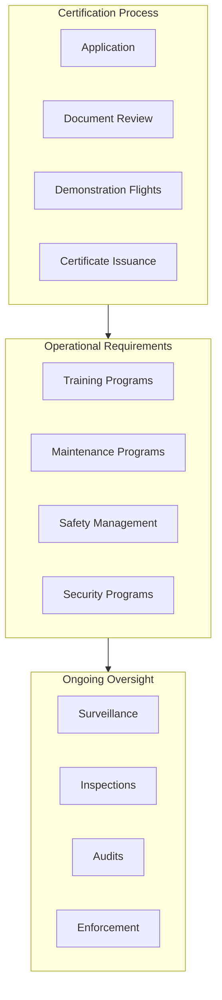
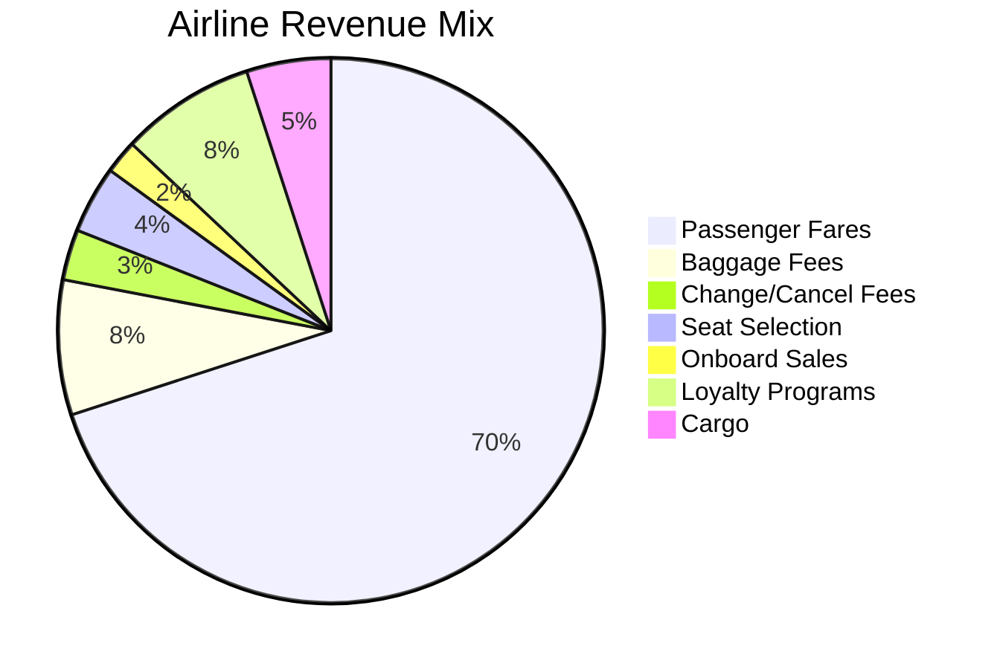

# Scheduled Passenger Air Transportation

> This U.S. industry comprises establishments primarily engaged in providing air transportation of passengers or passengers and freight over regular routes and on regular schedules.

## Overview

Scheduled Passenger Air Transportation (NAICS 481111) includes all airlines operating regular passenger service, from major network carriers to regional and commuter airlines. Establishments operate flights even when partially loaded, maintaining published schedules. This industry includes:

- Major network carriers (American, United, Delta, Southwest)
- Low-cost carriers (Spirit, Frontier, Allegiant)
- Regional carriers (SkyWest, Republic, Envoy)
- Commuter carriers (Cape Air, Mokulele)
- Scheduled helicopter services

## NAICS Hierarchy

## Key Statistics

| Metric | Value |
|--------|-------|
| NAICS Code | 481111 |
| Level | National Industry (6-digit) |
| Parent | [4811: Scheduled Air Transportation](./) |
| US Employment | ~420,000 |
| Annual Revenue | ~$200 billion |
| Number of Establishments | ~550 |

## Industry Segments

### Major Network Carriers

| Airline | Hub Cities | Fleet Size | Annual Passengers |
|---------|-----------|------------|-------------------|
| American Airlines | DFW, CLT, PHX, MIA | 900+ | 200M+ |
| Delta Air Lines | ATL, MSP, DTW, SLC | 850+ | 180M+ |
| United Airlines | ORD, DEN, IAH, EWR | 800+ | 160M+ |
| Southwest Airlines | DAL, DEN, LAS, PHX | 700+ | 150M+ |

### Regional Carriers

Operating under capacity purchase agreements (CPAs) with major carriers:

| Carrier | Operating As | Aircraft Types |
|---------|--------------|----------------|
| SkyWest Airlines | United Express, Delta Connection, American Eagle | CRJ-200/700/900, E175 |
| Republic Airways | United Express, Delta Connection, American Eagle | E170/175 |
| Envoy Air | American Eagle | E175, CRJ-700 |
| PSA Airlines | American Eagle | CRJ-700/900 |

## Regulatory Framework

### FAA Part 121 Requirements

### DOT Consumer Protection

| Requirement | Description |
|-------------|-------------|
| Tarmac Delay Rule | Passengers must be allowed to deplane after 3 hours (domestic) |
| Denied Boarding Compensation | Up to 400% of fare for oversales |
| Baggage Fees Disclosure | Clear disclosure at booking |
| Full Fare Advertising | All mandatory fees in advertised price |
| 24-Hour Hold Rule | Free cancellation within 24 hours of booking |

## Logistics Models

### Flight Operations Process

```mermaid
flowchart LR
    subgraph Planning["Pre-Flight"]
        P1[Flight Planning]
        P2[Weather Analysis]
        P3[Crew Assignment]
        P4[Aircraft Assignment]
    end

    subgraph Ground["Ground Ops"]
        G1[Check-in]
        G2[Security Screening]
        G3[Boarding]
        G4[Baggage Loading]
    end

    subgraph Flight["Flight Ops"]
        F1[Pushback]
        F2[Taxi]
        F3[Takeoff]
        F4[Cruise]
        F5[Approach]
        F6[Landing]
    end

    subgraph Arrival["Arrival"]
        A1[Taxi to Gate]
        A2[Deplaning]
        A3[Baggage Claim]
    end

    Planning --> Ground --> Flight --> Arrival
```

### Revenue Streams

## Technology

### Passenger-Facing Technology

| System | Function |
|--------|----------|
| Booking Engine | Online reservations, fare shopping |
| Mobile App | Check-in, boarding pass, notifications |
| Kiosk | Self-service check-in, bag tags |
| Inflight Entertainment | Seatback/streaming entertainment |
| WiFi | In-flight connectivity |

### Operational Technology

| System | Function |
|--------|----------|
| GDS (Global Distribution System) | Amadeus, Sabre, Travelport |
| PSS (Passenger Service System) | Reservations, inventory, departure control |
| Crew Management | Scheduling, tracking, optimization |
| Operations Control Center | Real-time flight monitoring |

## Competitive Dynamics

### Business Models

| Model | Characteristics | Examples |
|-------|-----------------|----------|
| Legacy Network | Hub-and-spoke, full service, alliances | American, Delta, United |
| Low-Cost | Point-to-point, unbundled fares | Southwest, JetBlue |
| Ultra Low-Cost | Basic fares, a la carte pricing | Spirit, Frontier |
| Regional | Hub feeder, CPA agreements | SkyWest, Republic |

### Key Success Factors

1. **Network breadth and connectivity**
2. **Cost efficiency and fuel hedging**
3. **Revenue management sophistication**
4. **Customer loyalty programs**
5. **Labor relations and productivity**
6. **Fleet commonality and optimization**

## Related Industries

- [Scheduled Freight Air Transportation](./ScheduledFreightAirTransportation.mdx) - Belly cargo revenue
- [Nonscheduled Air Transportation](../NonscheduledAirTransportation/) - Charter supplement
- [Airport Operations](../../SupportActivities/AirTransportSupport/) - Ground services
- [Travel Agencies](/industries/Services/TravelArrangement/) - Distribution channel

## Related Occupations

| Occupation | Role | Typical Employer |
|------------|------|------------------|
| Airline Captain | Aircraft commander | Major/regional carrier |
| First Officer | Co-pilot | Major/regional carrier |
| Flight Attendant | Cabin safety, service | All carriers |
| Gate Agent | Boarding, customer service | Carrier/ground handler |
| Ramp Agent | Baggage, aircraft servicing | Carrier/ground handler |

---

*Source: NAICS 481111 - U.S. Census Bureau, FAA, Airlines for America, DOT*
