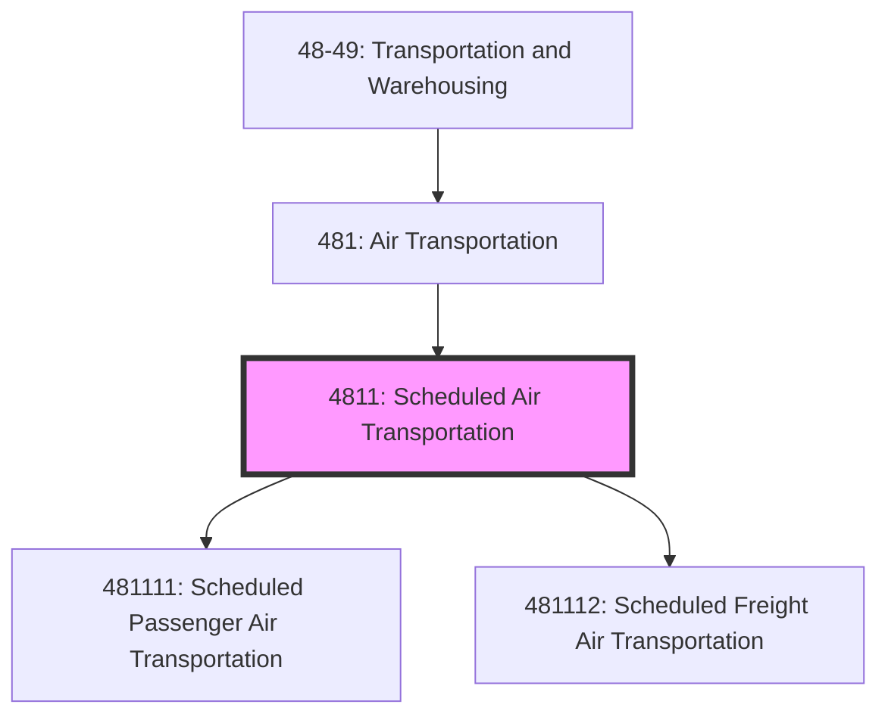
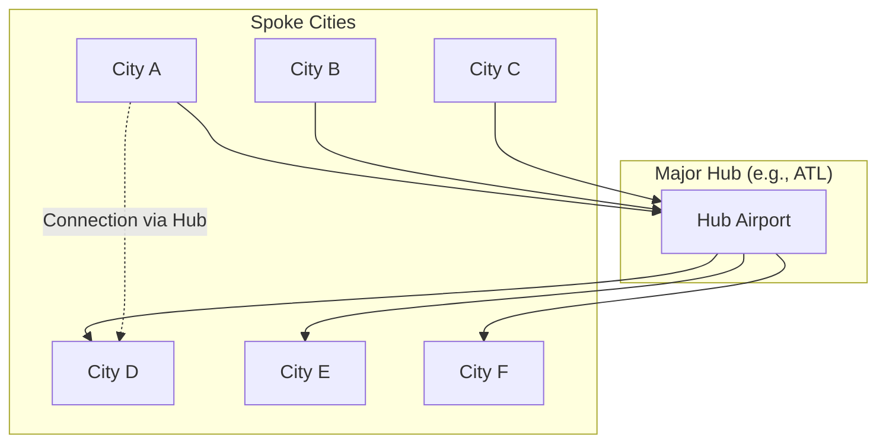

# Scheduled Air Transportation

> This industry group comprises establishments primarily engaged in providing air transportation of passengers, passengers and cargo, or cargo over regular routes and on regular schedules.

## Overview

Scheduled Air Transportation (NAICS 4811) includes airlines and air carriers that operate on fixed routes and schedules, flying even when loads are partial. This distinguishes them from charter and nonscheduled operations. The industry includes major network carriers, low-cost carriers, regional airlines, and all-cargo carriers operating scheduled freight services.

Key characteristics:
- Network-based operations with interconnecting routes
- Published schedules and fares
- High fixed costs requiring load factor optimization
- Code-sharing and alliance agreements
- FAA Part 121 certification requirements

## NAICS Hierarchy

## Key Statistics

| Metric | Value |
|--------|-------|
| NAICS Code | 4811 |
| Level | Industry Group |
| Parent | [481: Air Transportation](../) |
| National Industries | 2 |
| US Employment | ~450,000 |
| Annual Revenue | ~$220 billion |

## National Industries

| Code | National Industry | Description |
|------|-------------------|-------------|
| 481111 | [Scheduled Passenger Air Transportation](./ScheduledPassengerAirTransportation.mdx) | Regular passenger service including commuter and helicopter |
| 481112 | [Scheduled Freight Air Transportation](./ScheduledFreightAirTransportation.mdx) | Regular cargo-only service and mail transport |

## Regulatory Framework

### FAA Part 121 Certification

All scheduled air carriers must obtain FAA Part 121 certification, which requires:
- Operations Specifications (OpSpecs)
- Approved training programs
- Maintenance programs
- Safety Management Systems (SMS)
- Minimum equipment lists (MEL)

### DOT Economic Regulation

- Certificate of Public Convenience and Necessity
- Fitness determinations for new entrants
- Consumer protection rules (tarmac delays, oversales)
- Pricing transparency requirements

## Logistics Models

### Hub-and-Spoke Network

### Revenue Management

## Technology

### Operations Technology

| System | Function |
|--------|----------|
| Departure Control System (DCS) | Check-in, boarding, load control |
| Flight Operations System | Flight planning, dispatch, tracking |
| Crew Management System | Scheduling, tracking, compliance |
| Revenue Management System | Pricing, inventory optimization |
| Maintenance System (MRO) | Aircraft maintenance tracking |

### Aircraft Systems

- **ADS-B (Automatic Dependent Surveillance-Broadcast)**: Position reporting
- **ACARS**: Digital datalink for communications
- **EFB (Electronic Flight Bag)**: Digital charts, manuals, calculations
- **FMS (Flight Management System)**: Navigation and fuel optimization

## Related Industries

- [Nonscheduled Air Transportation](../NonscheduledAirTransportation/) - Charter operations
- [Support Activities for Air Transportation](../../SupportActivities/AirTransportSupport/) - Ground handling, fueling
- [Couriers and Messengers](../../CouriersAndMessengers/) - Integrated express carriers

## Related Occupations

| Occupation | Role | Certification |
|------------|------|---------------|
| Airline Pilot | Aircraft operation | ATP Certificate |
| First Officer | Co-pilot duties | Commercial Certificate |
| Flight Dispatcher | Flight planning, monitoring | FAA Dispatcher Certificate |
| Flight Attendant | Cabin safety, service | FAA Certification |
| Aircraft Mechanic | Maintenance | A&P Certificate |

---

*Source: NAICS 4811 - U.S. Census Bureau, FAA, Airlines for America*
