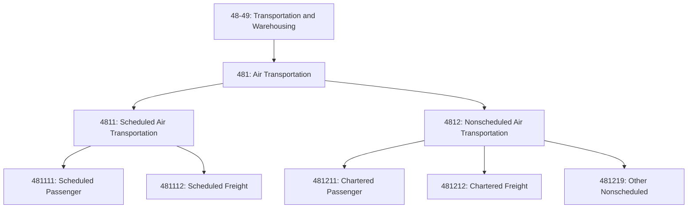
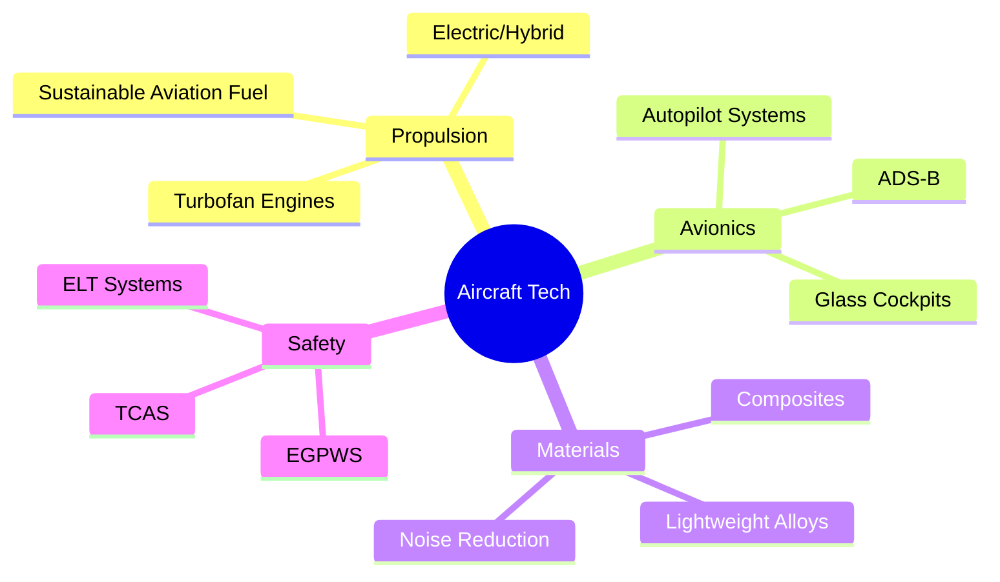
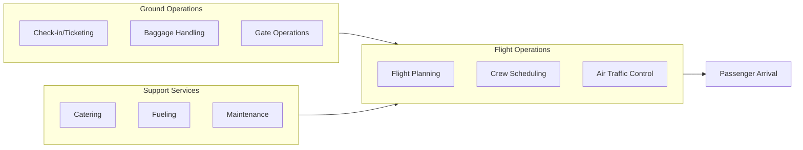

# Air Transportation

> Industries in the Air Transportation subsector provide air transportation of passengers and/or cargo using aircraft, such as airplanes, helicopters, and spacecraft.

## Overview

Air Transportation (NAICS 481) comprises establishments that provide air transportation services for passengers and cargo. The subsector distinguishes scheduled from nonscheduled air transportation, with scheduled carriers operating regular routes and schedules regardless of load factors, while nonscheduled carriers offer charter and specialty flying services.

Key characteristics:
- High capital intensity (aircraft, infrastructure)
- Hub-and-spoke network operations
- Stringent safety and security requirements
- Volatile fuel costs as major operating expense
- Labor-intensive with highly skilled workforce

## NAICS Hierarchy

## Key Statistics

| Metric | Value |
|--------|-------|
| NAICS Code | 481 |
| Level | Subsector |
| Parent | [48-49: Transportation and Warehousing](../) |
| Industry Groups | 2 |
| National Industries | 5 |
| US Employment | ~500,000 |
| Annual Revenue | ~$250 billion |

## Industry Groups

| Code | Industry Group | Description |
|------|----------------|-------------|
| 4811 | [Scheduled Air Transportation](./ScheduledAirTransportation/) | Regular routes and schedules for passengers and cargo |
| 4812 | [Nonscheduled Air Transportation](./NonscheduledAirTransportation/) | Charter, cargo, and specialty flying services |

## Regulatory Framework

### Federal Aviation Administration (FAA)

The FAA regulates all aspects of civil aviation:
- **Part 121**: Air carrier certification (large aircraft, scheduled)
- **Part 135**: Commuter and on-demand operations
- **Part 91**: General operating and flight rules
- **Part 139**: Certification of airports

### Transportation Security Administration (TSA)

- Passenger and baggage screening
- Air cargo security programs
- Known shipper programs
- Flight crew security training

### Department of Transportation (DOT)

- Economic regulation of airlines
- Consumer protection rules
- International route authority
- Essential Air Service program

## Technology and Operations

### Fleet Technology

### Operational Models

| Model | Description | Examples |
|-------|-------------|----------|
| Hub-and-Spoke | Concentrate traffic at central hubs | Delta (ATL), United (ORD), American (DFW) |
| Point-to-Point | Direct routes without hubs | Southwest, JetBlue |
| Regional Feed | Connect small cities to hubs | SkyWest, Republic Airways |
| All-Cargo | Dedicated freight operations | FedEx Express, UPS Airlines |

## Logistics Models

### Passenger Operations

### Air Cargo Operations

## Related Industries

- [Support Activities for Air Transportation](/industries/TransportationAndWarehousing/SupportActivities/AirTransportSupport/) - Airport operations, aircraft services
- [Couriers and Messengers](/industries/TransportationAndWarehousing/CouriersAndMessengers/) - Express delivery integration
- [Travel Arrangement](/industries/Services/TravelArrangement/) - Booking and reservations

## Related Occupations

| Occupation | Employment | Median Wage |
|------------|------------|-------------|
| Airline Pilots and Flight Engineers | 130,000+ | $134,630 |
| Flight Attendants | 120,000+ | $61,640 |
| Aircraft Mechanics | 85,000+ | $65,380 |
| Air Traffic Controllers | 25,000+ | $138,556 |
| Reservation and Ticket Agents | 80,000+ | $38,030 |

---

*Source: NAICS 481 - U.S. Census Bureau, Bureau of Labor Statistics, FAA*
