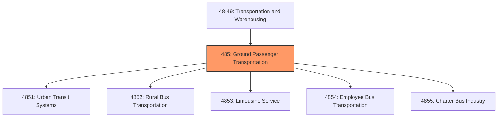
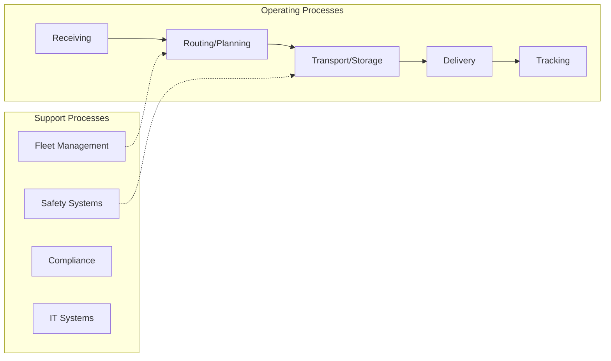

# Ground Passenger Transportation

> Industries in the Transit and Ground Passenger Transportation subsector include a variety of passenger transportation activities, such as urban transit systems; chartered bus, school bus, and interurban bus transportation; and taxis.

## Overview

Ground Passenger Transportation represents an important category within the Transportation and Warehousing sector (NAICS 48-49). This subsector encompasses establishments primarily engaged in ground passenger transportation.

Industries in the Transit and Ground Passenger Transportation subsector include a variety of passenger transportation activities, such as urban transit systems; chartered bus, school bus, and interurban bus transportation; and taxis. These activities are distinguished based primarily on such production process factors as vehicle types, routes, and schedules. In this subsector, the principal splits identify scheduled transportation as separate from nonscheduled transportation. The scheduled transportation industry groups are Urban Transit Systems, Interurban and Rural Bus Transportation, and School and Employee Bus Transportation. The nonscheduled industry groups are the Charter Bus Industry and Taxi and Limousine Service. The Other Transit and Ground Passenger Transportation industry group includes both scheduled and nonscheduled transportation. Scenic and sightseeing ground transportation services are not included in this subsector but are included in Subsector 487, Scenic and Sightseeing Transportation. Sightseeing does not usually involve place-to-place transportation; the passenger's trip starts and ends at the same location.

## Industry Hierarchy

## Key Statistics

| Metric | Value |
|--------|-------|
| NAICS Code | 485 |
| Level | Subsector |
| Child Industries | 5 |

## Sub-Industries

| Industry | Code | Description |
|----------|------|-------------|
| [Urban Transit Systems](./UrbanTransitSystems/) | 4851 | Urban Transit Systems |
| [Rural Bus Transportation](./RuralBusTransportation/) | 4852 | Rural Bus Transportation |
| [Limousine Service](./LimousineService/) | 4853 | This industry group comprises establishments primarily engaged in providing pass |
| [Employee Bus Transportation](./EmployeeBusTransportation/) | 4854 | Employee Bus Transportation |
| [Charter Bus Industry](./CharterBusIndustry/) | 4855 | Charter Bus Industry |

## Core Business Processes

## Industry Value Chain

```mermaid
graph LR
    subgraph Inputs["Inputs"]
        I1["Resources"]
        I2["Expertise"]
        I3["Technology"]
    end

    subgraph Primary["Primary Activities"]
        A1["Inbound Logistics"]
        A2["Core Operations"]
        A3["Quality Assurance"]
        A4["Outbound/Delivery"]
    end

    subgraph Outputs["Products/Services"]
        O1["Products"]
        O2["Services"]
        O3["Solutions"]
    end

    subgraph Customers["Markets"]
        C1["Businesses"]
        C2["Consumers"]
        C3["Government"]
        C4["Institutions"]
    end

    Inputs --> Primary --> Outputs --> Customers
```

---

*Source: NAICS 485 - Ground Passenger Transportation*
