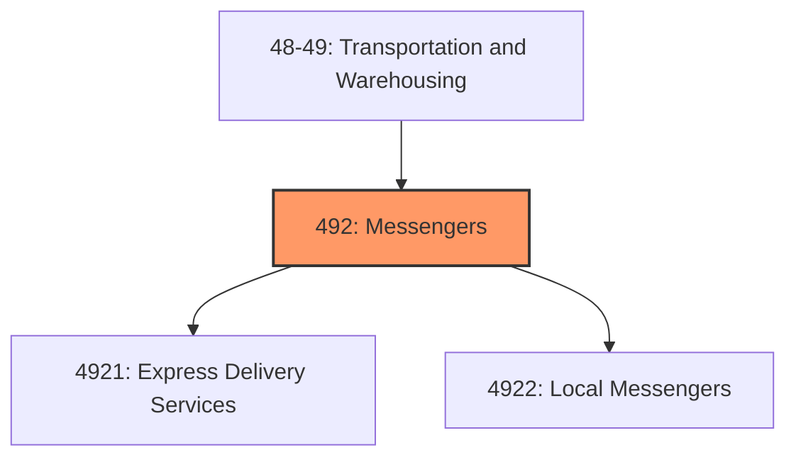
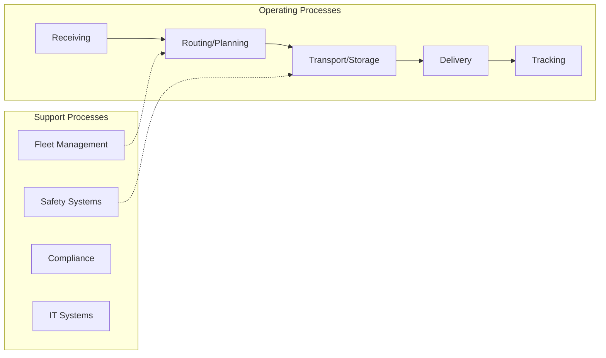

# Messengers

> Industries in the Couriers and Messengers subsector provide intercity, local, and/or international delivery of parcels and documents (including express delivery services) without operating under a universal service obligation.

## Overview

Messengers represents an important category within the Transportation and Warehousing sector (NAICS 48-49). This subsector encompasses establishments primarily engaged in messengers.

Industries in the Couriers and Messengers subsector provide intercity, local, and/or international delivery of parcels and documents (including express delivery services) without operating under a universal service obligation. These articles may originate in the U.S. but be delivered to another country and can be described as those that may be handled by one person without using special equipment. This allows the collection, pick-up, and delivery operations to be done with limited labor costs and minimal equipment. Sorting and transportation activities, where necessary, are generally mechanized. The restriction to small parcels partly distinguishes these establishments from those in the transportation industries. The complete network of courier services establishments also distinguishes these transportation services from local messenger and delivery establishments in this subsector. This includes the establishments that perform intercity transportation as well as establishments that, under contract to them, perform local pick-up and delivery. Messengers, which usually deliver within a metropolitan or single urban area, may use bicycle, foot, car, small truck, or van.

## Industry Hierarchy

## Key Statistics

| Metric | Value |
|--------|-------|
| NAICS Code | 492 |
| Level | Subsector |
| Child Industries | 2 |

## Sub-Industries

| Industry | Code | Description |
|----------|------|-------------|
| [Express Delivery Services](./ExpressDeliveryServices/) | 4921 | Express Delivery Services |
| [Local Messengers](./LocalMessengers/) | 4922 | Local Messengers |

## Core Business Processes

## Industry Value Chain

---

*Source: NAICS 492 - Messengers*
