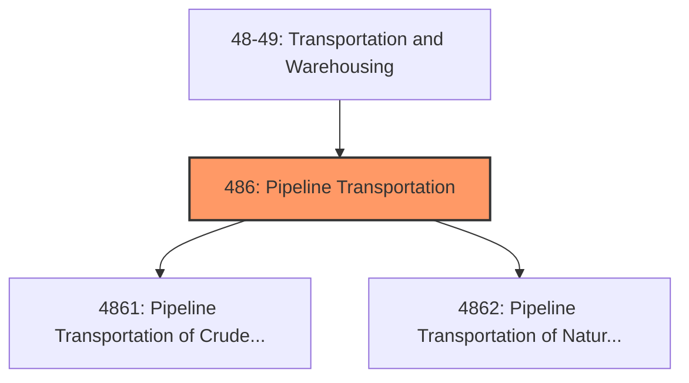
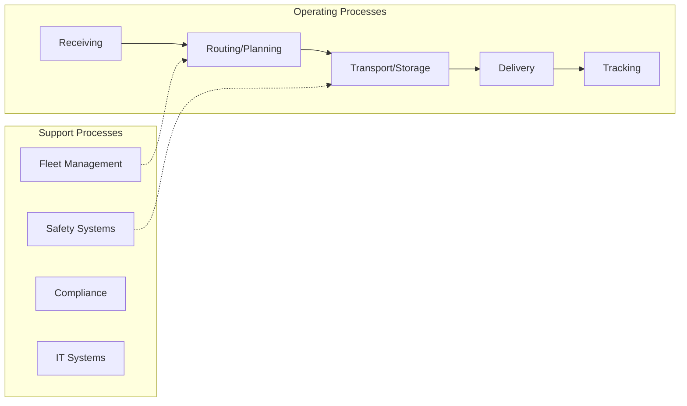

# Pipeline Transportation

> Industries in the Pipeline Transportation subsector use transmission pipelines to transport products, such as crude oil, natural gas, refined petroleum products, and slurry.

## Overview

Pipeline Transportation represents an important category within the Transportation and Warehousing sector (NAICS 48-49). This subsector encompasses establishments primarily engaged in pipeline transportation.

Industries in the Pipeline Transportation subsector use transmission pipelines to transport products, such as crude oil, natural gas, refined petroleum products, and slurry. Industries are identified based on the products transported (i.e., pipeline transportation of crude oil, natural gas, refined petroleum products, and other products). The Pipeline Transportation of Natural Gas industry includes the storage of natural gas because the storage is usually done by the pipeline establishment and because a pipeline is inherently a network in which all the nodes are interdependent.

## Industry Hierarchy

## Key Statistics

| Metric | Value |
|--------|-------|
| NAICS Code | 486 |
| Level | Subsector |
| Child Industries | 2 |

## Sub-Industries

| Industry | Code | Description |
|----------|------|-------------|
| [Pipeline Transportation of Crude Oil](./PipelineTransportationOfCrudeOil/) | 4861 | Pipeline Transportation of Crude Oil |
| [Pipeline Transportation of Natural Gas](./PipelineTransportationOfNaturalGas/) | 4862 | Pipeline Transportation of Natural Gas |

## Core Business Processes

## Industry Value Chain

## Market Context

Transportation and warehousing enable the movement of goods through supply chains, with technology driving efficiency improvements and last-mile innovations.

| Aspect | Details |
|--------|---------|
| Industry Sector | TransportationAndWarehousing |
| NAICS/SIC Code | 486 |
| Market Segment | Pipeline Transportation |

## Key Business Processes

- Route planning and optimization
- Freight handling
- Warehouse operations
- Last-mile delivery
- Fleet maintenance

## Common Occupations

- [Transportation Managers](/occupations/Management/TransportationStorageAndDistributionManagers)
- [Truck Drivers](/occupations/Transportation/HeavyAndTractorTrailerTruckDrivers)
- [Warehouse Workers](/occupations/Transportation/LaborersAndFreightStockAndMaterialMovers)
- [Logistics Coordinators](/occupations/Business/Logisticians)

## Regulations and Standards

- Department of Transportation (DOT)
- Federal Motor Carrier Safety Administration (FMCSA)
- Hazardous Materials Regulations (HMR)
- OSHA warehouse safety standards
- State transportation permits

## Technology and Tools

- Fleet management systems
- Warehouse management systems (WMS)
- GPS tracking and telematics
- Automated material handling
- Transportation management systems (TMS)

## Industry Trends

- Digital transformation and automation adoption
- Sustainability and environmental compliance focus
- Workforce development and skills training
- Supply chain resilience and optimization
- Customer experience enhancement

---

*Source: NAICS 486 - Pipeline Transportation*
