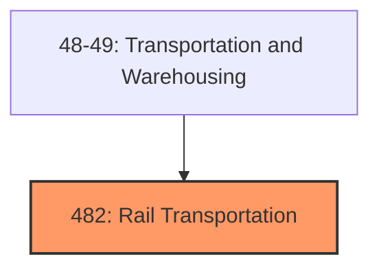
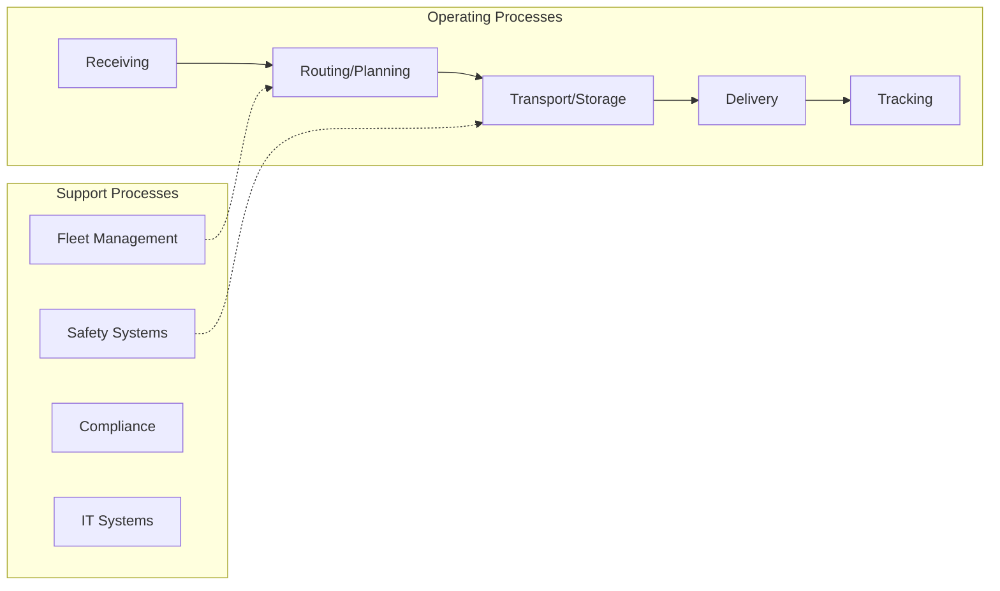

# Rail Transportation

> Industries in the Rail Transportation subsector provide rail transportation of passengers and/or cargo using railroad rolling stock.

## Overview

Rail Transportation represents an important category within the Transportation and Warehousing sector (NAICS 48-49). This subsector encompasses establishments primarily engaged in rail transportation.

Industries in the Rail Transportation subsector provide rail transportation of passengers and/or cargo using railroad rolling stock. The railroads in this subsector primarily either operate on networks, with physical facilities, labor force, and equipment spread over an extensive geographic area, or operate over a short distance on a local rail line. Scenic and sightseeing rail transportation and street railroads, commuter rail, and rapid transit are not included in this subsector but are included in Subsector 487, Scenic and Sightseeing Transportation, and Subsector 485, Transit and Ground Passenger Transportation, respectively. Although these activities use railroad rolling stock, they are different from the activities included in rail transportation. Sightseeing and scenic railroads do not usually involve place-to-place transportation; the passenger's trip typically starts and ends at the same location. Commuter railroads operate in a manner more consistent with local and urban transit and are often part of integrated transit systems.

## Industry Hierarchy

## Key Statistics

| Metric | Value |
|--------|-------|
| NAICS Code | 482 |
| Level | Subsector |
| Child Industries | 0 |

## Related Occupations

- [Transportation, Storage, and Distribution Managers](/occupations/Management/TransportationStorageAndDistributionManagers) - Plan and direct transportation operations
- [Logisticians](/occupations/Business/Logisticians) - Analyze and coordinate supply chain
- [Transportation Engineers](/occupations/Architecture/TransportationEngineers) - Design transportation infrastructure
- [Logistics Analysts](/occupations/Business/LogisticsAnalysts) - Analyze logistics data to optimize operations

## Core Business Processes

## Industry Value Chain

## Regulatory Environment

- **DOT** (Department of Transportation) - Regulates transportation safety and operations
- **FMCSA** (Federal Motor Carrier Safety Administration) - Oversees commercial vehicle operations
- **FAA** (Federal Aviation Administration) - Regulates air transportation
- **FRA** (Federal Railroad Administration) - Governs railroad safety and operations

## Technology & Innovation

- **Autonomous Vehicles** - Self-driving trucks, delivery drones, and autonomous ships
- **Fleet Telematics** - Real-time GPS tracking, fuel optimization, and predictive maintenance
- **Electric Transportation** - EV fleet adoption, charging infrastructure, and battery technology
- **Digital Freight Platforms** - Online marketplaces matching shippers with carriers

## Industry Outlook

The transportation and warehousing sector is investing heavily in electrification, automation, and digital logistics platforms. E-commerce growth continues to drive demand for last-mile delivery and warehouse capacity. Autonomous vehicle technology, drone delivery, and sustainable fleet management are key areas of innovation, while labor market tightness drives investment in driver retention and automated operations.

---

*Source: NAICS 482 - Rail Transportation*
