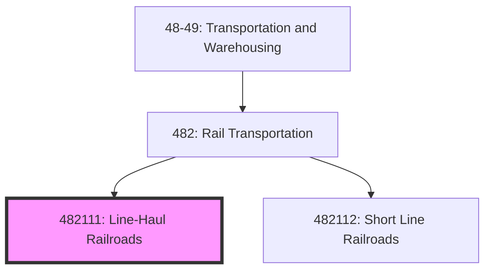
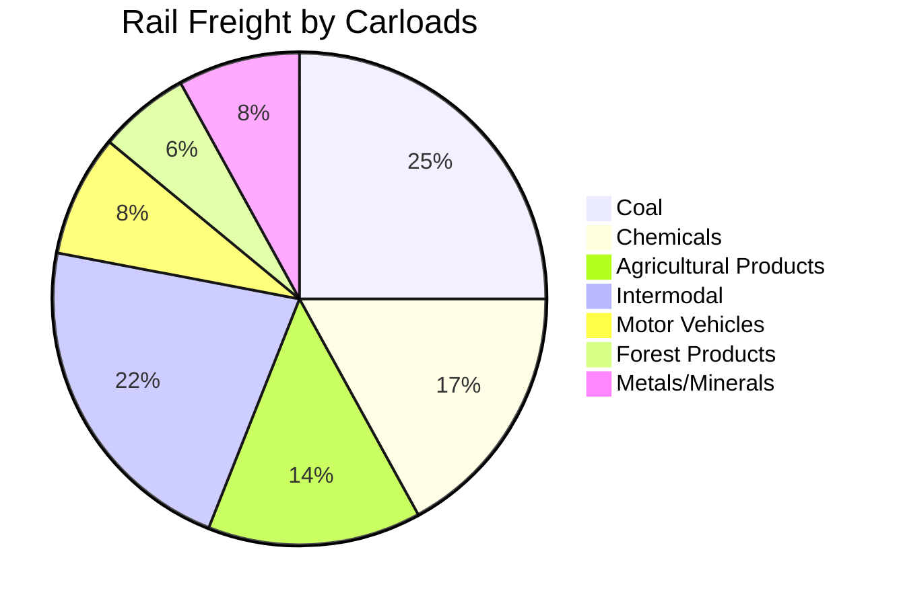
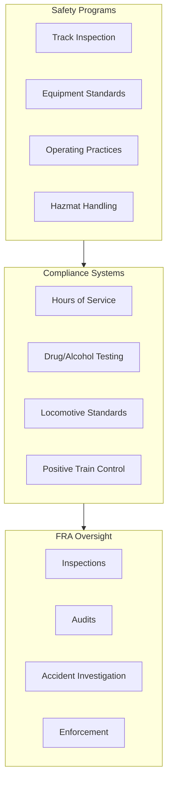
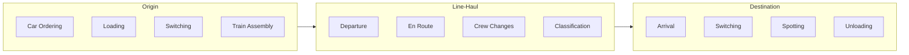

# Line-Haul Railroads

> This U.S. industry comprises establishments known as line-haul railroads primarily engaged in operating railroads for the transport of passengers and/or cargo over a long distance within a rail network.

## Overview

Line-Haul Railroads (NAICS 482111) represent the backbone of North American freight transportation, operating extensive rail networks for intercity movement of goods and passengers. These establishments provide long-distance rail transportation between terminals and stations on main and branch lines of a line-haul rail network.

The U.S. freight rail network spans approximately 140,000 miles, with Class I railroads accounting for about 70% of industry revenue. Line-haul railroads are characterized by:

- **Class I Railroads** - Operating revenues exceeding $900 million annually (BNSF, Union Pacific, CSX, Norfolk Southern, Kansas City Southern, Canadian National, Canadian Pacific)
- **Class II Regional Railroads** - Operating revenues between $40 million and $900 million
- **Amtrak** - National passenger rail service operating over freight railroad tracks
- **Intermodal Operations** - Container and trailer-on-flatcar services

## NAICS Hierarchy

## Key Statistics

| Metric | Value |
|--------|-------|
| NAICS Code | 482111 |
| Level | National Industry (6-digit) |
| Parent | [482: Rail Transportation](./) |
| US Employment | ~135,000 |
| Annual Revenue | ~$80 billion |
| Track Miles | ~140,000 |
| Ton-Miles Annually | ~1.7 trillion |

## Industry Segments

### Class I Freight Railroads

| Railroad | Headquarters | Route Miles | Annual Revenue |
|----------|--------------|-------------|----------------|
| BNSF Railway | Fort Worth, TX | 32,500 | $23B+ |
| Union Pacific | Omaha, NE | 32,300 | $24B+ |
| CSX Transportation | Jacksonville, FL | 21,000 | $14B+ |
| Norfolk Southern | Atlanta, GA | 19,500 | $12B+ |
| Canadian National | Montreal, QC | 20,000 (US/CA) | $15B+ |
| Canadian Pacific Kansas City | Calgary, AB | 20,000 (US/CA/MX) | $14B+ |

### Freight Traffic by Commodity

## Regulatory Framework

### FRA Safety Requirements

### Key Regulations

| Regulation | Description |
|------------|-------------|
| 49 CFR Part 213 | Track Safety Standards |
| 49 CFR Part 229 | Locomotive Safety Standards |
| 49 CFR Part 232 | Brake System Safety |
| 49 CFR Part 236 | Positive Train Control (PTC) |
| 49 CFR Part 228 | Hours of Service |
| 49 CFR Part 172 | Hazardous Materials |

### Surface Transportation Board (STB)

| Function | Description |
|----------|-------------|
| Rate Regulation | Adjudicates rate disputes for captive shippers |
| Mergers & Acquisitions | Reviews and approves rail consolidations |
| Service Standards | Addresses service complaints |
| Line Abandonments | Approves track discontinuance |

## Operations Model

### Train Operations Process

### Classification Yard Operations

| Process | Description |
|---------|-------------|
| Receiving | Inbound trains arrive at receiving yard |
| Humping | Cars pushed over hump for gravity classification |
| Classification | Cars sorted into tracks by destination |
| Departure | Outbound trains assembled and inspected |

## Technology

### Operational Systems

| System | Function |
|--------|----------|
| Positive Train Control (PTC) | Collision avoidance, speed enforcement |
| Centralized Traffic Control (CTC) | Remote signal and switch control |
| RFID/AEI | Automatic equipment identification |
| Wayside Detectors | Hot bearing, dragging equipment detection |
| Trip Optimizer | Fuel-efficient train handling |

### Fleet Management

| Technology | Application |
|------------|-------------|
| Locomotive Health Monitoring | Predictive maintenance analytics |
| Car Management Systems | Fleet utilization optimization |
| Train Scheduling Systems | Capacity planning and dispatching |
| Customer Portals | Shipment visibility and booking |

## Competitive Dynamics

### Business Models

| Segment | Characteristics |
|---------|-----------------|
| Bulk Commodities | Unit trains, high volume, origin-destination |
| Manifest/Carload | Mixed freight, classification required |
| Intermodal | Containers, trailers, high service standards |
| Automotive | Specialized equipment, just-in-time delivery |

### Key Success Factors

1. **Network reach and connectivity**
2. **Operating ratio efficiency**
3. **Service reliability and transit times**
4. **Intermodal terminal capacity**
5. **Labor productivity**
6. **Capital investment discipline**

## Related Industries

- [Short Line Railroads](./ShortLineRailroads.mdx) - First/last mile service
- [Rail Transportation Support](/industries/TransportationAndWarehousing/SupportActivitiesForTransportation/) - Terminal operations
- [Intermodal Transport](/industries/TransportationAndWarehousing/TruckTransportation/) - Truck drayage
- [Warehousing](/industries/TransportationAndWarehousing/Warehousing/) - Distribution services

## Related Occupations

| Occupation | Role | Typical Employer |
|------------|------|------------------|
| Locomotive Engineer | Operates locomotives | Class I/II railroad |
| Conductor | Train crew supervisor | Class I/II railroad |
| Signal Maintainer | Signal system maintenance | Class I/II railroad |
| Track Worker | Track maintenance and repair | Class I/II railroad |
| Dispatcher | Train movement coordination | Class I/II railroad |
| Yardmaster | Classification yard operations | Class I/II railroad |

## Industry Trends

- **Precision Scheduled Railroading (PSR)** - Operating model focused on efficiency
- **Intermodal Growth** - E-commerce driving container volumes
- **Alternative Fuels** - Battery and hydrogen locomotive development
- **Automation** - Autonomous train operations testing
- **Capacity Investment** - Siding extensions, double-tracking
- **Labor Relations** - Ongoing negotiations on crew size, scheduling

---

*Source: NAICS 482111, FRA, STB, Association of American Railroads (AAR)*
