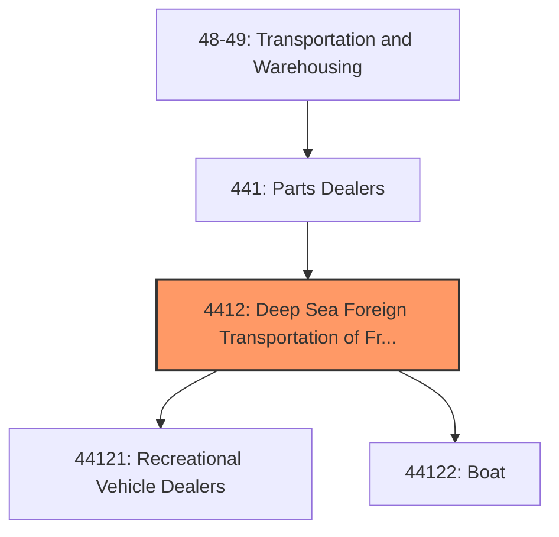
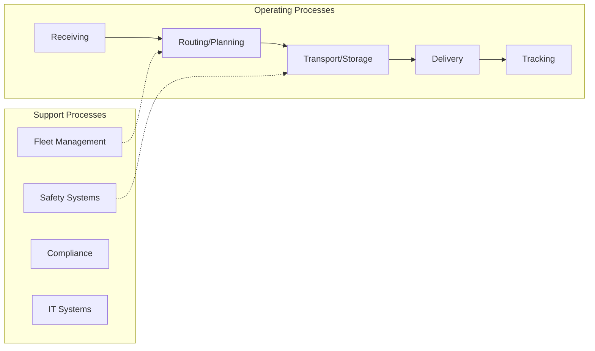

# Deep Sea Foreign Transportation of Freight

> Deep Sea Foreign Transportation of Freight.

## Overview

Deep Sea Foreign Transportation of Freight represents an important category within the Transportation and Warehousing sector (SIC 4412).

## Industry Hierarchy

## Key Statistics

| Metric | Value |
|--------|-------|
| SIC Code | 4412 |
| Level | SIC (4412) |
| Child Industries | 0 |

## Related Occupations

- [Transportation, Storage, and Distribution Managers](/occupations/Management/TransportationStorageAndDistributionManagers) - Plan and direct transportation operations
- [Logisticians](/occupations/Business/Logisticians) - Analyze and coordinate supply chain
- [Transportation Engineers](/occupations/Architecture/TransportationEngineers) - Design transportation infrastructure
- [Logistics Analysts](/occupations/Business/LogisticsAnalysts) - Analyze logistics data to optimize operations

## Core Business Processes

## Industry Value Chain

```mermaid
graph LR
    subgraph Inputs["Inputs"]
        I1["Resources"]
        I2["Expertise"]
        I3["Technology"]
    end

    subgraph Primary["Primary Activities"]
        A1["Inbound Logistics"]
        A2["Core Operations"]
        A3["Quality Assurance"]
        A4["Outbound/Delivery"]
    end

    subgraph Outputs["Products/Services"]
        O1["Products"]
        O2["Services"]
        O3["Solutions"]
    end

    subgraph Customers["Markets"]
        C1["Businesses"]
        C2["Consumers"]
        C3["Government"]
        C4["Institutions"]
    end

    Inputs --> Primary --> Outputs --> Customers
```

## Regulatory Environment

- **DOT** (Department of Transportation) - Regulates transportation safety and operations
- **FMCSA** (Federal Motor Carrier Safety Administration) - Oversees commercial vehicle operations
- **FAA** (Federal Aviation Administration) - Regulates air transportation
- **FRA** (Federal Railroad Administration) - Governs railroad safety and operations

## Technology & Innovation

- **Autonomous Vehicles** - Self-driving trucks, delivery drones, and autonomous ships
- **Fleet Telematics** - Real-time GPS tracking, fuel optimization, and predictive maintenance
- **Electric Transportation** - EV fleet adoption, charging infrastructure, and battery technology
- **Digital Freight Platforms** - Online marketplaces matching shippers with carriers

## Industry Outlook

The transportation and warehousing sector is investing heavily in electrification, automation, and digital logistics platforms. E-commerce growth continues to drive demand for last-mile delivery and warehouse capacity. Autonomous vehicle technology, drone delivery, and sustainable fleet management are key areas of innovation, while labor market tightness drives investment in driver retention and automated operations.

## Market Context

Transportation and warehousing enable the movement of goods through supply chains, with technology driving efficiency improvements and last-mile innovations.

| Aspect | Details |
|--------|---------|
| Industry Sector | TransportationAndWarehousing |
| NAICS/SIC Code | 4412 |
| Market Segment | Deep Sea Foreign Transportation of Freight |

## Key Business Processes

- Route planning and optimization
- Freight handling
- Warehouse operations
- Last-mile delivery
- Fleet maintenance

## Common Occupations

- [Transportation Managers](/occupations/Management/TransportationStorageAndDistributionManagers)
- [Truck Drivers](/occupations/Transportation/HeavyAndTractorTrailerTruckDrivers)
- [Warehouse Workers](/occupations/Transportation/LaborersAndFreightStockAndMaterialMovers)
- [Logistics Coordinators](/occupations/Business/Logisticians)

## Regulations and Standards

- Department of Transportation (DOT)
- Federal Motor Carrier Safety Administration (FMCSA)
- Hazardous Materials Regulations (HMR)
- OSHA warehouse safety standards
- State transportation permits

## Technology and Tools

- Fleet management systems
- Warehouse management systems (WMS)
- GPS tracking and telematics
- Automated material handling
- Transportation management systems (TMS)

## Industry Trends

- Digital transformation and automation adoption
- Sustainability and environmental compliance focus
- Workforce development and skills training
- Supply chain resilience and optimization
- Customer experience enhancement

---

*Source: SIC 4412 - Deep Sea Foreign Transportation of Freight*
