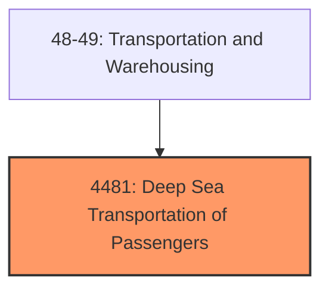
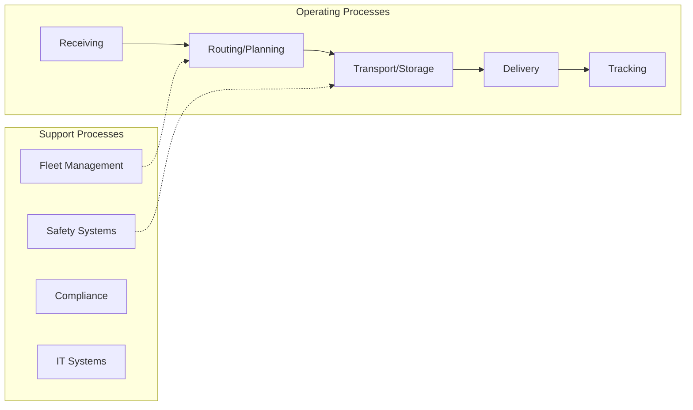

# Deep Sea Transportation of Passengers

> Deep Sea Transportation of Passengers.

## Overview

Deep Sea Transportation of Passengers represents an important category within the Transportation and Warehousing sector (SIC 4481).

## Industry Hierarchy

## Key Statistics

| Metric | Value |
|--------|-------|
| SIC Code | 4481 |
| Level | SIC (4481) |
| Child Industries | 0 |

## Related Occupations

See the [occupations directory](/occupations) for roles commonly found in this industry.

## Core Business Processes

## Industry Value Chain

---

*Source: SIC 4481 - Deep Sea Transportation of Passengers*
